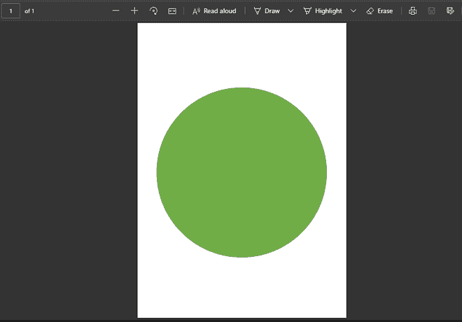

# 使用 Java 在带有画布的 PDF 中绘制对象

> 原文:[https://www . geesforgeks . org/drawing-a-object-in-a-pdf-with-canvas-use-Java/](https://www.geeksforgeeks.org/drawing-an-object-in-a-pdf-with-canvas-using-java/)

使用 Java 在带有画布的 PDF 中创建一个对象可以通过使用一个名为 iText 的库来完成。iText 是一个 Java 库，最初是由 Bruno Lowagie 创建的，它允许创建 PDF、读取 PDF 和操作它们。

**所需库:**

```java
iText
slf4j (Logging Library)
```

**示例:**在 PDF 中画一个圆


**进场:**

1.  获取正在运行的 java 程序的当前工作目录，以便在同一位置创建 PDF 文件
2.  创建一个 PdfWriter 对象(来自 itextpdf 库)，将 pdf 文件写入给定的路径
3.  创建一个空的 PdfDocument 对象，并使用 PdfPage 对象向其中添加一个页面
4.  使用 Pdf 页面中的 Pdf 画布对象创建画布
5.  在画布上创建对象，并用颜色填充对象

下面是上述方法的实现:

## Java 语言(一种计算机语言，尤用于创建网站)

```java
// Drawing an object in a PDF with Canvas using Java
import com.itextpdf.kernel.colors.*;
import com.itextpdf.kernel.pdf.PdfDocument;
import com.itextpdf.kernel.pdf.PdfPage;
import com.itextpdf.kernel.pdf.PdfWriter;
import com.itextpdf.kernel.pdf.canvas.PdfCanvas;
import com.itextpdf.layout.Document;

// importing generic packages
import java.io.*;
import java.util.*;

public class DrawPDF {
    public static void main(String args[]) throws Exception
    {

        // getting path of current working directory
        // to create the pdf file in the same directory of
        // the running java program
        String path = System.getProperty("user.dir");
        path += "/DrawPDF.pdf";
        // Creating a PdfWriter object using the path
        PdfWriter writer = new PdfWriter(path);

        // Creating a PdfDocument object
        PdfDocument pdfDoc = new PdfDocument(writer);

        // Creating a Document object
        Document doc = new Document(pdfDoc);

        // Creating a new page and adding to the pdfDoc
        // object
        PdfPage pdfPage = pdfDoc.addNewPage();

        // Creating a PdfCanvas object to draw the circle
        // object
        PdfCanvas canvas = new PdfCanvas(pdfPage);

        // Setting Green color to the circle, boolean fill
        // set to true. ColorsConstants from itext library
        // hosts an array of different colors
        canvas.setColor(ColorConstants.GREEN, true);

        // creating a circle with parameters : X-coordinate,
        // Y-coordinate , Circle Diameter
        canvas.circle(300, 400, 200);

        // Filling the circle
        canvas.fill();

        // Closing the document
        doc.close();
        System.out.println(
            "Object drawn & PDf created successfully!");
    }
}
```

**输出:**

PDF 文件是在指定的路径中创建的。

