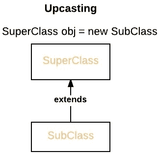
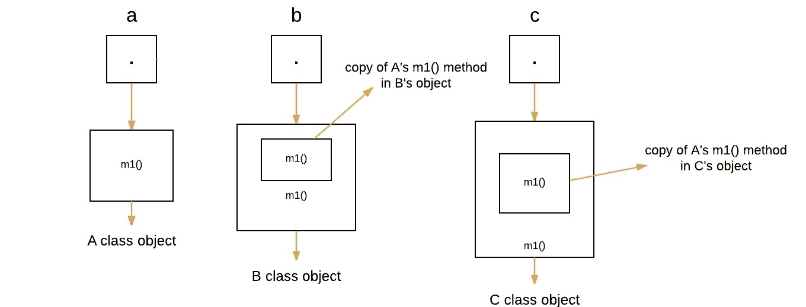
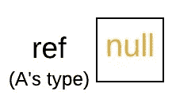
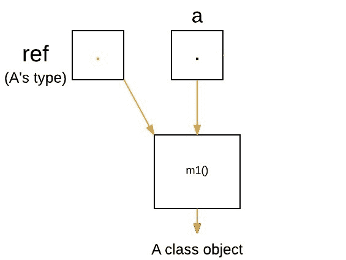
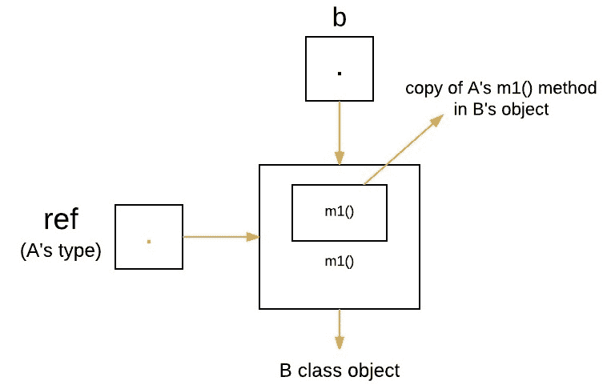
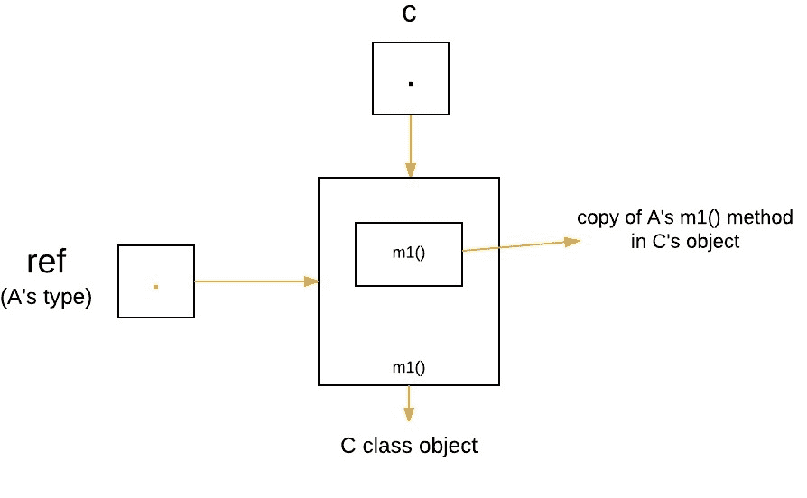

# Java 中的动态方法调度或运行时多态性

> 原文:[https://www . geesforgeks . org/dynamic-method-dispatch-runtime-多态-java/](https://www.geeksforgeeks.org/dynamic-method-dispatch-runtime-polymorphism-java/)

**先决条件:** [在 java 中覆盖](https://www.geeksforgeeks.org/overriding-in-java/)[继承](https://www.geeksforgeeks.org/inheritance-in-java/)

方法重写是 Java 支持运行时多态性的方式之一。动态方法分派是一种机制，通过它可以在运行时而不是编译时解析对被重写方法的调用。

*   当通过超类引用调用被覆盖的方法时，Java 会根据调用发生时被引用的对象的类型来确定要执行该方法的哪个版本(超类/子类)。因此，该确定是在运行时做出的。
*   在运行时，它取决于被引用的对象的类型(而不是引用变量的类型)，这决定了将执行被重写方法的哪个版本
*   超类引用变量可以引用子类对象。这也称为向上广播。Java 使用这个事实在运行时解析对重写方法的调用。



因此，如果超类包含被子类覆盖的方法，那么当通过超类引用变量引用不同类型的对象时，就会执行不同版本的方法。下面是一个说明动态方法分派的示例:

```
// A Java program to illustrate Dynamic Method
// Dispatch using hierarchical inheritance
class A
{
    void m1()
    {
        System.out.println("Inside A's m1 method");
    }
}

class B extends A
{
    // overriding m1()
    void m1()
    {
        System.out.println("Inside B's m1 method");
    }
}

class C extends A
{
    // overriding m1()
    void m1()
    {
        System.out.println("Inside C's m1 method");
    }
}

// Driver class
class Dispatch
{
    public static void main(String args[])
    {
        // object of type A
        A a = new A();

        // object of type B
        B b = new B();

        // object of type C
        C c = new C();

        // obtain a reference of type A
        A ref;

        // ref refers to an A object
        ref = a;

        // calling A's version of m1()
        ref.m1();

        // now ref refers to a B object
        ref = b;

        // calling B's version of m1()
        ref.m1();

        // now ref refers to a C object
        ref = c;

        // calling C's version of m1()
        ref.m1();
    }
}
```

输出:

```
Inside A's m1 method
Inside B's m1 method
Inside C's m1 method

```

**说明:**

上面的程序创建了一个名为 A 的超类，它有两个子类 B 和 c。这些子类覆盖了 m1()方法。

1.  Inside the main() method in Dispatch class, initially objects of type A, B, and C are declared.

    ```
    A a = new A(); // object of type A
    B b = new B(); // object of type B
    C c = new C(); // object of type C

    ```

    

2.  Now a reference of type A, called ref, is also declared, initially it will point to null.

    ```
    A ref; // obtain a reference of type A

    ```

    [](https://media.geeksforgeeks.org/wp-content/uploads/w.jpeg)

3.  Now we are assigning a reference to each **type of object** (either A’s or B’s or C’s) to *ref*, one-by-one, and uses that reference to invoke m1( ). As the output shows, the version of m1( ) executed is determined **by the type of object being referred to at the time of the call.**

    ```
    ref = a; // r refers to an A object
    ref.m1(); // calling A's version of m1()

    ```

    [](https://media.geeksforgeeks.org/wp-content/uploads/q1.jpeg)

    ```
    ref = b; // now r refers to a B object
    ref.m1(); // calling B's version of m1()

    ```

    [](https://media.geeksforgeeks.org/wp-content/uploads/q2.jpeg)

    ```
    ref = c; // now r refers to a C object
    ref.m1(); // calling C's version of m1()

    ```

    

**数据成员的运行时多态性**

在 Java 中，我们只能覆盖方法，不能覆盖变量(数据成员)，所以**运行时多态不能通过数据成员来实现。**例如:

```
// Java program to illustrate the fact that
// runtime polymorphism cannot be achieved
// by data members

// class A
class A
{
    int x = 10;
}

// class B
class B extends A
{
    int x = 20;
}

// Driver class
public class Test
{
    public static void main(String args[])
    {
        A a = new B(); // object of type B

        // Data member of class A will be accessed
        System.out.println(a.x);
    }
}
```

输出:

```
10

```

**说明:**在上面的程序中，A 类(超类)和 B 类(子类)都有一个公共变量‘x’。现在我们把 B 类的对象做成 a 类类型的“a”引用，因为变量没有被覆盖，所以语句“a.x”将**总是**引用超类的数据成员。

**动态方法调度的优势**

1.  动态方法分派允许 Java 支持方法的[覆盖](https://www.geeksforgeeks.org/overriding-in-java/)，这是运行时多态性的核心。
2.  它允许一个类指定对其所有派生方法通用的方法，同时允许子类定义这些方法中的一些或全部的具体实现。
3.  它还允许子类添加它的特定方法子类来定义一些特定的实现。

**[静态绑定 vs 动态绑定](https://www.geeksforgeeks.org/static-vs-dynamic-binding-in-java/)**

*   静态绑定在编译时完成，而动态绑定在运行时完成。
*   私有、最终和静态方法和变量使用静态绑定，并由编译器绑定，而被重写的方法在运行时根据运行时对象的类型进行绑定

本文由**高拉夫·米格拉尼**供稿。如果你喜欢 GeeksforGeeks 并想投稿，你也可以使用[contribute.geeksforgeeks.org](http://www.contribute.geeksforgeeks.org)写一篇文章或者把你的文章邮寄到 contribute@geeksforgeeks.org。看到你的文章出现在极客博客主页上，帮助其他极客。

如果你发现任何不正确的地方，或者你想分享更多关于上面讨论的话题的信息，请写评论。