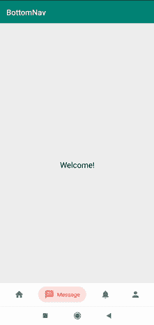
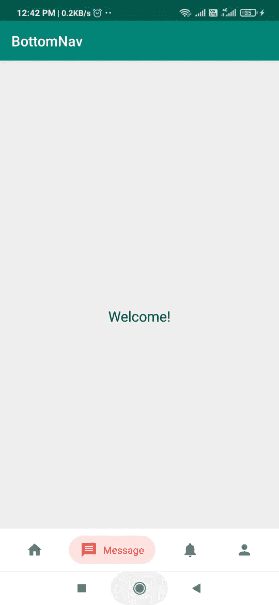

# 安卓底部导航栏轻松时尚的芯片按钮

> 原文:[https://www . geesforgeks . org/easy-style-chip-button-in-bottom-navigation-bar-in-Android/](https://www.geeksforgeeks.org/easy-stylish-chip-button-in-bottom-navigation-bar-in-android/)

我们都遇到过有底部导航栏的应用程序。一些流行的例子包括 Instagram、Snapchat 等。在本文中，让我们学习如何在安卓应用程序中实现一个简单时尚的功能性底部导航栏。关于创建基本的[底部导航栏，请参考 Android](https://www.geeksforgeeks.org/bottom-navigation-bar-in-android/) 中的底部导航栏。下面给出了一个 GIF 示例，来了解一下我们将在本文中做什么。注意，我们将使用 **Java** 语言来实现这个项目。



### 为什么我们需要一个**底部导航栏？**

*   它允许用户轻松地从一个片段导航到另一个片段。
*   它使查看应用程序中的所有其他屏幕变得容易。
*   用户可以很容易地查看他们现在在哪个屏幕上工作。

### **分步实施**

**第一步:创建新项目**

要在安卓工作室创建新项目，请参考[如何在安卓工作室创建/启动新项目](https://www.geeksforgeeks.org/android-how-to-create-start-a-new-project-in-android-studio/)。注意选择 **Java** 作为编程语言。

**第 2 步:将依赖项添加到 build.gradle(:app)文件中**

> 实现' com . ismaeldivita . chip navigation:chip-navigation-bar:1 . 3 . 4 '

**步骤 3:使用 activity_main.xml 文件**

导航到**应用程序> res >布局> activity_main.xml** 并将下面的代码添加到该文件中。下面是 **activity_main.xml** 文件的代码。

## 可扩展标记语言

```
<?xml version="1.0" encoding="utf-8"?>
<RelativeLayout 
    xmlns:android="http://schemas.android.com/apk/res/android"
    xmlns:app="http://schemas.android.com/apk/res-auto"
    xmlns:tools="http://schemas.android.com/tools"
    android:id="@+id/rl_layout"
    android:layout_width="match_parent"
    android:layout_height="match_parent"
    android:background="#EEEEEE"
    tools:context=".MainActivity">

    <TextView
        android:id="@+id/text_main"
        android:layout_width="wrap_content"
        android:layout_height="wrap_content"
        android:layout_centerInParent="true"
        android:text="Welcome!"
        android:textColor="#000"
        android:textSize="20sp" />

    <com.ismaeldivita.chipnavigation.ChipNavigationBar
        android:id="@+id/bottom_nav_bar"
        android:layout_width="match_parent"
        android:layout_height="60dp"
        android:layout_alignParentBottom="true"
        android:layout_gravity="bottom"
        android:background="#fff"
        android:fadingEdge="horizontal"
        app:cnb_menuResource="@menu/menu" />

</RelativeLayout>
```

**这就是 activity_main.xml 的样子:**



**步骤 4:为芯片导航栏创建菜单**

转到 **app > res >右键>新建>安卓资源文件**，在弹出的屏幕中选择**资源类型为菜单**，文件名保持为**菜单**。下面是 **menu.xml** 文件的代码。

## 可扩展标记语言

```
<?xml version="1.0" encoding="utf-8"?>
<menu xmlns:android="http://schemas.android.com/apk/res/android"
      xmlns:app="http://schemas.android.com/apk/res-auto">

    <item
        android:id="@+id/nav_near"
        android:icon="@drawable/ic_home_black_24dp"
        android:title="Home"
        app:cnb_iconColor="#2196F3"/>

    <item
        android:id="@+id/nav_new_chat"
        android:icon="@drawable/ic_message_black_24dp"
        android:title="Message"
        app:cnb_iconColor="#F44336"/>

    <item
        android:id="@+id/nav_profile"
        android:icon="@drawable/ic_notifications_black_24dp"
        android:title="Notify"
        app:cnb_iconColor="#4CAF50"/>

    <item
        android:id="@+id/nav_settings"
        android:icon="@drawable/ic_person_black_24dp"
        android:title="Profile"
        app:cnb_iconColor="#FF9800"/>

</menu>
```

**第五步:使用****MainActivity.java 文件**

转到**MainActivity.java**文件，参考以下代码。以下是**MainActivity.java**文件的代码。代码中添加了注释，以更详细地理解代码。

## Java 语言(一种计算机语言，尤用于创建网站)

```
import android.os.Bundle;
import androidx.appcompat.app.AppCompatActivity;
import com.ismaeldivita.chipnavigation.ChipNavigationBar;

public class MainActivity extends AppCompatActivity {

    ChipNavigationBar chipNavigationBar;

    @Override
    protected void onCreate(Bundle savedInstanceState) {
        super.onCreate(savedInstanceState);
        setContentView(R.layout.activity_main);
        chipNavigationBar = findViewById(R.id.bottom_nav_bar);
    }
}
```

### 输出:

<video class="wp-video-shortcode" id="video-559252-1" width="640" height="360" preload="metadata" controls=""><source type="video/mp4" src="https://media.geeksforgeeks.org/wp-content/uploads/20210212124633/WhatsApp-Video-2021-02-12-at-12.45.50-PM.mp4?_=1">[https://media.geeksforgeeks.org/wp-content/uploads/20210212124633/WhatsApp-Video-2021-02-12-at-12.45.50-PM.mp4](https://media.geeksforgeeks.org/wp-content/uploads/20210212124633/WhatsApp-Video-2021-02-12-at-12.45.50-PM.mp4)</video>