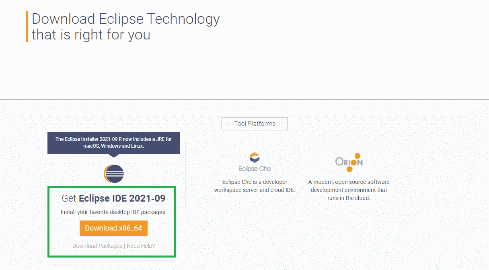
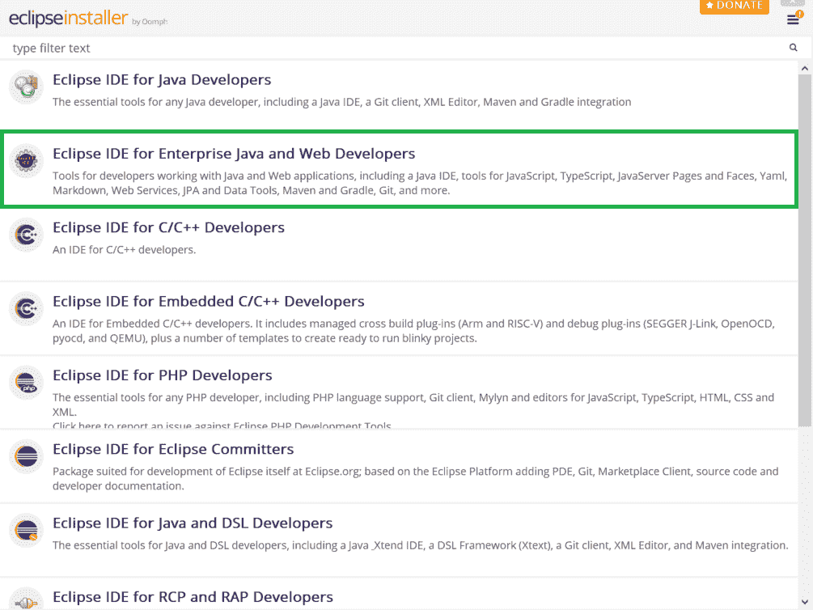
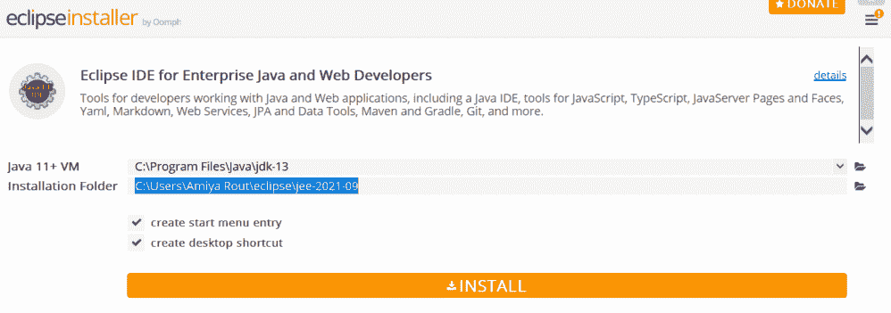
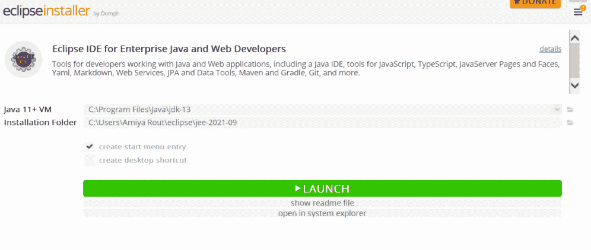
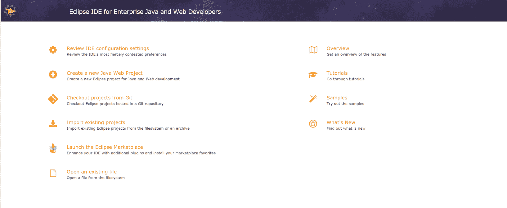

# 面向企业 Java 和 Web 开发人员的 Eclipse IDE

> 原文:[https://www . geesforgeks . org/eclipse-ide-for-enterprise-Java-and-web-developers/](https://www.geeksforgeeks.org/eclipse-ide-for-enterprise-java-and-web-developers/)

集成开发环境是帮助软件开发的工具组合。IDE 使编码变得更加容易。顾名思义**集成开发环境(IDE)** ，就是将一包工具组合或集成在一起，建立软件开发的安逸。工具组合包括

*   有助于语言语法的代码编辑器。
*   代码格式化、执行和调试器环境。
*   源代码和版本控制环境。

Eclipse IDE 以 **Java 集成开发环境(IDE)** 而闻名，但它有许多相当酷的 IDE，包括 C/C++ IDE、JavaScript/TypeScript IDE、PHP IDE 等等。在这篇文章中，我们将解释如何为企业 Java 和网络开发安装**Eclipse IDE**。Eclipse 为开发人员提供了一个处理 Java 和 Web 应用程序的工具，包括一个 **Java IDE** 、用于 **JavaScript** 、 **TypeScript** 的工具、JavaServer Pages 和 Faces、Yaml、Markdown、Web Services、JPA 和 Data Tools、Maven 和 Gradle、Git 等等。

### 逐步实施

1.  下载并安装 JDK(如果机器上没有安装 java，则可选)
2.  安装 Eclipse 集成开发环境
3.  打开下载的文件，从弹出的*中选择“*企业 Java 和网络开发人员 Eclipse IDE”*。*
4.  选择安装文件夹，按下“*INSTALL”*按钮。
5.  最后，点击“*午餐”* 按钮。

现在，让我们按照视觉辅助的顺序讨论这些步骤，以便在安装时更好地感知。

**步骤 1:** 下载并安装 JDK

要在您的工作空间中运行 Eclipse，您首先需要下载并安装 JDK (Java 开发工具包)。打开你的默认浏览器，搜索“JDK 下载”，点击 oracle.com 链接。甲骨文为您提供最新版本的 JDK。您可以根据需要的配置从这里下载。请参考本文[如何为 64 位机器](https://www.geeksforgeeks.org/how-to-download-and-install-java-for-64-bit-machine/)下载并安装 Java，并在您的系统中安装 JDK。

**第二步:**在你的工作区安装完 JDK 之后，我们可以通过[下载 Eclipse IDE](https://www.eclipse.org/downloads/) 来安装 Eclipse IDE。

**第三步:**下载完成后，打开下载的文件，从屏幕上打开的弹出窗口中选择**运行**。现在从下面的页面选择第二个选项*“面向企业 Java 和网络开发人员的 Eclipse IDE”*

**第 4 步:**点击此处后，将出现以下屏幕。现在点击**安装**按钮。通过接受协议，您可以完成安装。完成安装需要一些时间。

**第五步:**安装成功后点击**便当**按钮，如下图。

> 这是**企业 Java 和 Web 开发 Eclipse IDE 成功安装后的欢迎屏幕。**

