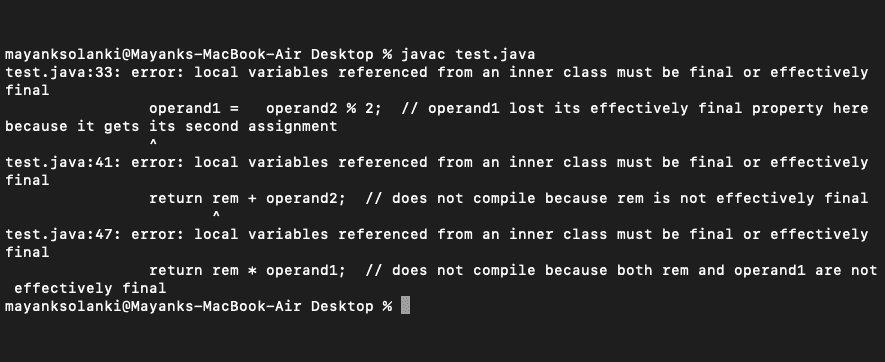
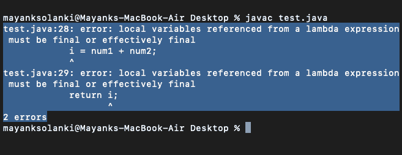

# 有效的 Java 最终变量，示例

> 原文:[https://www . geesforgeks . org/effect-final-variable-in-Java-with-examples/](https://www.geeksforgeeks.org/effectively-final-variable-in-java-with-examples/)

最终变量是用名为“ [final](https://www.geeksforgeeks.org/final-keyword-java/) 的关键字声明的变量。

**示例:**

```
final int number;
number = 77;
```

有效最终变量是一个局部变量，具有以下属性，如下所示:

*   未定义为最终
*   仅分配给一次。

任何局部变量或参数现在只被赋值一次(或只更新一次)。在整个计划中，它可能不会有效地保持最终状态。因此，这表明有效的 final 变量可能会在它被赋值/更新最少的另一个赋值之后立即失去其有效的 final 属性。此外，一个有效的最终变量可能是一个值没有改变，但没有用终极关键字声明的变量。

```
int number;
number = 7;
```

> **注意:** Final 和 Effective Final 类似，只是有效的 Final 变量没有用 Keyword final 声明。

**示例:**

## Java 语言(一种计算机语言，尤用于创建网站)

```
// Java Program to Illustrate Effective Final Keyword

// Importing input output classes
import java.io.*;

// Main class
class GFG {

    // Main friver method
    public static void main(String[] args)
    {

        // Calling the method where custom operands
        // are passed as parameters
        calculateValue(124, 53);
    }

    // Method 2
    // To calculate the value by passing operands as
    // parameters
    public static void calculateValue(int operand1,
                                      int operand2)
    {

        // Operands and remainder are effectively final here
        int rem = 0;

        // Remainder lost its effectively final property
        // here because it gets its second assignment
        rem = operand1 % 5;

        // Operands are still effectively final here

        // Class 2
        class operators {

            // Method 1
            void setNum()
            {

                // operand1 lost its effectively final
                // property here because it gets its second
                // assignment
                operand1 = operand2 % 2;
            }

            // Method 2
            int add()
            {

                // It does not compile because rem is not
                // effectively final
                return rem + operand2;
            }

            // Method 3
            int multiply()
            {

                // It does not compile because both
                // remainder and operand1 are not
                // effectively final
                return rem * operand1;
            }
        }
    }
}
```

**输出:**将如预期的那样抛出一个错误，可以从终端输出中感知到，如下所示:



**λ表达式捕获值**

当 lambda 表达式使用其封闭空间中的赋值局部变量时，有一个关键的限制。lambda 表达式只能使用值不变的局部变量。这种限制被称为“变量捕获”，被描述为:lambda 表达式捕获值，而不是变量。

lambda 表达式可以使用的局部变量被称为“有效最终变量”。

一个有效的最终变量的值在第一次赋值后不会改变。没有必要显式地将这样的变量声明为 final，尽管这样做不会出错。

**实现:**考虑我们确实有一个区域变量，让它是‘I’，用值得说的‘7’初始化，在 lambda 表达式中，我们试图通过给 I 赋值来改变该值。这将导致编译器错误—“在封闭范围中定义的局部变量 I 必须是最终的或实际上是最终的”。

## Java 语言(一种计算机语言，尤用于创建网站)

```
// Java Program to Illustrate Effective Final Keyword

// Importing input output classes
import java.io.*;

// Defining an interface
@FunctionalInterface

interface IFuncInt {

    // Method 1
    int func(int num1, int num2);
    public String toString();
}

// Main driver method
public class GFG {

    // Main driver method
    public static void main(String[] args)
    {

        int i = 7;

        IFuncInt funcInt = (num1, num2) ->
        {

            // It produces an error due to effectively final
            // variable not declared
            i = num1 + num2;
            return i;
        };
    }
}
```

**输出:**

