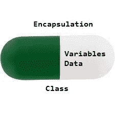

# Java 中的封装

> 原文:[https://www.geeksforgeeks.org/encapsulation-in-java/](https://www.geeksforgeeks.org/encapsulation-in-java/)

封装被定义为将数据包装在一个单元下。它是将代码及其操作的数据绑定在一起的机制。考虑封装的另一种方式是，它是一个保护屏障，防止数据被这个屏障之外的代码访问。

*   从技术上讲，在封装中，一个类的变量或数据对任何其他类都是隐藏的，只能通过声明它的自己的类的任何成员函数来访问。
*   如同在封装中一样，一个类中的数据使用数据隐藏概念对其他类进行隐藏，这是通过使一个类的成员或方法私有来实现的，并且该类向最终用户或世界公开，而不提供使用抽象概念的实现背后的任何细节，因此它也被称为数据隐藏和抽象的**组合**。
*   封装可以通过将类中的所有变量声明为私有，并在类中编写公共方法来设置和获取变量值来实现



访问封装演示类变量的程序如下所示:

## Java 语言(一种计算机语言，尤用于创建网站)

```java
// Java program to demonstrate encapsulation
class Encapsulate {
    // private variables declared
    // these can only be accessed by
    // public methods of class
    private String geekName;
    private int geekRoll;
    private int geekAge;

    // get method for age to access
    // private variable geekAge
    public int getAge() { return geekAge; }

    // get method for name to access
    // private variable geekName
    public String getName() { return geekName; }

    // get method for roll to access
    // private variable geekRoll
    public int getRoll() { return geekRoll; }

    // set method for age to access
    // private variable geekage
    public void setAge(int newAge) { geekAge = newAge; }

    // set method for name to access
    // private variable geekName
    public void setName(String newName)
    {
        geekName = newName;
    }

    // set method for roll to access
    // private variable geekRoll
    public void setRoll(int newRoll) { geekRoll = newRoll; }
}

public class TestEncapsulation {
    public static void main(String[] args)
    {
        Encapsulate obj = new Encapsulate();

        // setting values of the variables
        obj.setName("Harsh");
        obj.setAge(19);
        obj.setRoll(51);

        // Displaying values of the variables
        System.out.println("Geek's name: " + obj.getName());
        System.out.println("Geek's age: " + obj.getAge());
        System.out.println("Geek's roll: " + obj.getRoll());

        // Direct access of geekRoll is not possible
        // due to encapsulation
        // System.out.println("Geek's roll: " +
        // obj.geekName);
    }
}
```

**Output**

```java
Geek's name: Harsh
Geek's age: 19
Geek's roll: 51
```