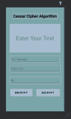

# 使用凯撒密码算法的安卓加解密应用

> 原文:[https://www . geesforgeks . org/加密解密-安卓应用-使用-凯撒-密码-算法/](https://www.geeksforgeeks.org/encryption-and-decryption-application-in-android-using-caesar-cipher-algorithm/)

这里我们要做一个“加解密”的应用。通过制作这个应用程序，我们将能够了解如何将普通文本转换为[密文](https://en.wikipedia.org/wiki/Ciphertext)并加密我们的消息。我们还将在密钥的帮助下解密我们的消息，再次将其转换为可读形式。本文将帮助您介绍 android 开发中密码学的基本概念。

**先决条件:**

在继续应用程序之前，您应该了解密码学中的凯撒密码算法。如果你不知道，可以用【密码学中的[凯撒密码](https://www.geeksforgeeks.org/caesar-cipher-in-cryptography/)一文来了解一下。

### 我们将在本文中构建什么？

在这个应用程序中，我们将提供一个空间(文本视图)来显示加密或解密消息的输出。消息、密文和密钥将作为用户的输入。将创建一个名为实用程序的 java 类来编写加密和解密按钮的逻辑。注意，我们将使用 **Java** 语言来实现这个应用程序。下面给出了一个示例视频，以了解我们将在本文中做什么。

<video class="wp-video-shortcode" id="video-628574-1" width="640" height="360" preload="metadata" controls=""><source type="video/mp4" src="https://media.geeksforgeeks.org/wp-content/uploads/20210616061037/WhatsApp-Video-2021-06-16-at-06.07.28.mp4?_=1">[https://media.geeksforgeeks.org/wp-content/uploads/20210616061037/WhatsApp-Video-2021-06-16-at-06.07.28.mp4](https://media.geeksforgeeks.org/wp-content/uploads/20210616061037/WhatsApp-Video-2021-06-16-at-06.07.28.mp4)</video>

现在让我们看看这个应用程序的逐步实现。

### **分步实施**

**第一步:创建新项目**

*   打开一个新项目。
*   我们将使用 Java 语言来处理空活动。保持所有其他选项不变。
*   您可以在方便的时候更改项目的名称。
*   将有两个名为 **activity_main.xml 和 MainActivity.java**的默认文件。

如果你不知道如何在安卓工作室创建新项目，那么你可以参考[如何在安卓工作室创建/启动新项目？](https://www.geeksforgeeks.org/android-how-to-create-start-a-new-project-in-android-studio/)

**第二步:使用 activity_main.xml 文件**

在这里，我们将设计应用程序的用户界面。我们将在他们各自的作品中使用以下组件:

*   文本视图–显示输出(加密或解密的消息)。
*   编辑文本–接受输入(消息、密文和密钥)。
*   按钮–点击可加密或解密信息。

导航到**应用程序> res >布局> activity_main.xml** 并将下面的代码添加到该文件中。

## 可扩展标记语言

```
<?xml version="1.0" encoding="utf-8"?>
<androidx.constraintlayout.widget.ConstraintLayout 
    xmlns:android="http://schemas.android.com/apk/res/android"
    xmlns:app="http://schemas.android.com/apk/res-auto"
    xmlns:tools="http://schemas.android.com/tools"
    android:layout_width="match_parent"
    android:layout_height="match_parent"
    android:background="#7AA4A8"
    tools:context=".MainActivity">

    <!-- This text view is used to show the 
         output of encrypted or decrypted message  -->
    <TextView
        android:id="@+id/tV1"
        android:layout_width="0dp"
        android:layout_height="200dp"
        android:layout_marginStart="27dp"
        android:layout_marginEnd="27dp"
        android:layout_marginBottom="25dp"
        android:background="#A8BDD1"
        android:gravity="center_vertical|center_horizontal"
        android:hint="Enter Your Text"
        android:padding="20dp"
        android:textColor="@color/black"
        android:textSize="40sp"
        app:layout_constraintBottom_toTopOf="@id/inputMessage"
        app:layout_constraintEnd_toEndOf="parent"
        app:layout_constraintHorizontal_bias="0.0"
        app:layout_constraintStart_toStartOf="parent"
        app:layout_constraintTop_toBottomOf="@+id/tV2" />

    <!-- This text view is used to show 
         the text "Caesar Cipher AAlgorithm" -->
    <TextView
        android:id="@+id/tV2"
        android:layout_width="wrap_content"
        android:layout_height="wrap_content"
        android:layout_marginTop="42dp"
        android:layout_marginBottom="36dp"
        android:text="Caesar Cipher Algorithm"
        android:textColor="#070000"
        android:textSize="28sp"
        android:textStyle="bold"
        app:layout_constraintBottom_toTopOf="@id/tV1"
        app:layout_constraintEnd_toEndOf="parent"
        app:layout_constraintStart_toStartOf="parent"
        app:layout_constraintTop_toTopOf="parent" />

    <!-- Button to perform the operations 
         to encrypt the message-->
    <Button
        android:id="@+id/btnencrypt"
        android:layout_width="0dp"
        android:layout_height="50dp"
        android:layout_marginStart="30dp"
        android:layout_marginEnd="30dp"
        android:background="#000000"
        android:text="Encrypt"
        android:textColor="#390F0F"
        android:textSize="18sp"
        android:textStyle="bold"
        app:backgroundTint="#A8BDD1"
        app:layout_constraintBaseline_toBaselineOf="@+id/btndecrypt"
        app:layout_constraintEnd_toStartOf="@+id/btndecrypt"
        app:layout_constraintStart_toStartOf="parent" />

    <!-- Button to perform the operations
         to decrypt the message-->
    <Button
        android:id="@+id/btndecrypt"
        android:layout_width="165dp"
        android:layout_height="49dp"
        android:layout_marginEnd="31dp"
        android:layout_marginRight="31dp"
        android:layout_marginBottom="90dp"
        android:background="@color/black"
        android:text="Decrypt"
        android:textColor="#421414"
        android:textSize="18sp"
        android:textStyle="bold"
        app:backgroundTint="#A8BDD1"
        app:layout_constraintBottom_toBottomOf="parent"
        app:layout_constraintEnd_toEndOf="parent"
        app:layout_constraintStart_toEndOf="@+id/btnencrypt"
        app:layout_constraintTop_toBottomOf="@+id/key_dt" />

    <!-- Edit text to take input of message 
         which user want to encrypt-->
    <EditText
        android:id="@+id/inputMessage"
        android:layout_width="0dp"
        android:layout_height="50dp"
        android:layout_marginStart="32dp"
        android:layout_marginEnd="32dp"
        android:hint="Your Message"
        android:textColor="@color/black"
        app:layout_constraintBottom_toTopOf="@+id/ciphEdt"
        app:layout_constraintEnd_toEndOf="parent"
        app:layout_constraintHorizontal_bias="0.0"
        app:layout_constraintStart_toStartOf="parent"
        app:layout_constraintTop_toBottomOf="@+id/tV2" />

    <!-- Edit text to take input of ciphertext 
         using which encryption will be done -->
    <EditText
        android:id="@+id/ciphEdt"
        android:layout_width="356dp"
        android:layout_height="50dp"
        android:layout_marginStart="29dp"
        android:layout_marginEnd="29dp"
        android:layout_marginBottom="17dp"
        android:hint="Cipher Text"
        android:textColor="@color/black"
        app:layout_constraintBottom_toTopOf="@+id/key_dt"
        app:layout_constraintEnd_toEndOf="parent"
        app:layout_constraintStart_toStartOf="parent"
        app:layout_constraintTop_toBottomOf="@+id/inputMessage" />

    <!-- Edit text to take input of key using
         which message will be decrypted -->
    <EditText
        android:id="@+id/key_dt"
        android:layout_width="356dp"
        android:layout_height="50dp"
        android:layout_marginStart="29dp"
        android:layout_marginEnd="29dp"
        android:layout_marginBottom="21dp"
        android:hint="Key"
        android:textColor="@color/black"
        app:layout_constraintBottom_toTopOf="@+id/btndecrypt"
        app:layout_constraintEnd_toEndOf="parent"
        app:layout_constraintStart_toStartOf="parent"
        app:layout_constraintTop_toBottomOf="@+id/ciphEdt" />

</androidx.constraintlayout.widget.ConstraintLayout>
```

实现上述代码后，activity_main.xml 文件的设计如下所示。



**第三步:创建一个新的 java 类**

如下所示创建一个新的 java 类，并将其命名为“**实用工具**”。


**第四步:使用 utility.java 文件**

加密和解密我们的消息的所有逻辑都将写在这个类中。在此类中使用下面提供的代码:

## Java 语言(一种计算机语言，尤用于创建网站)

```
public class utility {

    // Declaration of all the required variables
    private static String alphabet = "ABCDEFGHIJKLMNOPQRSTUVWXYZ";
    private static int index;
    private static int updated_index;
    private static int final_index;
    private static int index_p_t_l;
    private static int index_s_t_l;
    private static String plainTxt;
    private static String cipherTxt;
    private static String finalTxt;

    // code for encryption
    public static String encrypt1(String plaintext, int encrptionKey) {
        reset();
        // plaintext is converted to uppercase 
        // so that it is easy to convert according
        // to Caesar Cipher algorithm
        plaintext = plaintext.toUpperCase();
        // using a for loop the use index and 
        // change text with help of it
        for (index = 0; index < plaintext.length(); index++) {
            // checking the condition for plaintext to be
            // null at some character position
            if (plaintext.charAt(index) != ' ') {
                index_p_t_l = alphabet.indexOf(plaintext.charAt(index));
                // index is being updated 
                // so that next and final index
                // be used for ciphertext
                updated_index = encrptionKey + alphabet.indexOf(plaintext.charAt(index));
                if (updated_index >= alphabet.length()) {
                    final_index = updated_index - alphabet.length();
                } else
                    final_index = updated_index;
                // substring is used so that every character
                // can be separately converted to ciphertext
                cipherTxt = alphabet.substring(final_index, final_index + 1);
                finalTxt = finalTxt + cipherTxt;
            }
        }
        // returning the 
        // final changed text
        return finalTxt;
    }

    // code for decryption
    public static String decrypt1(String ciphertext, int decryptionKey) {
        reset();
        ciphertext = ciphertext.toUpperCase();
        // using a for loop the use index and 
        // change text with help of it
        for (index = 0; index < ciphertext.length(); index++) {
            if (ciphertext.charAt(index) != ' ') {
                index_p_t_l = alphabet.indexOf(ciphertext.charAt(index));
                index_s_t_l = index_p_t_l;
                // index is updated with help of decryption
                // key which we provided as input
                updated_index = alphabet.indexOf(ciphertext.charAt(index)) - decryptionKey;
                if (updated_index < 0) {
                    final_index = updated_index + alphabet.length();
                } else
                    final_index = updated_index;
                // reverse of encryption is done as 
                // substring here is used to convert
                // each ciphertext character to plaintext 
                plainTxt = alphabet.substring(final_index, final_index + 1);
                finalTxt += plainTxt;
            }
        }
        // returning the 
        // final changed text
        return finalTxt;
    }

    // method to reset the text
    // in the output textview
    private static void reset() {
        finalTxt = "";
    }
}
```

**第五步:使用 MainActivity.java 文件**

在 MainActivity.java 文件中，onClickListerner 用于加密和解密按钮，实用程序类的方法直接在这里传递。在**MainActivity.java**文件中使用以下代码。

## Java 语言(一种计算机语言，尤用于创建网站)

```
import android.os.Bundle;
import android.view.View;
import android.widget.Button;
import android.widget.EditText;
import android.widget.TextView;

import androidx.appcompat.app.AppCompatActivity;

public class MainActivity extends AppCompatActivity {

    // declaring all essential variables
    private Button encrypt, decrypt;
    private EditText message, cipher, key;
    private TextView screen_output;
    private static final String alphabetString = "abcdefghijklmnopqrstuvwxyz";

    @Override
    protected void onCreate(Bundle savedInstanceState) {
        super.onCreate(savedInstanceState);
        setContentView(R.layout.activity_main);

        // findViewById is the method that 
        // finds the View by the ID it is given
        encrypt = findViewById(R.id.btnencrypt);
        decrypt = findViewById(R.id.btndecrypt);
        screen_output = findViewById(R.id.tV1);
        message = findViewById(R.id.inputMessage);
        cipher = findViewById(R.id.ciphEdt);
        key = findViewById(R.id.key_dt);

        // setting onCLickLister on encrypt button
        encrypt.setOnClickListener(new View.OnClickListener() {
            @Override
            public void onClick(View view) {
                encrypt12(message.getText().toString(), Integer.parseInt(key.getText().toString()));
            }
        });

        // setting onCLickLister on decrypt button
        decrypt.setOnClickListener(new View.OnClickListener() {
            @Override
            public void onClick(View view) {
                decrypt12(cipher.getText().toString(), Integer.parseInt(key.getText().toString()));
            }
        });
    }

    // method to show the final output on the output
    // textView when decrypt button is clicked
    public void decrypt12(String cipher, int key) {
        screen_output.setText((utility.decrypt1(cipher, key).toLowerCase()));
    }

    // method to show the final output on the output
    // textView when encrypt button is clicked
    public String encrypt12(String message, int shiftkey) {
        message = message.toLowerCase();
        String cipherText = "";
        for (int i = 0; i < message.length(); i++) {
            int charPosition = alphabetString.indexOf(message.charAt(i));
            int keyval = (shiftkey + charPosition) % 26;
            char replaceVAL = alphabetString.charAt(keyval);
            cipherText += replaceVAL;
            screen_output.setText(cipherText);
            cipher.setText(cipherText);
        }

        // returning the final ciphertext
        return cipherText;
    }
}
```

恭喜你！！您已经成功地使用凯撒密码算法进行了加密和解密应用。这是我们应用程序的最终输出。

**输出:**

<video class="wp-video-shortcode" id="video-628574-2" width="640" height="360" preload="metadata" controls=""><source type="video/mp4" src="https://media.geeksforgeeks.org/wp-content/uploads/20210616061037/WhatsApp-Video-2021-06-16-at-06.07.28.mp4?_=2">[https://media.geeksforgeeks.org/wp-content/uploads/20210616061037/WhatsApp-Video-2021-06-16-at-06.07.28.mp4](https://media.geeksforgeeks.org/wp-content/uploads/20210616061037/WhatsApp-Video-2021-06-16-at-06.07.28.mp4)</video>

> **注意:**输入的键号不要超过 26，因为我们已经对 26 个字母使用了凯撒密码算法。如果密钥超过 26，应用程序可能会崩溃。

**GitHub 链接:**[https://GitHub . com/Karan-Jangir/Caesar _ cipher _ algorithm _ cryptography](https://github.com/Karan-Jangir/caesar_cipher_algorithm_crytography)