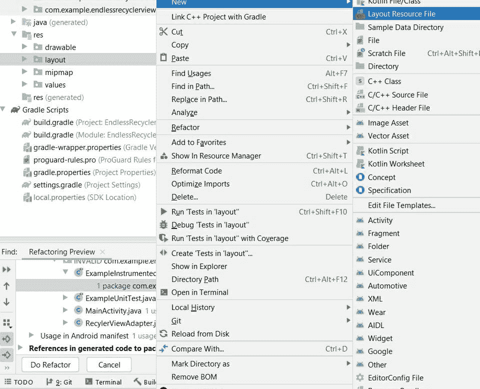
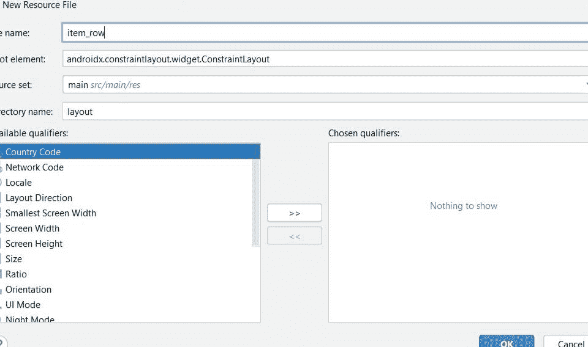

# 安卓中的无尽回收视图

> 原文:[https://www . geeksforgeeks . org/endless-recycle view-in-Android/](https://www.geeksforgeeks.org/endless-recyclerview-in-android/)

在这篇文章中，我们将看到如何在**安卓工作室中构建一个无尽的[回收视图](https://www.geeksforgeeks.org/android-recyclerview/)。**多用于设计对安卓应用的列表和网格有很大控制力的用户界面。我们可以使用 RecyclerView 实现水平和垂直布局。在这里，我们将创建一个**回收视图**和一个**加载更多**选项。下面显示了一个示例视频，以了解我们将在本文中做什么。注意，我们将使用 **Java** 作为编程语言。

<video class="wp-video-shortcode" id="video-590605-1" width="640" height="360" preload="metadata" controls=""><source type="video/mp4" src="https://media.geeksforgeeks.org/wp-content/uploads/20210403141248/WhatsApp-Video-2021-04-03-at-2.04.36-PM.mp4?_=1">[https://media.geeksforgeeks.org/wp-content/uploads/20210403141248/WhatsApp-Video-2021-04-03-at-2.04.36-PM.mp4](https://media.geeksforgeeks.org/wp-content/uploads/20210403141248/WhatsApp-Video-2021-04-03-at-2.04.36-PM.mp4)</video>

### **分步实施**

**第一步:创建新项目**

要在安卓工作室创建新项目，请参考[如何在安卓工作室创建/启动新项目](https://www.geeksforgeeks.org/android-how-to-create-start-a-new-project-in-android-studio/)。注意选择 **Java** 作为编程语言。

**步骤 2:使用 activity_main.xml 文件**

导航到**应用程序> res >布局> activity_main.xml** 并将下面的代码添加到该文件中。下面是 **activity_main.xml** 文件的代码。

## 可扩展标记语言

```
<?xml version="1.0" encoding="utf-8"?>
<androidx.constraintlayout.widget.ConstraintLayout 
    xmlns:android="http://schemas.android.com/apk/res/android"
    xmlns:app="http://schemas.android.com/apk/res-auto"
    xmlns:tools="http://schemas.android.com/tools"
    android:layout_width="match_parent"
    android:layout_height="match_parent"
    android:orientation="vertical"
    tools:context=".MainActivity">

    <!--RecyclerView is Added. The attribute  
        app:layoutManager="androidx.recyclerview.widget.LinearLayoutManager"
        is used for Linear Layout Manager-->
    <androidx.recyclerview.widget.RecyclerView
        android:id="@+id/recyclerView"
        android:layout_width="match_parent"
        android:layout_height="match_parent"
        app:layoutManager="androidx.recyclerview.widget.LinearLayoutManager"
        app:layout_constraintBottom_toBottomOf="parent"
        app:layout_constraintLeft_toLeftOf="parent"
        app:layout_constraintRight_toRightOf="parent"
        app:layout_constraintTop_toTopOf="parent" />

</androidx.constraintlayout.widget.ConstraintLayout>
```

**第三步:新建布局资源文件**

创建一个名为**的新  布局资源文件。要创建新的布局资源文件，请导航至**资源>布局**。右键点击布局文件夹，然后点击**新建**然后点击**布局资源文件**，一个对话框打开，给你的布局资源文件添加一个名称，然后点击**确定**按钮。您的新布局资源文件已创建。遵循下面给出的图片:**

 

**第四步:使用 item_row.xml 文件**

转到**布局> item_row.xml** 文件，并将下面的代码添加到该文件中。这里定义了回收视图行的布局。

## 可扩展标记语言

```
<?xml version="1.0" encoding="utf-8"?>
<androidx.cardview.widget.CardView 
    xmlns:android="http://schemas.android.com/apk/res/android"
    xmlns:app="http://schemas.android.com/apk/res-auto"
    android:layout_width="match_parent"
    android:layout_height="match_parent"
    app:cardElevation="8dp"
    app:cardUseCompatPadding="true">

    <!--TextView Added for the layout 
        of rows of the recyclerview-->
    <TextView
        android:id="@+id/tvItem"
        android:layout_width="wrap_content"
        android:layout_height="wrap_content"
        android:padding="16dp"
        android:text="Item X" />

</androidx.cardview.widget.CardView>
```