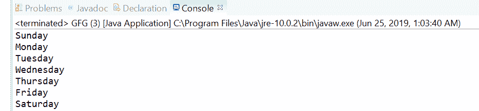
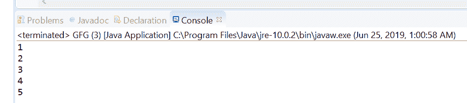

# 列举 Java 中的 asIterator()方法并举例

> 原文:[https://www . geesforgeks . org/enumeration-ASI terator-method-in-Java-with-examples/](https://www.geeksforgeeks.org/enumeration-asiterator-method-in-java-with-examples/)

实现**枚举接口**的对象生成一系列元素，一次一个。**枚举**的**Asisterror()**方法，用于返回遍历该枚举覆盖的剩余元素的迭代器。如果在调用 asIterator()后在此枚举上调用了任何方法，则遍历是未定义的。

**语法:**

```java
default Iterator asIterator()

```

**参数:**此方法不接受任何内容。

**返回值:**这个方法返回一个**迭代器**，代表这个枚举的剩余元素。

下面的程序举例说明了阿西特尔()方法:
**程序 1:**

```java
// Java program to demonstrate
// Enumeration.asIterator() method

import java.util.*;

public class GFG {

    public static void main(String[] args)
    {

        // create enumeration
        Enumeration Days;
        Vector week = new Vector();

        week.add("Sunday");
        week.add("Monday");
        week.add("Tuesday");
        week.add("Wednesday");
        week.add("Thursday");
        week.add("Friday");
        week.add("Saturday");
        Days = week.elements();

        // get the iterator
        Days.asIterator()
            .forEachRemaining(s -> System.out.println(s));
    }
}
```



**程序 2:**

```java
// Java program to demonstrate
// Enumeration.asIterator() method

import java.util.*;

public class GFG {

    public static void main(String[] args)
    {

        // create enumeration
        Enumeration<Integer> classNine;
        Vector<Integer> rollno
            = new Vector<Integer>();

        rollno.add(1);
        rollno.add(2);
        rollno.add(3);
        rollno.add(4);
        rollno.add(5);
        classNine = rollno.elements();

        // get the iterator
        classNine.asIterator()
            .forEachRemaining(s -> System.out.println(s));
    }
}
```



**参考文献:**T2