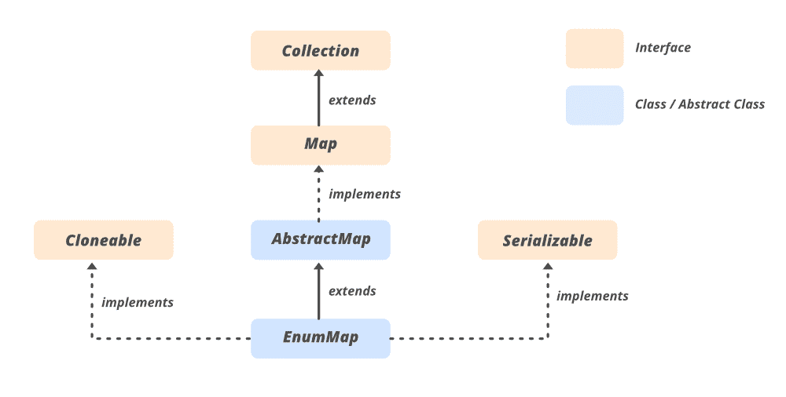

# Java 中的 EnumMap 类

> 原文:[https://www.geeksforgeeks.org/enummap-class-java-example/](https://www.geeksforgeeks.org/enummap-class-java-example/)

EnumMap 是[枚举类型](https://www.geeksforgeeks.org/enum-in-java/)的[映射接口](https://www.geeksforgeeks.org/map-interface-java-examples/)的专门实现。它扩展了抽象地图，并在 Java 中实现了[地图](https://www.geeksforgeeks.org/map-interface-java-examples/)界面。属于 [java.util 包](https://www.geeksforgeeks.org/java-util-package-java/)。EnumMap 的几个重要特性如下:

*   EnumMap 类是 [Java 集合框架的成员](https://www.geeksforgeeks.org/collections-in-java-2/) &是不同步的。
*   EnumMap 是一个有序集合，它们按照其键的自然顺序进行维护(键的自然顺序意味着枚举常量在枚举类型中声明的顺序)
*   这是一个高性能的地图实现，比 [HashMap](https://www.geeksforgeeks.org/hashmap-treemap-java/) 快得多。
*   每个枚举实例的所有键必须是单个[枚举](https://www.geeksforgeeks.org/enum-in-java/)类型的键。
*   EnumMap 不允许空键，当我们试图插入空键时会抛出[NullPointerException](http://www.geeksforgeeks.org/null-pointer-exception-in-java/)**。**
*   **集合视图返回的迭代器弱一致性:它们永远不会抛出[ConcurrentModificationException](https://www.geeksforgeeks.org/concurrentmodificationexception-in-java-with-examples/)，并且它们可能显示也可能不显示迭代过程中对地图进行的任何修改的效果。**
*   **EnumMap 在内部表示为数组。这种表示非常紧凑和高效。**

****语法:**声明**

```java
public class EnumMap<K extends Enum<K>,​V> extends AbstractMap<K,​V> implements Serializable, Cloneable
```

****参数:****

*   **关键对象类型**
*   **值对象类型**

> ****K** 必须扩展[枚举](https://www.geeksforgeeks.org/java-lang-enum-class-java/)，这强制要求密钥必须是指定的[枚举](https://www.geeksforgeeks.org/enum-in-java/)类型。**

### **枚举层次结构**

****

### **枚举的构造函数**

1.  ****枚举映射(类键类型):**构造函数用于用指定的*键类型*创建一个空枚举映射。**
2.  ****枚举映射(EnumMap m):** 构造函数用于创建一个枚举映射，该映射与指定的枚举映射具有相同的键类型，初始映射与 EnumMap 相同**
3.  ****枚举映射(Map m):** 构造函数用于从参数中指定的映射创建一个带有初始化的枚举映射。**

****例****

## **Java 语言(一种计算机语言，尤用于创建网站)**

```java
// Java Program to illustrate Working of EnumMap class
// and its functions

// Importing EnumMap class
import java.util.EnumMap;

// Main class
public class EnumMapExample {

    // Enum
    public enum GFG {
        CODE,
        CONTRIBUTE,
        QUIZ,
        MCQ;
    }

    // Main driver method
    public static void main(String args[])
    {

        // Java EnumMap
        // Creating an empty EnumMap with key
        // as enum type state
        EnumMap<GFG, String> gfgMap
            = new EnumMap<GFG, String>(GFG.class);

        // Putting values inside EnumMap in Java
        // Inserting Enum keys different from
        // their natural order
        gfgMap.put(GFG.CODE, "Start Coding with gfg");
        gfgMap.put(GFG.CONTRIBUTE, "Contribute for others");
        gfgMap.put(GFG.QUIZ, "Practice Quizes");
        gfgMap.put(GFG.MCQ, "Test Speed with Mcqs");

        // Printing size of EnumMap
        System.out.println("Size of EnumMap in java: "
                           + gfgMap.size());

        // Printing Java EnumMap
        // Print EnumMap in natural order
        // of enum keys (order on which they are declared)
        System.out.println("EnumMap: " + gfgMap);

        // Retrieving value from EnumMap
        System.out.println("Key : " + GFG.CODE + " Value: "
                           + gfgMap.get(GFG.CODE));

        // Checking if EnumMap contains a particular key
        System.out.println(
            "Does gfgMap has " + GFG.CONTRIBUTE + ": "
            + gfgMap.containsKey(GFG.CONTRIBUTE));

        // Checking if EnumMap contains a particular value
        System.out.println(
            "Does gfgMap has :" + GFG.QUIZ + " : "
            + gfgMap.containsValue("Practice Quizes"));
        System.out.println("Does gfgMap has :" + GFG.QUIZ
                           + " : "
                           + gfgMap.containsValue(null));
    }
}
```

****Output**

```java
Size of EnumMap in java: 4
EnumMap: {CODE=Start Coding with gfg, CONTRIBUTE=Contribute for others, QUIZ=Practice Quizes, MCQ=Test Speed with Mcqs}
Key : CODE Value: Start Coding with gfg
Does gfgMap has CONTRIBUTE: true
Does gfgMap has :QUIZ : true
Does gfgMap has :QUIZ : false
```** 

### ****枚举菜单上的基本操作****

****操作 1:** 添加元素**

**为了向 EnumMap 添加元素，我们可以使用 put()或 putAll()方法，如下所示。**

## **Java 语言(一种计算机语言，尤用于创建网站)**

```java
// Java Program to Add Elements to the EnumMap

// Importing EnumMap class
import java.util.EnumMap;

// Main class
// AddingElementsToEnumMap
class GFG {

    enum Color { RED, GREEN, BLUE, WHITE }
    public static void main(String[] args)
    {

        // Creating an EnumMap of the Color enum
        EnumMap<Color, Integer> colors1
            = new EnumMap<>(Color.class);

        // Insert elements in Map
        // using put() method
        colors1.put(Color.RED, 1);
        colors1.put(Color.GREEN, 2);

        // Printing mappings to the console
        System.out.println("EnumMap colors1: " + colors1);

        // Creating an EnumMap of the Color Enum
        EnumMap<Color, Integer> colors2
            = new EnumMap<>(Color.class);

        // Adding elements using the putAll() method
        colors2.putAll(colors1);
        colors2.put(Color.BLUE, 3);

        // Printing mappings to the console
        System.out.println("EnumMap colors2: " + colors2);
    }
}
```

****Output**

```java
EnumMap colors1: {RED=1, GREEN=2}
EnumMap colors2: {RED=1, GREEN=2, BLUE=3}
```** 

****操作 2:** 访问元素**

**我们可以使用 entrySet()，keySet()，values()，get()来访问 EnumMap 的元素。下面的例子解释了这些方法。**

## **Java 语言(一种计算机语言，尤用于创建网站)**

```java
// Java Program to Access the Elements of EnumMap

// Importing required classes
import java.util.EnumMap;

// Main class
// AccessElementsOfEnumMap
class GFG {

    // Enum
    enum Color { RED, GREEN, BLUE, WHITE }

    // Main driver method
    public static void main(String[] args)
    {

        // Creating an EnumMap of the Color enum
        EnumMap<Color, Integer> colors
            = new EnumMap<>(Color.class);

        // Inserting elements using put() method
        colors.put(Color.RED, 1);
        colors.put(Color.GREEN, 2);
        colors.put(Color.BLUE, 3);
        colors.put(Color.WHITE, 4);

        System.out.println("EnumMap colors : " + colors);

        // Using the entrySet() method
        System.out.println("Key/Value mappings: "
                           + colors.entrySet());

        // Using the keySet() method
        System.out.println("Keys: " + colors.keySet());

        // Using the values() method
        System.out.println("Values: " + colors.values());

        // Using the get() method
        System.out.println("Value of RED : "
                           + colors.get(Color.RED));
    }
}
```

****Output**

```java
EnumMap colors : {RED=1, GREEN=2, BLUE=3, WHITE=4}
Key/Value mappings: [RED=1, GREEN=2, BLUE=3, WHITE=4]
Keys: [RED, GREEN, BLUE, WHITE]
Values: [1, 2, 3, 4]
Value of RED : 1
```** 

****操作 3:** 移除元素**

**为了移除元素，EnumMap 提供了 remove()方法的两种变体。**

****例****

## **Java 语言(一种计算机语言，尤用于创建网站)**

```java
// Java program to Remove Elements of EnumMap

// Importing EnumMap class
import java.util.EnumMap;

// Main class
class GFG {

    // Enum
    enum Color {

        // Custom elements
        RED,
        GREEN,
        BLUE,
        WHITE
    }

    // Main driver method
    public static void main(String[] args)
    {

        // Creating an EnumMap of the Color enum
        EnumMap<Color, Integer> colors
            = new EnumMap<>(Color.class);

        // Inserting elements in the Map
        // using put() method
        colors.put(Color.RED, 1);
        colors.put(Color.GREEN, 2);
        colors.put(Color.BLUE, 3);
        colors.put(Color.WHITE, 4);

        // Printing colors in the EnumMap
        System.out.println("EnumMap colors : " + colors);

        // Removing a mapping
        // using remove() Method
        int value = colors.remove(Color.WHITE);

        // Displaying the removed value
        System.out.println("Removed Value: " + value);

        // Removing specific color and storing boolean
        // if removed or not
        boolean result = colors.remove(Color.RED, 1);

        // Printing the boolean result whether removed or
        // not
        System.out.println("Is the entry {RED=1} removed? "
                           + result);

        // Printing the updated Map to the console
        System.out.println("Updated EnumMap: " + colors);
    }
}
```

****Output**

```java
EnumMap colors : {RED=1, GREEN=2, BLUE=3, WHITE=4}
Removed Value: 4
Is the entry {RED=1} removed? true
Updated EnumMap: {GREEN=2, BLUE=3}
```** 

****操作 4:** 更换元件**

**[映射界面](https://www.geeksforgeeks.org/map-interface-java-examples/)提供了 replace()方法的三种变体来改变 EnumMap 的映射。**

****例****

## **Java 语言(一种计算机语言，尤用于创建网站)**

```java
// Java Program to Replace Elements of EnumMap

// Importing required classes
import java.util.EnumMap;

// Main class
class GFG {

    // Enum
    enum Color {

        RED,
        GREEN,
        BLUE,
        WHITE
    }

    // Main driver method
    public static void main(String[] args)
    {

        // Creating an EnumMap of the Color enum
        EnumMap<Color, Integer> colors
            = new EnumMap<>(Color.class);

        // Inserting elements to Map
        // using put() method
        colors.put(Color.RED, 1);
        colors.put(Color.GREEN, 2);
        colors.put(Color.BLUE, 3);
        colors.put(Color.WHITE, 4);

        // Printing all elements inside above Map
        System.out.println("EnumMap colors " + colors);

        // Replacing certain elements depicting colors
        // using the replace() method
        colors.replace(Color.RED, 11);
        colors.replace(Color.GREEN, 2, 12);

        // Printing the updated elements (colors)
        System.out.println("EnumMap using replace(): "
                           + colors);

        // Replacing all colors using the replaceAll()
        // method
        colors.replaceAll((key, oldValue) -> oldValue + 3);

        // Printing the elements of above Map
        System.out.println("EnumMap using replaceAll(): "
                           + colors);
    }
}
```

****Output**

```java
EnumMap colors {RED=1, GREEN=2, BLUE=3, WHITE=4}
EnumMap using replace(): {RED=11, GREEN=12, BLUE=3, WHITE=4}
EnumMap using replaceAll(): {RED=14, GREEN=15, BLUE=6, WHITE=7}
```** 

### **同步枚举**

**枚举映射的实现不同步。这意味着，如果多个线程同时访问一个树集合，并且至少有一个线程修改了该集合，那么它必须在外部同步。这通常通过使用[集合类](https://www.geeksforgeeks.org/collections-class-in-java/)的 synchronizedMap()方法来实现。这最好在创建时完成，以防止意外的不同步访问。**

```java
 Map<EnumKey, V> m = Collections.synchronizedMap(new EnumMap<EnumKey, V>(...));
```

### **列举方法**

*   **k–关键对象的类型**
*   **v–值对象的类型**

<figure class="table">

| 

方法

 | 

已执行的操作

 |
| --- | --- |
| [晴()](https://www.geeksforgeeks.org/enummap-clear-method-in-java/) | 从此映射中删除所有映射。 |
| [克隆()](https://www.geeksforgeeks.org/enummap-clone-method-in-java/) | 返回此枚举映射的浅层副本。 |
| [包含键(对象键)](https://www.geeksforgeeks.org/enummap-containskey-method-in-java/) | 如果此映射包含指定键的映射，则返回 true。 |
| [包含值(对象值)](https://www.geeksforgeeks.org/enummap-containsvaluevalue-method-in-java/) | 如果此映射将一个或多个键映射到指定值，则返回 true。 |
| [输入 ySet()](https://www.geeksforgeeks.org/enummap-entryset-method-in-java/) | 返回此映射中包含的映射的集合视图。 |
| [等于(对象 o)](https://www.geeksforgeeks.org/enummap-equals-method-in-java-with-examples/) | 将指定的对象与此映射进行比较，看是否相等。 |
| [获取(对象键)](https://www.geeksforgeeks.org/enummap-get-method-in-java/) | 返回指定键映射到的值，如果此映射不包含键映射，则返回 null。 |
| hashCode() | 返回此映射的哈希代码值。 |
| [键集()](https://www.geeksforgeeks.org/enummap-keyset-method-in-java/) | 返回此地图中包含的键的集合视图。 |
| [放(K 键，V 值)](https://www.geeksforgeeks.org/enummap-put-method-in-java/) | 将指定值与此映射中的指定键相关联。 |
| [普塔尔(地图<？延伸 K，？延伸 V > m)](https://www.geeksforgeeks.org/enummap-putallmap-method-in-java/) | 将指定映射中的所有映射复制到此映射。 |
| [移除(对象键)](https://www.geeksforgeeks.org/enummap-remove-method-in-java/) | 从该映射中删除该键的映射(如果存在)。 |
| [尺寸()](https://www.geeksforgeeks.org/enummap-size-method-in-java/) | 返回此映射中键值映射的数量。 |
| [值()](https://www.geeksforgeeks.org/enummap-values-method-in-java/) | 返回此地图中包含的值的集合视图。 |

</figure>

### **抽象映射类中声明的方法**

<figure class="table">

| 

方法

 | 

描述

 |
| --- | --- |
| [【isempty()](https://www.geeksforgeeks.org/abstractmap-isempty-method-in-java-with-examples/) | 如果此映射不包含键值映射，则返回 true。 |
| toString() | 返回此映射的字符串表示形式。 |

</figure>

### **接口中声明的方法**

<figure class="table">

| 

方法

 | 

描述输入

 |
| --- | --- |
| 计算(组合键，双功能 super K,​? super V,​? extends V>恢复功能) | 尝试计算指定键及其当前映射值的映射(如果没有当前映射，则为空)。 |
| 计算不存在(K 键，功能 super K,​? extends V>映射功能) | 如果指定的键尚未与值相关联(或映射为 null)，会尝试使用给定的映射函数计算其值，并将其输入到此映射中，除非为 null。 |
| 计算当前(K 键，双功能 super K,​? super V,​? extends V>恢复功能) | 如果指定键的值存在且不为空，将尝试计算给定键及其当前映射值的新映射。 |
| forEach(双消费者〔t0〕行动) | 对此映射中的每个条目执行给定的操作，直到所有条目都已处理完毕或该操作引发异常。 |
| getOrDefault（Object key， V defaultValue） | 返回指定键映射到的值，如果此映射不包含键映射，则返回默认值。 |
| 合并(K 键，V 值，双功能 super V,​? super V,​? extends V>重映射功能) | 如果指定的键尚未与值相关联或与 null 相关联，则将其与给定的非 null 值相关联。 |
| 莆田(K key，V value) | 如果指定的键还没有与值相关联(或者被映射为 null)，则将它与给定值相关联并返回 null，否则返回当前值。 |
| 移除(对象键，对象值) | 仅当指定项当前映射到指定值时，才移除该项。 |
| 更换(K 键，V 值) | 仅当指定键当前映射到某个值时，才替换该项。 |
| 更换(K 键、旧值、新值) | 仅当当前映射到指定值时，替换指定键的条目。 |
| 替换全部(双功能 super K,​? super V,​? extends V>功能) | 将每个条目的值替换为对该条目调用给定函数的结果，直到所有条目都已处理完毕或函数引发异常。 |

</figure>

### **EnumMap vs EnumSet**

<figure class="table">

| 

财产

 | 

枚举数

 | 

enumset 集

 |
| --- | --- | --- |
| *内部表示* | EnumMap 在内部表示为数组。该表示是紧凑和有效的。 | 枚举在内部表示为位向量或位序列。 |
| *允许空元素？* | 不允许空键，但允许空值。 | 不允许空元素。 |
| *是*抽象类吗？** | 不 | 是 |
| *实例化* | 由于 EnumMap 不是一个抽象类，因此可以使用新的运算符来实例化它。 | 它是一个抽象类，没有构造函数。枚举集是使用它的预定义方法创建的，如 allOf()、noneOf()、Of()等。 |
| *实施* | 枚举映射是一种专用的映射实现，用于枚举类型键。 | 枚举集是一个专门用于枚举类型的集合实现。 |

</figure>

**本文由 [**Pratik Agarwal**](https://www.facebook.com/Pratik.Agarwal01) 供稿。如果你喜欢 GeeksforGeeks 并想投稿，你也可以使用[write.geeksforgeeks.org](http://www.write.geeksforgeeks.org)写一篇文章或者把你的文章邮寄到 review-team@geeksforgeeks.org。看到你的文章出现在极客网的主页上，帮助其他极客。如果你发现任何不正确的地方，或者你想分享更多关于上面讨论的话题的信息，请写评论。**