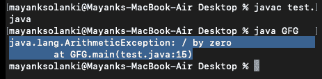

# Java 中的错误 V/s 异常

> 原文:[https://www . geesforgeks . org/errors-v-s-exceptions-in-Java/](https://www.geeksforgeeks.org/errors-v-s-exceptions-in-java/)

在 java 中，Errors 和 Exceptions 都是 java.lang.Throwable 类的子类。[错误](https://www.geeksforgeeks.org/types-of-errors-in-java-with-examples/)是指用户进行了非法操作，导致程序工作异常。在编译或执行程序之前，编程错误通常不会被发现。有些错误会阻止程序被编译或执行。因此，应该在编译和执行之前删除错误。它有三种类型:

*   编译时
*   运行时
*   逻辑学的

而 java 中的[异常](https://www.geeksforgeeks.org/exceptions-in-java/)指的是在程序执行期间(即运行时)发生的干扰程序指令正常流程的不必要或意外事件。


现在让我们讨论各种类型的错误，以便更好地理解数组。正如在标题中所讨论的，错误表示一个合理的应用程序不应该试图捕捉的严重问题。错误是任何处理技术都无法恢复的情况。这肯定会导致程序异常终止。错误属于未检查的类型，大多发生在运行时。一些错误示例是内存不足错误或系统崩溃错误。

**示例 1** 编译时错误

## Java 语言(一种计算机语言，尤用于创建网站)

```java
// Java Program to Illustrate Error
// Stack overflow error via infinite recursion

// Class 1
class StackOverflow {

    // method of this class
    public static void test(int i)
    {
        // No correct as base condition leads to
        // non-stop recursion.
        if (i == 0)
            return;
        else {
            test(i++);
        }
    }
}

// Class 2
// Main class
public class GFG {

    // Main driver method
    public static void main(String[] args)
    {
        // Testing for error by passing
        // custom integer as an argument
        StackOverflow.test(5);
    }
}
```

**输出:**

<video class="wp-video-shortcode" id="video-213842-1" width="640" height="360" preload="metadata" controls=""><source type="video/mp4" src="https://media.geeksforgeeks.org/wp-content/uploads/20210906064258/stackOverFlowError.jpeg.mp4?_=1">[https://media.geeksforgeeks.org/wp-content/uploads/20210906064258/stackOverFlowError.jpeg.mp4](https://media.geeksforgeeks.org/wp-content/uploads/20210906064258/stackOverFlowError.jpeg.mp4)</video>

**例 2**

## Java 语言(一种计算机语言，尤用于创建网站)

```java
// Java Program to Illustrate Run-time Errors

// Main class
class GFG {

    // Main driver method
    public static void main(String args[])
    {

        // Declaring and initializing numbers
        int a = 2, b = 8, c = 6;

        if (a > b && a > c)
            System.out.println(a
                               + " is the largest Number");
        else if (b > a && b > c)
            System.out.println(b
                               + " is the smallest Number");

        // The correct message should have been
        // System.out.println
        // (b+" is the largest Number"); to make logic
        else
            System.out.println(c
                               + " is the largest Number");
    }
}
```

**Output**

```java
8 is the smallest Number
```

**现在让我们详细讨论异常****表示一个合理的应用程序可能想要捕捉的条件。异常是运行时出现的可能导致程序终止的情况。但是使用 try、catch 和 throw 关键字是可以恢复的。例外分为两类:**

*   **[已检查异常情况](https://www.geeksforgeeks.org/checked-vs-unchecked-exceptions-in-java/)**
*   **[未检查的异常](https://www.geeksforgeeks.org/checked-vs-unchecked-exceptions-in-java/)**

**编译器在编译时已知的类似 IOException 的已检查异常，而编译器在运行时已知的类似 ArrayIndexOutOfBoundException 的未检查异常。大部分是程序员写的程序造成的。**

****例**异常**

## **Java 语言(一种计算机语言，尤用于创建网站)**

```java
// Java program illustrating exception thrown
// by AritmeticExcpetion class

// Main class
class GFG {

    // main driver method
    public static void main(String[] args)
    {
        int a = 5, b = 0;

        // Try-catch block to check and handle exceptions
        try {

            // Attempting to divide by zero
            int c = a / b;
        }
        catch (ArithmeticException e) {

            // Displaying line number where exception occured
            // using printStackTrace() method
            e.printStackTrace();
        }
    }
}
```

****输出:****

****

**最后，通过以表格形式绘制出它们之间的差异来总结本文，如下所示:**

<figure class="table">

| 错误 | 例外 |
| --- | --- |
| 从错误中恢复是不可能的。 | 我们可以通过使用 try-catch 块或向错误抛出异常来从异常中恢复。 |
| java 中的所有错误都是未检查的类型。 | 例外包括已检查类型和未检查类型。 |
| 错误主要是由程序运行的环境引起的。 | 程序本身负责导致异常。 |
| 错误可能发生在编译时，也可能发生在运行时。编译时间:例如语法错误运行时间:逻辑错误。 | 所有异常都发生在运行时，但编译器知道已检查的异常，而未检查的异常则不知道。 |
| 它们是在 java.lang.Error 包中定义的。 | 它们在 java.lang.Exception 包中定义 |
| 示例:java.lang.StackOverflowError，java.lang.OutOfMemoryError | 示例:选中的异常:SQLException，IOException 未选中的异常:ArrayIndexOutOfBoundException，NullPointerException，ArithmeticException。 |

</figure>