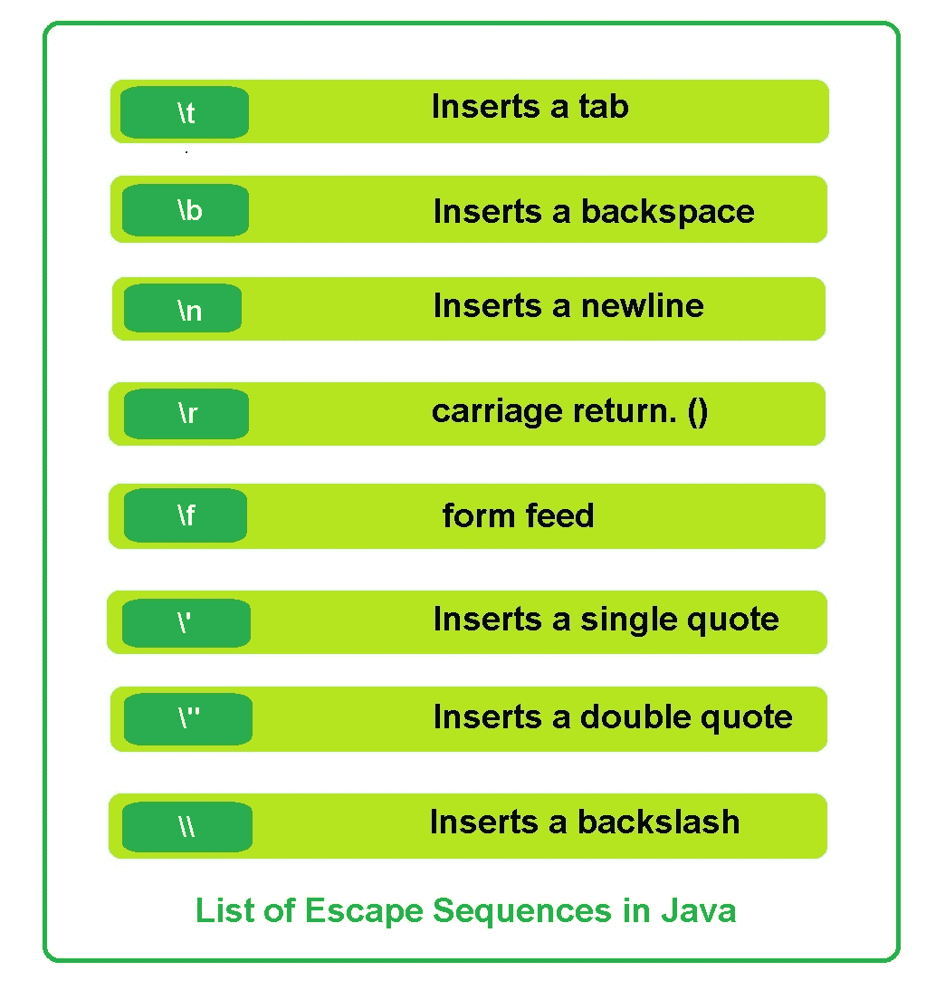

# Java 中的转义序列

> 原文:[https://www.geeksforgeeks.org/escape-sequences-in-java/](https://www.geeksforgeeks.org/escape-sequences-in-java/)

在其前面带有反斜杠(\)的字符是转义序列或转义字符。我们使用转义字符来执行一些特定的任务。Java 中转义序列或转义字符的总数为 8。每个转义字符都是有效的字符文本。
Java 转义序列列表:


**为什么我们会需要 Escape 序列？**
假设我们想要运行后续的 java 代码:

```java
public class Test {
    public static void main(String[] args)
    {
        System.out.println("Hi geek, welcome to " GeeksforGeeks ".");
    }
}
```

这段代码给出了如下编译时错误:

```java
prog.java:3: error: ')' expected
    System.out.println("Hi geek, welcome to "GeeksforGeeks".");
                                             ^
prog.java:3: error: not a statement
    System.out.println("Hi geek, welcome to "GeeksforGeeks".");
                                                          ^
prog.java:3: error: ';' expected
    System.out.println("Hi geek, welcome to "GeeksforGeeks".");
                                                             ^
3 errors
```

发生这种情况是因为编译器除了引号内的字符串之外什么都不需要，但是当编译器发现引号时，它期望在不久的将来有另一个引号(结束的引号)，并且在它们之间，应该创建文本字符串。在这种情况下，单词“GeeksforGeeks”的引号被嵌套(在另一个引号内)。一旦编译器到达这里，编译器就会感到困惑。根据规则，引号提示编译器创建一个字符串，但是编译器之前忙于做那件事，代码给我们一个编译时错误。

所以我们应该向编译器提供关于引号的正确说明。也就是说，当一个引号用于创建一个字符串(作为一个命令)时，以及当它本身是一个字符(输出字符串的一部分)时。
其他字符也会出现类似的混淆(如-back skills()、单引号和双引号('、")，这些字符在任何情况下都会导致编译时错误。为了解决这些问题，我们必须使用 java 字符转义。

**控制序列:**
控制序列什么都不是，但是与字符(必须转义的字符)粘合在一起的反斜杠(\)被称为控制序列。
**示例:**
\\是用于显示反斜杠作为输出的控制序列。

因此，让我们在前面的 java 代码中使用这个概念来避免编译时错误:

```java
public class Test {
    public static void main(String[] args)
    {
        System.out.println("Hi geek, welcome to \"GeeksforGeeks\".");
    }
}
```

```java
Output: Hi geek, welcome to "GeeksforGeeks".
```

**Java 转义字符的一些编码示例**

1.  **Java code for the escape sequence \t:**

    ```java
    // \t -> It gives a tab between two words.

    public class Test {
        public static void main(String[] args)
        {
            System.out.println("Good Morning\t Geeks! ");
        }
    }
    ```

    **输出:**

    ```java
    Good Morning     Geeks!  
    ```

2.  **Java code for the escape sequence \b :**

    ```java
    // The escape sequence \b is a backspace character
    // It moves the cursor one character back with
    // or without deleting the character(depending upon compiler)

    public class Test {
        public static void main(String[] args)
        {
            System.out.println("Good Morning\bg Geeks! ");
        }
    }
    ```

    **输出:**(输出取决于编译器)

    ```java
    Good Morning Geeks! 

    ```

3.  **Java code for the escape sequence \n :**

    ```java
    // This \n escape sequence is for a new line.

    public class Test {
        public static void main(String[] args)
        {
            System.out.println("Good Morning Geeks! \n How are you all?  ");
        }
    }
    ```

    **输出:**

    ```java
    Good Morning Geeks! 
    How are you all? 

    ```

4.  **Java code for the escape sequence \r:**

    ```java
    // This \r escape sequence is a carriage return character 
    // It moves the output point back to the beginning of the line without moving down a line (usually).

    public class Test {
        public static void main(String[] args)
        {
            System.out.println("Good Morning Geeks! \r How are you all?  ");
        }
    }
    ```

    **输出:**(输出取决于编译器)

    ```java
      Good Morning Geeks! 
      How are you all? 

    ```

5.  **Java code for the escape sequence \f:**

    ```java
    // This \f escape sequence is a form feed character
    // It is an old technique and used to indicate a page break.

    public class Test {
        public static void main(String[] args)
        {
            System.out.println("Good Morning Geeks! \f How are you all?  ");
        }
    }
    ```

    **输出:**(输出取决于编译器)

    ```java
    Good Morning Geeks!  
                         How are you all? 

    ```

6.  **Java code for the escape sequence \’**

    ```java
    // This \' escape sequence is for printing a single quotation mark on the text string

    public class Gfg {
        public static void main(String[] args)
        {
            System.out.println("Good Morning \'Geeks!\' How are you all?  ");
        }
    }
    ```

    **输出:**

    ```java
    Good Morning 'Geeks!' How are you all? 
    ```

7.  **Java code for the escape sequence \”**

    ```java
    // This \" escape sequence is for printing a double quotation mark on the text string

    public class Gfg {
        public static void main(String[] args)
        {
            System.out.println("Good Morning \"Geeks!\" How are you all?  ");
        }
    }
    ```

    **输出:**

    ```java
    Good Morning "Geeks!" How are you all? 
    ```

8.  **Java code for the escape sequence \\**

    ```java
    // This \\ escape sequence is for printing a backslash on the text string

    public class Gfg {
        public static void main(String[] args)
        {
            System.out.println("\\- this is a backslash. ");
        }
    }
    ```

    **输出:**

    ```java
    \- this is a backslash. 
    ```

    **解释:**它包含两个反斜杠，这意味着在读取第一个\之后，编译器将下一个\作为新字符读取。