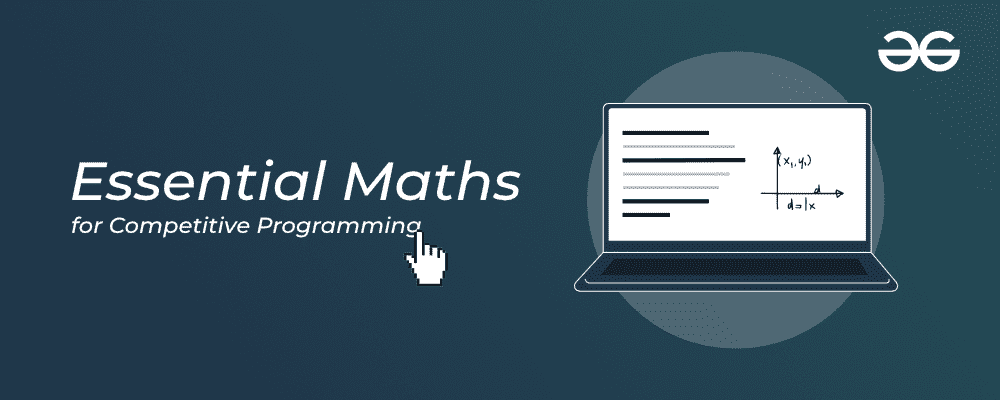

# 极客竞技编程课程的基础数学

> 原文:[https://www . geesforgeeks . org/essential-mathematics-for-competitive-programming-by-geesforgeeks/](https://www.geeksforgeeks.org/essential-maths-for-competitive-programming-course-by-geeksforgeeks/)

当我们谈论**竞技编程**时，我们不能忽视数学在这里的**意义。是的，一个人可以在没有任何数学背景的情况下开始竞争编程，这是真的，但是一个不可战胜的事实是，在解决编程问题时，对几个特定的数学概念有很好的掌握会给你带来比其他人急需的优势。有许多数学概念、公式和定理可以帮助你在必要的时间限制内解决问题，同时进行竞争性编程。**

然而，你需要知道的是，作为一名优秀的竞争性程序员，你不需要掌握一些高级微积分或其他高级数学概念——但你需要精通一些相关的数学主题，如大整数、GCD、LCM、欧几里德算法、二项式概念等。尽管只找出这些相关的和竞争编程所需的数学主题并相应地掌握它们并不是一件容易的事情，尤其是对初学者来说。

但是，如果你能在一个地方学会竞争性编程的所有基本数学概念呢？？是的，为了使这成为可能，GeeksforGeeks 正在为您提供**竞争编程课程的基本数学**，它将建立和加强您在竞争编码中使用的基于数学的概念的基础。课程设计为两个版本，**一个为 C++一个为 Java** ，方便考生。现在，考生可以根据自己喜欢的编程语言选择这两种语言中的任何一种。

*   [**【竞争性编程课程的基本数学–c++**](https://practice.geeksforgeeks.org/courses/cp-maths)
*   [**竞争性编程课程的基本数学-针对 Java**](https://practice.geeksforgeeks.org/courses/cp-maths-java)

### 课程详情

虽然这个**竞争编程课程的基本数学**对所有人开放，但它是专门为那些一年级或二年级的大学生设计的，他们的知识可能从初学者到中级不等，并且愿意加强他们的技能。在这里，您将与我们的行业专家一起在竞争性编程中建立您的编程概念，这些专家不仅将加强您的数学技能，还将使您成为其中的专家。在本课程中，您将以最有趣、最有效的方式学习所有关键概念，如时间复杂性、素数和因式分解、LCM 和其他数学原理、加泰罗尼亚数字等。

本课程的一些突出特点如下:

*   *终身参加课程*
*   *评估技能的每周评估测试*
*   *基于轨迹的学习*
*   *极客实习机会*
*   *访问极客博客门户*
*   *课程结业证书*

让我们告诉你这个**竞争编程课程的基本数学**的实际价格是 1999 印度卢比/-，但是它是以 899 印度卢比/- 的折扣价提供给你的。购买本课程之前，请查看分为以下步骤的注册流程:-

*   **第一步:**访问 [**竞争编程基础数学课程–针对 C++**](https://practice.geeksforgeeks.org/courses/cp-maths) **或** [**竞争编程基础数学课程–针对 Java**](https://practice.geeksforgeeks.org/courses/cp-maths-java) **。**
*   **第 2 步:**在课程描述下方，您将看到一个绿色的“立即注册”按钮。点击那个，之后，你需要做的就是填写你所有的细节。它们将是你的全名、国家、电话号码、电子邮件、学院/大学名称和毕业年份。
*   **第三步:**现在，你肯定可以点击保存并下一步按钮。这将引导您进入我们的最后一步，即付款。在这里，您可以找到多个支付选项，如 PhonePe、亚马逊支付、合众国际社或任何其他支付选项。选择其中任何一项支付课程费用。
*   **第 4 步:**现在就开始享受吧，因为您已经支付了费用，并准备好访问课程内容。

如有疑问或疑问，请发邮件至[**【geeks.classes@geeksforgeeks.org】**](geeks.classes@geeksforgeeks.org)**。**

### 课程内容

我们的竞争程序设计基础数学课程的内容是:–

### 对于 C++

**1。模块 1**

*   时间复杂性
*   基础
*   斐波纳契
*   位屏蔽

**2。模块 2**

*   素数
*   质因数分解
*   除数

**3。模块 3**

*   GCD 与 LCM
*   数论函数
*   数学原理

**04。模块 4**

*   模块化操作
*   模幂运算
*   二项式概念
*   加泰罗尼亚数字

**5。模块 5**

*   组合博弈论
*   几何算法
*   处理杂项问题

查看 [**这里**](https://media.geeksforgeeks.org/courses/syllabus/e3a1a90aebda83291e3191ab404a5016.pdf) 的【竞争程序设计基础数学(c++)】详细教学大纲。

### 对于 Java

竞技编程基础数学课程(Java)的课程内容几乎与竞技编程基础数学课程(C++)相似——唯一的区别是这里用 Java 来教你概念，而不是 C++。

竞争程序设计课程(Java) 的详细教学大纲将很快在这里更新。

### 常见问题解答

**1。我如何报名参加《竞争程序设计基础数学》课程？**

您可以通过访问以下链接轻松注册课程: [**【竞争编程课程基础数学–c++**](https://practice.geeksforgeeks.org/courses/cp-maths)**或** [**【竞争编程课程基础数学–Java】**](https://practice.geeksforgeeks.org/courses/cp-maths-java)**。**如果你还没有在极客网注册，那么你应该创建你的账户，稍后通过脸书/谷歌登录。

**2。我将为这门课支付多少钱？**

本课程的实际价格为【1999 印度卢比/- ，但正在以**899 印度卢比/-** 的折扣价向您提供

**3。课程结束后，我会获得课程结业证书吗？**

是的，一旦完成课程，你将获得课程结业证书。

**4。课程内容会在课程结束日期后提供吗？**

是的，课程内容带有终身有效期。