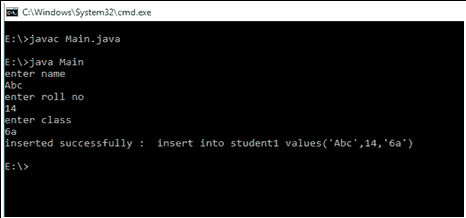

# 在 Java 中建立 JDBC 连接

> 原文:[https://www . geeksforgeeks . org/建立-JDBC-连接-in-java/](https://www.geeksforgeeks.org/establishing-jdbc-connection-in-java/)

在前端(即您的 Java 程序)和后端(即数据库)之间建立连接之前，我们应该了解什么是 JDBC，以及它为什么会存在。现在让我们来讨论一下 JDBC 到底代表着什么，并借助于现实生活中的插图来让它发挥作用。

**什么是 JDBC？**

[JDBC](https://www.geeksforgeeks.org/introduction-to-jdbc/) 是 Java 数据库连接的缩写。这是开放数据库连接的一个进步。JDBC 是一个标准的应用编程接口规范，旨在将数据从前端移动到后端。这个 API 由用 Java 编写的类和接口组成。它基本上充当您的 Java 程序和数据库之间的接口(不是我们在 Java 中使用的接口)或通道，也就是说，它在两者之间建立了一个链接，以便程序员可以从 Java 代码发送数据并将其存储在数据库中以备将来使用。

**说明:**与实时相关的 JDBC 工作


JDBC 为什么会出现？

如前所述，JDBC 是 ODBC 的一个进步，依赖于平台的 ODBC 有很多缺点。ODBC API 是用 C、C++、Python、Core Java 编写的，正如我们所知，上述语言(除了 Java 和 Python 的某些部分)都是依赖于平台的。因此，为了消除依赖性，JDBC 是由一家数据库供应商开发的，它由用 Java 编写的类和接口组成。

【Java 程序和数据库连接的步骤

1.  导入数据库
2.  使用 *forName()方法*加载驱动程序
3.  使用驱动管理器注册驱动程序
4.  *使用连接类对象建立连接*
5.  **创建语句**
6.  **执行查询**
7.  **关闭连接**

**在通过编写合适的代码来说明 JDBC/的连接步骤来实现之前，让我们简单地讨论一下这些步骤**

****步骤 1:** 导入数据库**

****步骤 2:** 装载驱动程序**

**首先，在程序中使用驱动程序之前，您首先需要加载或注册它。注册在你的程序中只需完成一次。您可以通过以下两种方式之一注册驱动程序:**

****2-A** 类. forName()**

**这里我们在运行时将驱动程序的类文件加载到内存中。不需要使用新的或创建对象。以下示例使用 Class.forName()加载 Oracle 驱动程序，如下所示:**

```java
**Class.forName(“oracle.jdbc.driver.OracleDriver”);**
```

****2-b**driver manager . register driver()**

**DriverManager 是一个带有静态成员寄存器的 Java 内置类。这里我们在编译时调用驱动类的构造函数。以下示例使用 DriverManager.registerDriver()注册 Oracle 驱动程序，如下所示:**

```java
 **DriverManager.registerDriver(new oracle.jdbc.driver.OracleDriver())**
```

****步骤 4:** 使用*连接类对象*建立连接**

***加载驱动程序后，通过如下所示建立连接:***

```java
***Connection con = DriverManager.getConnection(url,user,password)***
```

*   *****用户:U** sername，从中可以访问您的 SQL 命令提示符。***
*   *****密码:**可以访问 SQL 命令提示符的密码。***
*   *****con:** 是对连接接口的引用。***
*   *****网址**:统一资源定位符，如下图所示:***

```java
***String url = “ jdbc:oracle:thin:@localhost:1521:xe”***
```

***其中 oracle 是使用的数据库，thin 是使用的驱动程序，@localhost 是存储数据库的 IP 地址，1521 是端口号，xe 是服务提供商。上面的 3 个参数都是字符串类型的，需要程序员在调用函数之前声明。这一点的使用可以参考最终代码。***

*****步骤 5:** 创建语句***

***一旦建立了连接，您就可以与数据库进行交互。JDBCStatement、CallableStatement 和 PreparedStatement 接口定义了使您能够发送 SQL 命令和从数据库接收数据的方法。
JDBC 陈述的用法如下:***

```java
***Statement st = con.createStatement();***
```

> *****注意:**这里的 con 是对上一步使用的 Connection 接口的引用。***

*****步骤 6:** 执行查询***

***现在是最重要的部分，即执行查询。这里的查询是一个 SQL 查询。现在我们知道我们可以有多种类型的查询。其中一些如下:***

*   ***在数据库中更新/插入表的查询。***
*   ***用于检索数据的查询。***

*****语句接口**的 executeQuery()方法用于执行从数据库中检索值的查询。此方法返回 ResultSet 的对象，该对象可用于获取表的所有记录。
语句接口的 executeUpdate(sql 查询)方法用于执行更新/插入的查询。***

*****Pseodo 码:*****

```java
***int m = st.executeUpdate(sql);
if (m==1)
    System.out.println("inserted successfully : "+sql);
else
    System.out.println("insertion failed");***
```

> ***这里是字符串类型的 sql 查询***

*****步骤 7:关闭连接*****

***所以最后我们已经将数据发送到指定的位置，现在我们即将完成我们的任务。通过关闭连接，语句和结果集的对象将自动关闭。连接接口的 close()方法用于关闭连接。如下图所示:***

```java
 ***con.close();***
```

*****示例:*****

## ***Java 语言(一种计算机语言，尤用于创建网站)***

```java
***// Java Program to Establish Connection in JDBC

// Importing database
importjava.sql.*;
// Importing required classes
importjava.util.*;

// Main class
class Main {

    // Main driver method
    public static void main(String a[])
    {

        // Creating the connection using Oracle DB
        // Note: url syntax is standard, so do grasp
        String url = "jdbc:oracle:thin:@localhost:1521:xe";

        // Usernamer and password to access DB
        // Custom initialization
        String user = "system";
        String pass = "12345";

        // Entering the data
        Scanner k = new Scanner(System.in);

        System.out.println("enter name");
        String name = k.next();

        System.out.println("enter roll no");
        int roll = k.nextInt();

        System.out.println("enter class");
        String cls = k.next();

        // Inserting data using SQL query
        String sql = "insert into student1 values('" + name
                     + "'," + roll + ",'" + cls + "')";

        // Connection class object
        Connection con = null;

        // Try block to check for exceptions
        try {

            // Registering drivers
            DriverManager.registerDriver(
                new oracle.jdbc.OracleDriver());

            // Reference to connection interface
            con = DriverManager.getConnection(url, user,
                                              pass);

            // Creating a statement
            Statement st = con.createStatement();

            // Executing query
            int m = st.executeUpdate(sql);
            if (m == 1)
                System.out.println(
                    "inserted successfully : " + sql);
            else
                System.out.println("insertion failed");

            // Closing the connections
            con.close();
        }

        // Catch block to handle exceptions
        catch (Exception ex) {
            // Display message when exceptions occurs
            System.err.println(ex);
        }
    }
}***
```

*****输出:*****

******

***本文由 **Shreya Gupta** 供稿。如果你喜欢 GeeksforGeeks 并想投稿，你也可以使用[write.geeksforgeeks.org](https://write.geeksforgeeks.org)写一篇文章或者把你的文章邮寄到 review-team@geeksforgeeks.org。看到你的文章出现在极客博客主页上，帮助其他极客。如果你发现任何不正确的地方，或者你想分享更多关于上面讨论的话题的信息，请写评论。***