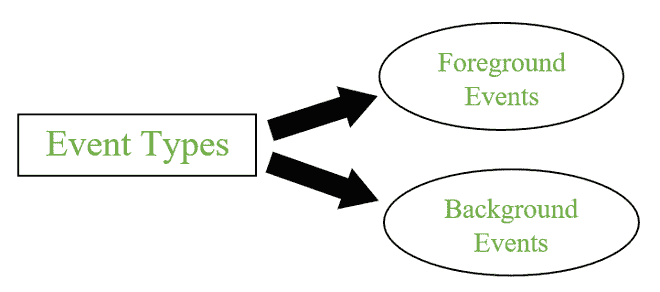
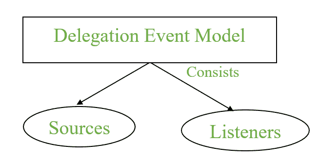
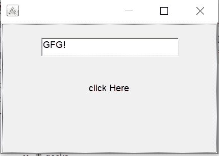
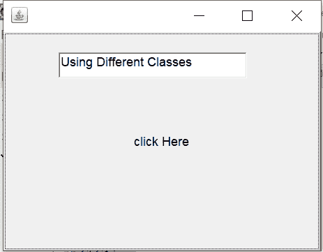
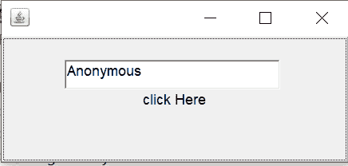

# Java 中的事件处理

> 原文:[https://www.geeksforgeeks.org/event-handling-in-java/](https://www.geeksforgeeks.org/event-handling-in-java/)

一个**事件** 可以定义为通过执行动作来改变一个对象或行为的状态。动作可以是按钮点击、光标移动、键盘按键或页面滚动等。

**java.awt.event** 包可以用来提供各种事件类。

### 事件分类

*   前景事件
*   背景事件



事件类型

#### 1.前景事件

前台事件是需要用户交互才能生成的事件，即前台事件是由于用户在图形用户界面( **GUI** )的组件上进行交互而生成的。交互只是点击按钮、滚动滚动条、光标时刻等。

#### 2.背景事件

不需要用户交互来生成的事件称为背景事件。这些事件的例子有操作系统故障/中断、操作完成等。

## 事件处理

这是一种机制，用于**控制事件**和**决定事件**发生后应该发生什么。为了处理事件，Java 遵循 ***委托事件模型。***

### 委托事件模型

*   它有源和侦听器。



委托事件模型

*   **来源:**事件从来源生成。有各种各样的来源，如按钮、复选框、列表、菜单项、选项、滚动条、文本组件、窗口等。，以生成事件。
*   **侦听器:**侦听器用于处理从源生成的事件。这些侦听器中的每一个都代表负责处理事件的接口。

要执行事件处理，我们需要向侦听器注册源。

### 向侦听器注册源

不同的类提供不同的注册方法。

**语法:**

```
addTypeListener()
```

其中类型表示事件的类型。

**例 1:** 对于**按键事件**我们使用 *addKeyListener()* 进行注册。

**例 2:** 说明对于**动作事件**我们使用 *addActionListener()* 进行注册。

### Java 中的事件类

<figure class="table">

| 

事件类

 | 

监听器接口

 | 

描述

 |
| --- | --- | --- |
| ActionEvent | 动作监听器 | 一种事件，指示组件定义的操作发生，如按钮单击或从菜单项列表中选择一项。 |
| 调整事件 | 调整监听器 | 调整事件由像滚动条这样的可调整对象发出。 |
| ComponentEvent | 组件侦听器 | 指示组件移动、大小改变或可见性改变的事件。

 |
| 包含事件 | 集装箱装卸机 | 当组件被添加到容器(或从容器中移除)时，该事件由容器对象生成。 |
| 聚焦事件 | 聚焦监听器 | 这些是与焦点相关的事件，包括焦点、聚焦、聚焦输出和模糊。 |
| ItemEvent(项目事件) | ItemListener | 一个事件，指示某项是否被选中。 |
| KeyEvent(密钥事件) | KeyListener | 由于键盘上的一系列按键而发生的事件。 |
| 老鼠事件 | mouse listener & mouemotionlistener | 由于用户与鼠标(定点设备)的交互而发生的事件。 |
| MouseWheelEvent | 鼠标滚轮监听器 | 指定鼠标滚轮在组件中旋转的事件。 |
| TextEvent(文本消息) | 文本监听器

 | 当对象的文本更改时发生的事件。 |
| WindowEvent | WindowListener | 指示窗口是否已改变状态的事件。 |

</figure>

> **注意:** As Interfaces 包含需要由注册类实现的抽象方法来处理事件。

不同的接口由下面指定的不同方法组成。

<figure class="table">

| 

监听器接口

 | 

方法

 |
| --- | --- |
| 动作监听器 | 

*   Execute ()

 |
| 调整监听器 | 

*   The adjustment value has changed ()

 |
| 组件侦听器 | 

*   Resize components ()
*   Component display ()
*   Move components ()
*   Hide components ()

 |
| 集装箱装卸机 | 

*   Add component ()
*   Delete component ()

 |
| 聚焦监听器 | 

*   聚焦增益()
*   焦点丢失()

 |
| ItemListener | 

*   Project status has changed ()

 |
| KeyListener | 

*   Enter ()
*   Enter ()
*   Press release ()

 |
| 鼠标监听器 | 

*   Mouse down ()
*   Click the mouse ()
*   Enter the mouse ()
*   Mouse out ()
*   Mouse release ()

 |
| MouseMotionListener | 

*   Move the mouse ()
*   Drag the mouse ()

 |
| 鼠标滚轮监听器 | 

*   【鼠标垫移动()

 |
| 文本监听器 | 

*   文本已更改()

 |
| WindowListener | 

*   窗口已激活()
*   窗口已停用()
*   窗口打开()
*   窗户关闭()
*   windowClosed()
*   窗口图标化()
*   windowDeiconified()

 |

</figure>

### 事件处理流程

1.  生成事件需要用户与组件交互。
2.  各个事件类的对象是在事件生成后自动创建的，它保存事件源的所有信息。
3.  新创建的对象被传递给注册侦听器的方法。
4.  方法执行并返回结果。

### 代码方法

执行事件处理的三种方法是将事件处理代码放在下面指定的位置之一。

1.  班级内
2.  其他类
3.  匿名类

> **注意:**使用任何 IDE 或安装 JDK 运行代码，Online 编译器可能会因为某些包不可用而抛出错误。

### 类内事件处理

## Java 语言(一种计算机语言，尤用于创建网站)

```
// Java program to demonstrate the
// event handling within the class

import java.awt.*;
import java.awt.event.*;

class GFG extends Frame implements ActionListener {

    TextField textField;

    GFGTop()
    {
        // Component Creation
        textField = new TextField();

        // setBounds method is used to provide 
        // position and size of the component
        textField.setBounds(60, 50, 180, 25);
        Button button = new Button("click Here");
        button.setBounds(100, 120, 80, 30);

        // Registering component with listener
        // this refers to current instance
        button.addActionListener(this);

        // add Components
        add(textField);
        add(button);

        // set visibility
        setVisible(true);
    }

    // implementing method of actionListener
    public void actionPerformed(ActionEvent e)
    {
        // Setting text to field
        textField.setText("GFG!");
    }

    public static void main(String[] args)
    {
      new GFGTop(); 
    }
}
```

#### 输出



单击后，文本字段值设置为 GFG！

#### 说明

1.  首先用 applet 扩展这个类，并实现相应的监听器。
2.  创建文本字段和按钮组件。
3.  用相应的事件注册了按钮组件。即由 addActionListener()执行的 ActionEvent。
4.  最后，实现抽象方法。

### 按其他类别处理事件

## Java 语言(一种计算机语言，尤用于创建网站)

```
// Java program to demonstrate the
// event handling by the other class

import java.awt.*;
import java.awt.event.*;

class GFG1 extends Frame {

    TextField textField;

    GFG2()
    {
        // Component Creation
        textField = new TextField();

        // setBounds method is used to provide 
        // position and size of component
        textField.setBounds(60, 50, 180, 25);
        Button button = new Button("click Here");
        button.setBounds(100, 120, 80, 30);

        Other other = new Other(this);

        // Registering component with listener
        // Passing other class as reference
        button.addActionListener(other);

        // add Components
        add(textField);
        add(button);

        // set visibility
        setVisible(true);
    }

    public static void main(String[] args)
    { 
      new GFG2(); 
    }
}
```

## Java 语言(一种计算机语言，尤用于创建网站)

```
/// import necessary packages
import java.awt.event.*;

// implements the listener interface
class Other implements ActionListener {

    GFG2 gfgObj;

    Other(GFG1 gfgObj)
    {
      this.gfgObj = gfgObj; 
    }

    public void actionPerformed(ActionEvent e)
    {
        // setting text from different class
        gfgObj.textField.setText("Using Different Classes");
    }
}
```

#### 输出



处理不同类别的事件

### 匿名类的事件处理

## Java 语言(一种计算机语言，尤用于创建网站)

```
// Java program to demonstrate the
// event handling by the anonymmous class

import java.awt.*;
import java.awt.event.*;

class GFG3 extends Frame {

    TextField textField;

    GFG3()
    {
        // Component Creation
        textField = new TextField();

        // setBounds method is used to provide 
        // position and size of component
        textField.setBounds(60, 50, 180, 25);
        Button button = new Button("click Here");
        button.setBounds(100, 120, 80, 30);

        // Registering component with listener anonymously
        button.addActionListener(new ActionListener() {
            public void actionPerformed(ActionEvent e)
            {
                // Setting text to field
                textField.setText("Anonymous");
            }
        });

        // add Components
        add(textField);
        add(button);

        // set visibility
        setVisible(true);
    }

    public static void main(String[] args)
    { 
        new GFG3(); 
    }
}
```

#### **输出**



匿名处理