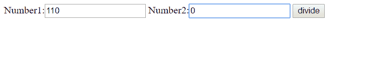
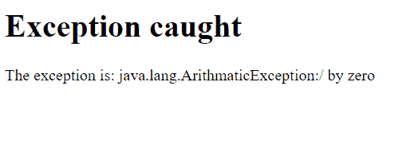

# JSP 中的异常处理

> 原文:[https://www.geeksforgeeks.org/exception-handling-in-jsp/](https://www.geeksforgeeks.org/exception-handling-in-jsp/)

Java Server Pages 声明了 9 个隐式对象，**异常**对象是其中之一。它是 **java.lang.Throwable** 类的对象，用于打印异常。但是，它只能在错误页面中使用。

JSP 中有两种处理异常的方式。它们是:

*   通过页面指令的错误页面和 isErrorPage 属性
*   通过 web.xml 文件中的<error-page>元素</error-page>

**使用页面指令属性处理异常**

JSP 中的 page 指令提供了两个用于异常处理的属性。他们是:

*   **错误页面**:用于设置出现异常时显示哪个页面。
    语法:

```
 <%@page errorPage="url of the error page"%>
```

*   **isErrorPage** :用于将显示异常的页面标记为错误页面。
    语法:

```
 <%@page isErrorPage="true"%>
```

为了使用前面提到的页面指令处理异常，拥有一个 jsp 页面来执行正常代码是很重要的，因为正常代码容易出现异常。此外，将创建一个单独的错误页面，显示异常。如果异常发生在具有异常倾向代码的页面上，控件将被导航到显示异常的错误页面。

下面是一个使用页面指令说明异常处理的示例:

**index.html**

## 超文本标记语言

```
<html>
<head>
<body>
<form action="a.jsp"> 
Number1:<input type="text" name="first" >
Number2:<input type="text" name="second" >
<input type="submit" value="divide"> 
</form> 
</body>
</html>
```

**A.jsp**

## Java 语言(一种计算机语言，尤用于创建网站)

```
// JSP code to divide two numbers
<% @page errorPage = "error.jsp" %> < %

                                          String num1
    = request.getParameter("first");
String num2 = request.getParameter("second");

// extracting numbers from request
int x = Integer.parseInt(num1);
int y = Integer.parseInt(num2);
int z = x / y; // dividing the numbers
out.print("division of numbers is: " + z); // result

% >
```

**error.jsp**

## Java 语言(一种计算机语言，尤用于创建网站)

```
// JSP code for error page, which displays the exception
<% @page isErrorPage = "true" %>

    <h1> Exception caught</ h1>

        The exception is : <%= exception %> // displaying the exception
```

**输出**:
T3】index.html



**error.jsp**



**使用错误页面元素处理异常**

这是为每个元素指定错误页面的另一种方式，但是可以使用 **<错误页面>** 元素，在 web.xml 文件中指定每个页面的错误页面，而不是使用 error page 指令。语法如下:

## 超文本标记语言

```
<web-app> 

 <error-page> 
  <exception-type>Type of Exception</exception-type> 
  <location>Error page url</location> 
  </error-page> 

</web-app> 
```

下面的示例说明了如何使用这种技术来处理异常:

**index.html**

## 超文本标记语言

```
<html>
<head>
<body>
<form action="a.jsp"> 
Number1:<input type="text" name="first" >
Number2:<input type="text" name="second" >
<input type="submit" value="divide"> 
</form> 
</body>
</html>
```

**a.jsp**

## Java 语言(一种计算机语言，尤用于创建网站)

```
// JSP code to divide two numbers
< %

        String num1
    = request.getParameter("first");
String num2 = request.getParameter("second");
// extracting the numbers
int x = Integer.parseInt(num1);
int y = Integer.parseInt(num2);
int z = x / y; // dividing
out.print("division of numbers is: " + z); // result

% >
```

**error.jsp**

## Java 语言(一种计算机语言，尤用于创建网站)

```
// JSP code for error page, which displays the exception
<%@ page isErrorPage="true" %> 

<h1>Exception caught</h1> 

// displaying the exception
The exception is: <%= exception %>
```

**web.xml**

## 超文本标记语言

```
<web-app> 

 <error-page> 
  <exception-type>java.lang.Exception</exception-type> 
  <location>/error.jsp</location> 
  </error-page> 

</web-app> 
```

在这种情况下，输出与上一个类似。