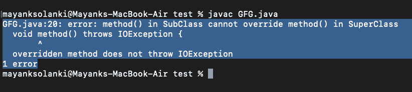
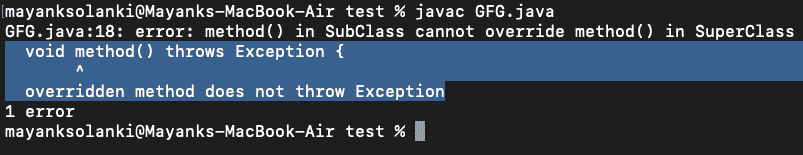

# Java 中方法覆盖的异常处理

> 原文:[https://www . geeksforgeeks . org/Java 中方法重写异常处理/](https://www.geeksforgeeks.org/exception-handling-with-method-overriding-in-java/)

[异常](https://www.geeksforgeeks.org/exceptions-in-java/)是在程序执行期间(即运行时)发生的不必要或意外的事件，它会中断程序指令的正常流动。[异常处理](https://www.geeksforgeeks.org/java-gq/exception-handling-2-gq/)用于处理运行时错误。它有助于保持程序的正常流程。
在任何面向对象的编程语言中，[override](https://www.geeksforgeeks.org/overriding-in-java/)是一种特性，它允许子类或子类提供一种方法的特定实现，该方法已经由其超类或父类之一提供。当子类中的方法与它的超类中的方法具有相同的名称、相同的参数或签名以及相同的返回类型(或子类型)时，那么子类中的方法被称为覆盖超类中的方法。

**方法覆盖的异常处理**
当方法覆盖涉及异常处理时，会出现歧义。编译器对遵循哪个定义感到困惑。

**问题类型:**

与之相关的问题有两种类型，如下所示:

1.  **问题 1** : 如果超类没有声明异常
2.  **问题 2** :如果超类声明了异常

让我们讨论这些问题下的不同案例，并感知它们的输出。

**问题 1** : 如果超类没有声明异常

在这个问题中，将出现以下两种情况:

*   **情况 1:** 如果超类没有声明任何异常，子类声明选中的异常
*   **情况 2:** 如果超类没有声明任何异常，子类声明未检查的异常

让我们讨论上述两个案例，并借助如下示例进行解释:

**情况 1:** 如果超类没有声明任何异常，子类声明选中的异常。

**例**

## Java 语言(一种计算机语言，尤用于创建网站)

```
// Java Program to Illustrate Exception Handling
// with Method Overriding
// Where SuperClass does not declare any exception and
// subclass declare checked exception

// Importing required classes
import java.io.*;

class SuperClass {

  // SuperClass doesn't declare any exception
  void method() {
    System.out.println("SuperClass");
  }
}

// SuperClass inherited by the SubClass
class SubClass extends SuperClass {

  // method() declaring Checked Exception IOException
  void method() throws IOException {

    // IOException is of type Checked Exception
    // so the compiler will give Error

    System.out.println("SubClass");
  }

  // Driver code
  public static void main(String args[]) {
    SuperClass s = new SubClass();
    s.method();
  }
}
```

**输出:**



**情况 2:** 如果超类没有声明任何异常，子类声明未检查的异常

**例**

## Java 语言(一种计算机语言，尤用于创建网站)

```
// Java Program to Illustrate Exception Handling
// with Method Overriding
// Where SuperClass doesn't declare any exception and
// SubClass declare Unchecked exception

// Importing required classes
import java.io.*;

class SuperClass {

    // SuperClass doesn't declare any exception
    void method()
    {
        System.out.println("SuperClass");
    }
}

// SuperClass inherited by the SubClass
class SubClass extends SuperClass {

    // method() declaring Unchecked Exception ArithmeticException
    void method() throws ArithmeticException
    {

        // ArithmeticException is of type Unchecked Exception
        // so the compiler won't give any error

        System.out.println("SubClass");
    }

    // Driver code
    public static void main(String args[])
    {
        SuperClass s = new SubClass();
        s.method();
    }
}
```

**Output**

```
SubClass
```

现在来看下一个相关的问题，如果超类声明了一个异常。在这个问题中，将出现以下三种情况:

*   **情况 1:** 如果超类声明了一个异常，子类声明了除超类的子异常之外的异常，则声明 exception。
*   **情况 2:** 如果超类声明了一个异常，子类声明了超类声明的异常的子异常。
*   **情况 3:** 如果 SuperClass 声明异常，SubClass 声明无异常。

现在让我们通过实现和用例子解释来解释这些情况。

**情况 1:** 如果超类声明了一个异常，子类声明了除超类的子异常之外的异常，则声明 exception。

**例**

## Java 语言(一种计算机语言，尤用于创建网站)

```
// Java Program to Illustrate Exception Handling
// with Method Overriding
// Where SuperClass declares an exception and
// SubClass declares exceptions other than the child exception
// of the SuperClass declared Exception.

// Importing required classes
import java.io.*;

class SuperClass {

  // SuperClass declares an exception
  void method() throws RuntimeException {
    System.out.println("SuperClass");
  }
}

// SuperClass inherited by the SubClass
class SubClass extends SuperClass {

  // SubClass declaring an exception
  // which are not a child exception of RuntimeException
  void method() throws Exception {

    // Exception is not a child exception
    // of the RuntimeException
    // So the compiler will give an error

    System.out.println("SubClass");
  }

  // Driver code
  public static void main(String args[]) {
    SuperClass s = new SubClass();
    s.method();
  }
}
```

**输出:**



**情况 2:** 如果超类声明了一个异常，子类声明了超类声明的异常的子异常。

**例**

## Java 语言(一种计算机语言，尤用于创建网站)

```
// Java Program to Illustrate Exception Handling
// with Method Overriding
// Where SuperClass declares an exception and
// SubClass declares a child exception
// of the SuperClass declared Exception

// Importing required classes
import java.io.*;

class SuperClass {

    // SuperClass declares an exception
    void method() throws RuntimeException
    {
        System.out.println("SuperClass");
    }
}

// SuperClass inherited by the SubClass
class SubClass extends SuperClass {

    // SubClass declaring a child exception
    // of RuntimeException
    void method() throws ArithmeticException
    {

        // ArithmeticException is a child exception
        // of the RuntimeException
        // So the compiler won't give an error
        System.out.println("SubClass");
    }

    // Driver code
    public static void main(String args[])
    {
        SuperClass s = new SubClass();
        s.method();
    }
}
```

**Output**

```
SubClass
```

**情况 3:** 如果 SuperClass 声明异常，SubClass 声明无异常。

**例**

## Java 语言(一种计算机语言，尤用于创建网站)

```
// Java Program to Illustrate Exception Handling
// with Method Overriding
// Where SuperClass declares an exception and
// SubClass declares without exception

// Importing required classes
import java.io.*;

class SuperClass {

    // SuperClass declares an exception
    void method() throws IOException
    {
        System.out.println("SuperClass");
    }
}

// SuperClass inherited by the SubClass
class SubClass extends SuperClass {

    // SubClass declaring without exception
    void method()
    {
        System.out.println("SubClass");
    }

    // Driver code
    public static void main(String args[])
    {
        SuperClass s = new SubClass();
    try {
        s.method();
    } catch (IOException e) {
        e.printStackTrace();
    }
    }
}
```

**Output**

```
SubClass
```

> **结论:**
> 
> 从以上 3 个例子中可以看出，为了处理这种异常，得出以下结论:
> 
> *   如果 SuperClass 没有声明异常，那么 SubClass 只能声明未检查的异常，而不能声明检查的异常。
> *   如果超类声明了一个异常，那么子类只能声明超类声明的异常和任何新的运行时异常的相同或子异常，而不能声明任何相同级别或更高级别的新检查异常。
> *   如果 SuperClass 声明了一个异常，那么 SubClass 可以无异常地声明。