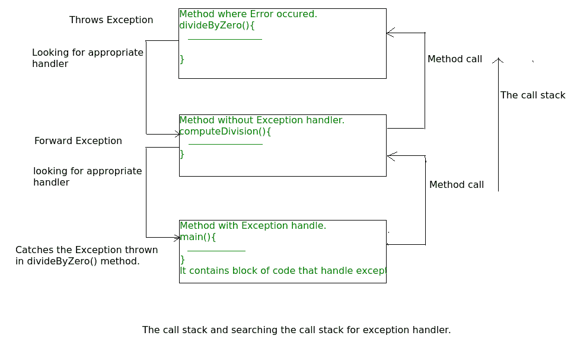
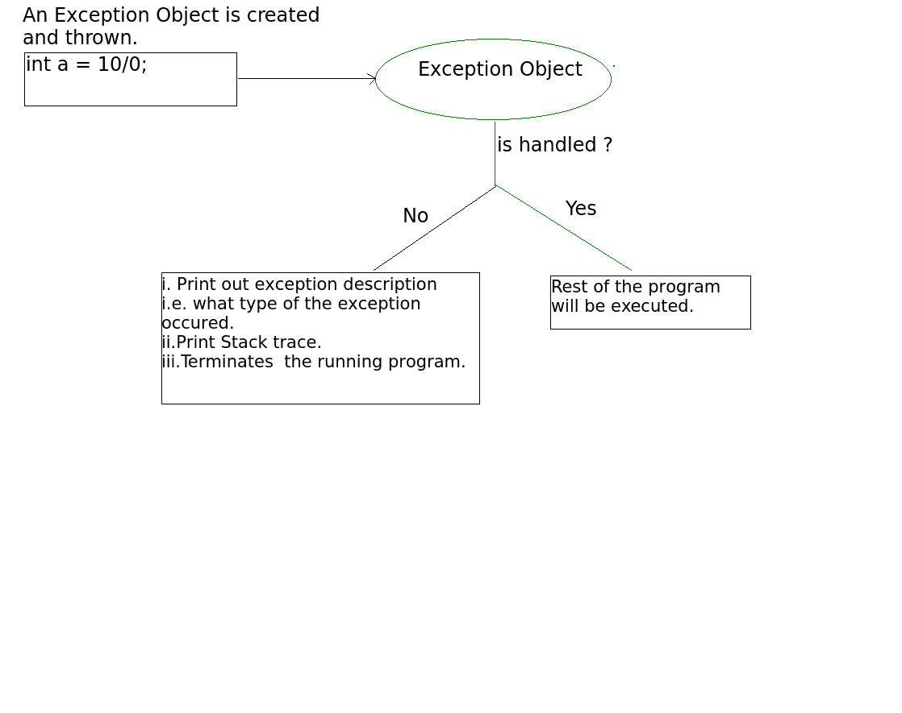

# Java 中的异常

> 原文:[https://www.geeksforgeeks.org/exceptions-in-java/](https://www.geeksforgeeks.org/exceptions-in-java/)

**什么是例外？**

异常是指在程序执行期间(即运行时)发生的不必要或意外的事件，它会中断程序指令的正常流动。

**错误对异常**

**错误:**错误表示合理的应用程序不应该试图捕捉的严重问题。
**异常:**异常表示合理应用程序可能试图捕捉的条件。

**异常层次结构**

所有异常和错误类型都是类**的子类**，它是层次结构的基类。一家分公司由**领导，例外**。此类用于用户程序应该捕获的异常情况。NullPointerException 就是这种异常的一个例子。另一个分支，**错误**被 Java 运行时系统( [JVM](https://www.geeksforgeeks.org/jvm-works-jvm-architecture/) )用来指示与运行时环境本身(JRE)有关的错误。StackOverflowError 就是这样一个错误的例子。

[](https://media.geeksforgeeks.org/wp-content/uploads/Exception-in-java1.png)

对于已检查与未检查的异常，请参见[已检查与未检查的异常](https://www.geeksforgeeks.org/checked-vs-unchecked-exceptions-in-java/)

**JVM 如何处理异常？**

**默认异常处理:**每当在一个方法内部，如果发生了异常，该方法创建一个称为异常对象的对象，并将其交给运行时系统(JVM)。异常对象包含异常的名称和描述，以及发生异常的程序的当前状态。创建异常对象并将其处理到运行时系统称为引发异常。可能有一个方法列表，这些方法被调用来获取发生异常的方法。这个方法的有序列表叫做**调用栈**。现在将发生以下过程。

*   运行时系统搜索调用堆栈以找到包含可以处理发生的异常的代码块的方法。代码块被称为**异常处理程序**。
*   运行时系统从发生异常的方法开始搜索，以调用方法的相反顺序通过调用堆栈。
*   如果它找到合适的处理程序，那么它会将发生的异常传递给它。适当的处理程序意味着抛出的异常对象的类型与其能够处理的异常对象的类型相匹配。
*   如果运行时系统搜索调用堆栈上的所有方法，并且找不到合适的处理程序，那么运行时系统将异常对象切换到**默认异常处理程序**，它是运行时系统的一部分。该处理程序以下列格式打印异常信息，并异常终止程序**。

    ```java
    Exception in thread "xxx" Name of Exception : Description
    ... ...... ..  // Call Stack

    ```** 

**参见下图，了解调用堆栈的流程。
**

****例**:**

```java
// Java program to demonstrate how exception is thrown.
class ThrowsExecp{

    public static void main(String args[]){

        String str = null;
        System.out.println(str.length());

    }
}
```

**输出:**

```java
Exception in thread "main" java.lang.NullPointerException
    at ThrowsExecp.main(File.java:8) 
```

**让我们看一个例子，说明运行时系统如何在调用堆栈上搜索适当的异常处理代码:**

```java
// Java program to demonstrate exception is thrown
// how the runTime system searches th call stack
// to find appropriate exception handler.
class ExceptionThrown
{
    // It throws the Exception(ArithmeticException).
    // Appropriate Exception handler is not found within this method.
    static int divideByZero(int a, int b){

        // this statement will cause ArithmeticException(/ by zero)
        int i = a/b; 

        return i;
    }

    // The runTime System searches the appropriate Exception handler
    // in this method also but couldn't have found. So looking forward
    // on the call stack.
    static int computeDivision(int a, int b) {

        int res =0;

        try
        {
          res = divideByZero(a,b);
        }
        // doesn't matches with ArithmeticException
        catch(NumberFormatException ex)
        {
           System.out.println("NumberFormatException is occured"); 
        }
        return res;
    }

    // In this method found appropriate Exception handler.
    // i.e. matching catch block.
    public static void main(String args[]){

        int a = 1;
        int b = 0;

        try
        {
            int i = computeDivision(a,b);

        }

        // matching ArithmeticException
        catch(ArithmeticException ex)
        {
            // getMessage will print description of exception(here / by zero)
            System.out.println(ex.getMessage());
        }
    }
}
```

**输出:**

```java
/ by zero. 
```

 ****程序员如何处理异常？**

**定制异常处理:** Java 异常处理通过五个关键词进行管理:**试**、**抓**、**T7】扔** 、**T11】扔** ，最后**扔**。简而言之，以下是它们的工作原理。您认为会引发异常的程序语句包含在 try 块中。如果 try 块中出现异常，将引发异常。您的代码可以捕获这个异常(使用 catch 块)并以某种合理的方式处理它。系统生成的异常由 Java 运行时系统自动抛出。要手动抛出异常，使用关键字[抛出](https://www.geeksforgeeks.org/throw-throws-java/)。从方法中抛出的任何异常都必须通过[抛出](https://www.geeksforgeeks.org/throw-throws-java/)子句来指定。任何必须在 try 块完成后执行的代码都放在 finally 块中。

**详细文章:** [控制流程在试抓最后阻断](https://www.geeksforgeeks.org/flow-control-in-try-catch-finally-in-java/)

**尝试-捕获条款的需求(定制异常处理)**

考虑下面的 java 程序。

```java
// java program to demonstrate 
// need of try-catch clause

class GFG {
    public static void main (String[] args) {

        // array of size 4.
        int[] arr = new int[4];

        // this statement causes an exception
        int i = arr[4];

        // the following statement will never execute
        System.out.println("Hi, I want to execute");
    }
}
```

输出:

```java
Exception in thread "main" java.lang.ArrayIndexOutOfBoundsException: 4
    at GFG.main(GFG.java:9)

```

**解释:**在上面的例子中，数组是用大小定义的，也就是说，你只能访问从索引 0 到 3 的元素。但是您试图访问索引 4 处的元素(错误地)，这就是它抛出异常的原因。在这种情况下，JVM 异常终止程序**。语句 *System.out.println(“嗨，我要执行”)；*永远不会执行。要执行它，我们必须使用 try-catch 处理异常。因此，为了继续程序的正常流程，我们需要 try-catch 子句。**

****如何使用试捕条款****

```java
try {
// block of code to monitor for errors
// the code you think can raise an exception
}
catch (ExceptionType1 exOb) {
// exception handler for ExceptionType1
}
catch (ExceptionType2 exOb) {
// exception handler for ExceptionType2
}
// optional
finally {
// block of code to be executed after try block ends
} 
```

****需要记住的点:****

*   **在一个方法中，可能会有多个语句抛出异常，因此将所有这些语句放在自己的 **try** 块中，并在自己的 **catch** 块中为每个语句提供单独的异常处理程序。**
*   **如果在 **try** 块中出现异常，该异常将由与之关联的异常处理程序处理。要关联异常处理程序，我们必须在它后面放置 **catch** block。可以有多个异常处理程序。每个 **catch** 块都是一个异常处理程序，用于处理其参数所指示类型的异常。参数 ExceptionType 声明了它可以处理的异常的类型，并且必须是从 **Throwable** 类继承的类的名称。**
*   **对于每个试块，可以有零个或多个捕捉块，但是**只有一个**最终块。**
*   **finally 块是可选的。无论 try 块中是否出现异常，它总是被执行。如果出现异常，则在**试捕块后执行。**如果异常没有发生，那么将在**尝试**块后执行。java 中的 finally 块用于放置重要的代码，例如清理代码，例如关闭文件或关闭连接。**

****总结**
**

**相关文章:**

*   **[Java 中异常的类型](https://www.geeksforgeeks.org/types-of-exception-in-java-with-examples/)**
*   **[已检查异常与未检查异常](https://www.geeksforgeeks.org/checked-vs-unchecked-exceptions-in-java/)**
*   **[投掷 Java 中的投掷](https://www.geeksforgeeks.org/throw-throws-java/)**

**参考:
[https://docs . Oracle . com/javase/tutorial/essential/exceptions/definition . html](https://docs.oracle.com/javase/tutorial/essential/exceptions/definition.html)**

**本文由 **Nitsdheerendra** 和**Gaurav migrani**投稿。如果你喜欢 GeeksforGeeks 并想投稿，你也可以使用[contribute.geeksforgeeks.org](http://www.contribute.geeksforgeeks.org)写一篇文章或者把你的文章邮寄到 contribute@geeksforgeeks.org。看到你的文章出现在极客博客主页上，帮助其他极客。**

**如果你发现任何不正确的地方，或者你想分享更多关于上面讨论的话题的信息，请写评论。****