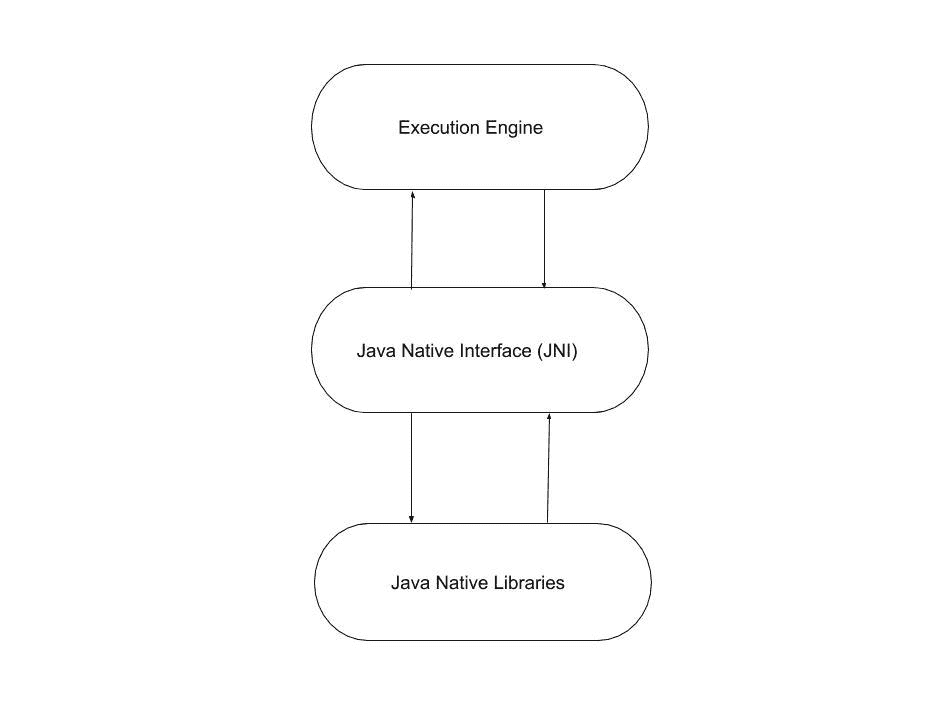

# Java 中的执行引擎

> 原文:[https://www.geeksforgeeks.org/execution-engine-in-java/](https://www.geeksforgeeks.org/execution-engine-in-java/)

[Java 虚拟机或 JVM](https://www.geeksforgeeks.org/differences-jdk-jre-jvm/) 可以可视化为驻留在计算机中的虚拟机，为代码的执行提供环境。Java 运行时环境是 JVM 的一种实现。为了执行代码，使用了执行引擎。在本文中，让我们了解执行引擎和其中的不同组件。

执行引擎是 [java 虚拟机](https://www.geeksforgeeks.org/jvm-works-jvm-architecture/) (JVM)的中心组件。它与 JVM 的各种内存区域进行通信。正在运行的应用程序的每个线程都是虚拟机执行引擎的不同实例。执行引擎通过类加载器执行分配给 JVM 中运行时数据区的字节码。Java 类文件由执行引擎执行。

执行引擎包含三个用于执行 Java 类的主要组件。它们是:

1.  **解释器:**读取字节码，[将](https://www.geeksforgeeks.org/compiler-vs-interpreter-2/)(转换)为机器码(原生码)并按顺序执行。该组件通过接受文件名参数从命令行运行应用程序。解释器的问题是每次都解释，甚至多次解释同一个方法，降低了系统的性能。为了克服这个问题，1.1 版引入了 JIT 编译器。
2.  **[JIT Compiler](https://www.geeksforgeeks.org/just-in-time-compiler/):** JIT compiler counterbalances the interpreter’s disadvantage of slow execution and improves the performance.
    *   在运行时，JVM 加载类文件，确定每个文件的语义，并执行适当的计算。与本机应用程序相比，解释过程中额外的处理器和内存使用使得 Java 应用程序执行缓慢。
    *   JIT 编译器通过在运行时将字节码编译成本机机器代码来帮助提高 Java 程序的性能。
    *   JIT 编译器始终处于启用状态，当调用一个方法时，它就会被激活。对于已编译的方法，JVM 直接调用已编译的代码，而不是解释它。从理论上讲，如果编译不需要任何处理器时间或内存使用，本机编译器和 Java 编译器的速度将是相同的。
    *   JIT 编译需要处理器时间和内存使用。当 java 虚拟机首次启动时，会调用数千个方法。编译所有这些方法会显著影响启动时间，即使最终结果是非常好的性能优化。

    **Profiler:** 这是一个工具，它是 JIT 编译器的一部分，负责在 JVM 级别监控 java 字节码的构造和操作。

3.  **[垃圾收集器](https://www.geeksforgeeks.org/garbage-collection-java/) :** 这是一个用 java 编写的自动管理内存的程序。这是一个始终在后台运行的[守护线程](https://www.geeksforgeeks.org/daemon-thread-java/)。这基本上是通过销毁无法访问的方法来释放堆内存。

**Java 原生接口(JNI):** JNI 充当了 Java 方法调用和对应的原生库之间的桥梁(中介器)。也就是:
