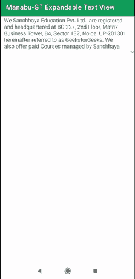

# 安卓中可扩展的文本视图

> 原文:[https://www . geesforgeks . org/expandable-textview-in-Android/](https://www.geeksforgeeks.org/expandable-textview-in-android/)

**expandableletextview**是一个安卓库，可以让我们轻松创建一个 [TextView](https://www.geeksforgeeks.org/working-with-the-textview-in-android/) ，当用户点击时可以展开/折叠。我们可以在许多应用程序中使用这一功能，例如电影评论应用程序或讲故事应用程序，以及许多其他应用程序。下面给出了一个示例 GIF，以了解我们将在本文中做什么。请注意，我们将使用 **Java** 语言来实现这个项目。



### **接近**

**第一步:创建新项目**

要在安卓工作室创建新项目，请参考[如何在安卓工作室创建/启动新项目](https://www.geeksforgeeks.org/android-how-to-create-start-a-new-project-in-android-studio/)。注意选择 **Java** 作为编程语言。

**第二步:去编码区之前先做一些前置任务**

转到**应用程序->RES->values->colors . XML**文件，为应用程序设置颜色。

## 可扩展标记语言

```java
<?xml version="1.0" encoding="utf-8"?>
<resources>

    <color name="colorPrimary">#0F9D58</color>
    <color name="colorPrimaryDark">#0F9D58</color>
    <color name="colorAccent">#05af9b</color>

</resources>
```

转到**应用程序->RES->values->strings . XML**文件，为应用程序设置字符串。

## 可扩展标记语言

```java
<resources>
    <string name="app_name">Manabu-GT Expandable Text View </string>
    <string name="expandable_text">We Sanchhaya Education Pvt. Ltd., are registered and headquartered
        at BC 227, 2nd Floor, Matrix Business Tower, B4, Sector 132, Noida, UP-201301, hereinafter 
        referred to as GeeksforGeeks. We also offer paid Courses managed by Sanchhaya Classes Pvt. Ltd.
        with registered office address B-142, Vishwash Park, Uttam Nagar, New Delhi, North Delhi, Delhi, India, 110059.
        At GeeksforGeeks, we value your trust and  respect your privacy. This privacy statement (“Privacy Statement”)
        applies to the treatment of personally identifiable information submitted by, or otherwise obtained from, 
        you in connection with the associated application (“Application”). The Application is 
        provided by GeeksforGeeks (and may be provided by Geeksforgeeks on behalf 
        of a GeeksforGeeks licensor or partner (“Application Partner”). 
        By using or otherwise accessing the Application, you acknowledge that you accept the practices
        and policies outlined in this Privacy Statement.</string>
</resources>
```

转到**Gradle Scripts->build . Gradle**(模块:app)部分，导入以下依赖项，然后点击上面弹出的“**立即同步**”。

> 实现' com . ms-square:expandableTextView:0 . 1 . 4 '

**第三步:设计 UI**

在 **activity_main.xml** 中，去掉默认的 TextView，将布局改为[relative elayout](https://www.geeksforgeeks.org/android-relativelayout-in-kotlin/)，添加 **ExpandableTextView** ，在里面我们添加一个 TextView 和 [ImageButton](https://www.geeksforgeeks.org/imagebutton-in-kotlin/) ，如下图。导航到 **app > res >布局> activity_main.xml** 并将下面的代码添加到该文件中。下面是**activity _ main . XML**文件的代码。

## 可扩展标记语言

```java
<?xml version="1.0" encoding="utf-8"?>
<RelativeLayout 
    xmlns:android="http://schemas.android.com/apk/res/android"
    xmlns:expandableTextView="http://schemas.android.com/apk/res-auto"
    xmlns:tools="http://schemas.android.com/tools"
    android:layout_width="match_parent"
    android:layout_height="match_parent"
    tools:context=".MainActivity">

    <!--  ExpandableTextView Container -->
    <com.ms.square.android.expandabletextview.ExpandableTextView
        android:id="@+id/expand_text_view"
        android:layout_width="match_parent"
        android:layout_height="wrap_content"
        expandableTextView:animDuration="100"
        expandableTextView:maxCollapsedLines="5">

        <!-- simple text view  -->
        <TextView
            android:id="@id/expandable_text"
            android:layout_width="match_parent"
            android:layout_height="wrap_content"
            android:layout_marginLeft="10dp"
            android:layout_marginRight="10dp"
            android:textColor="#666666"
            android:textSize="16sp" />

        <!-- expandable ImageButton -->
        <ImageButton
            android:id="@id/expand_collapse"
            android:layout_width="wrap_content"
            android:layout_height="wrap_content"
            android:layout_gravity="right|bottom"
            android:background="@android:color/transparent" />

    </com.ms.square.android.expandabletextview.ExpandableTextView>

</RelativeLayout>
```

> **注意:**的 id**image button**必须是**展开折叠**的 id**TextView**必须是**展开文字**

**可扩展属性视图**

*   **可展开的删除文本视图:可折叠的:**将可绘制的设置自定义为图像按钮以折叠文本视图
*   **expandableletextview:expandaddrawalable:**用于将 drawable 设置为 image 按钮，展开 TextView
*   **expandableletextview:maxCollapsedLines:**TextView 折叠时允许显示的最大文本行数(默认值为 **8**
*   **可扩展删除视图:动画持续时间:**用于设置扩展/折叠动画的持续时间(默认为**300 毫秒**
*   **expandableletextview:animalpastart:**动画开始时 TextView 的 alpha 值(**注**)如果要禁用 alpha 动画，请将该值设置为 1(默认为 **0.7f** )

**第四步:编码部分**

打开**MainActivity.java**文件，在【创建】(上的**内部创建并初始化可扩展文本视图，并从如下所示的 strings . XML**(r . string . expandable _ text)**将其设置为文本**

## Java 语言(一种计算机语言，尤用于创建网站)

```java
// getting reference of  ExpandableTextView
ExpandableTextView expTv = (ExpandableTextView) findViewById(R.id.expand_text_view).findViewById(R.id.expand_text_view);

// calling setText on the ExpandableTextView so that 
// text content will be  displayed to the user
expTv.setText(getString(R.string.expandable_text));
```

以下是**文件的完整代码。代码中添加了注释，以更详细地理解代码。**

## **Java 语言(一种计算机语言，尤用于创建网站)**

```java
import android.os.Bundle;

import androidx.appcompat.app.AppCompatActivity;

import com.ms.square.android.expandabletextview.ExpandableTextView;

public class MainActivity extends AppCompatActivity {

    @Override
    public void onCreate(Bundle savedInstanceState) {
        super.onCreate(savedInstanceState);
        setContentView(R.layout.activity_main);

        // getting reference of  ExpandableTextView
        ExpandableTextView expTv = (ExpandableTextView) findViewById(R.id.expand_text_view).findViewById(R.id.expand_text_view);

        // calling setText on the ExpandableTextView so that
        // text content will be  displayed to the user
        expTv.setText(getString(R.string.expandable_text));
    }
}
```

****输出:****

**<video class="wp-video-shortcode" id="video-584614-1" width="640" height="360" preload="metadata" controls=""><source type="video/mp4" src="https://media.geeksforgeeks.org/wp-content/uploads/20210328105812/Manabu-GT-Expandable-Text-View-onlyklohan.mp4?_=1">[https://media.geeksforgeeks.org/wp-content/uploads/20210328105812/Manabu-GT-Expandable-Text-View-onlyklohan.mp4](https://media.geeksforgeeks.org/wp-content/uploads/20210328105812/Manabu-GT-Expandable-Text-View-onlyklohan.mp4)</video>**