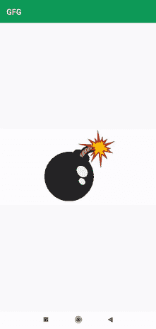

# 安卓爆发动画

> 原文:[https://www.geeksforgeeks.org/explode-animation-in-android/](https://www.geeksforgeeks.org/explode-animation-in-android/)

在这篇文章中，我们将展示安卓爆炸动画。这是非常有趣的事情。您可能已经在一些游戏应用程序甚至许多转账应用程序中看到了此功能。他们展示这样的奖励。当你点击奖励时，它会爆炸并显示你得到的奖励。下面给出了一个 GIF 示例，来了解一下我们将在本文中做什么。注意，我们将使用 **Java** 语言来实现这个项目。



### **分步实施**

**第一步:创建新项目**

要在安卓工作室创建新项目，请参考[如何在安卓工作室创建/启动新项目](https://www.geeksforgeeks.org/android-how-to-create-start-a-new-project-in-android-studio/)。注意选择 **Java** 作为编程语言。

**步骤 2:使用构建. gradle 文件**

导航至 **Gradle 脚本> build.gradle(模块:app)** 并在依赖项部分添加以下依赖项。

```
implementation 'tyrantgit:explosionfield:1.0.1'
```

**步骤 3:使用 activity_main.xml 文件**

导航到**应用程序> res >布局> activity_main.xml** ，并将下面的代码添加到该文件中。下面是 **activity_main.xml** 文件的代码。我们将创建一个简单的[图像视图](https://www.geeksforgeeks.org/imageview-in-android-with-example/)，我们将点击爆炸。

## 可扩展标记语言

```
<?xml version="1.0" encoding="utf-8"?>
<LinearLayout 
    xmlns:android="http://schemas.android.com/apk/res/android"
    xmlns:tools="http://schemas.android.com/tools"
    android:layout_width="match_parent"
    android:layout_height="match_parent"
    android:gravity="center"
    tools:context=".MainActivity">

    <ImageView
        android:layout_width="match_parent"
        android:layout_height="200dp"
        android:id="@+id/explode"
        android:src="@drawable/bomb"/>

</LinearLayout>
```

**第四步:使用****MainActivity.java 文件**

转到**MainActivity.java**文件，参考以下代码。以下是**MainActivity.java**文件的代码。代码中添加了注释，以更详细地理解代码。

## Java 语言(一种计算机语言，尤用于创建网站)

```
import android.os.Bundle;
import android.view.View;
import android.widget.ImageView;

import androidx.appcompat.app.AppCompatActivity;

import tyrantgit.explosionfield.ExplosionField;

public class MainActivity extends AppCompatActivity {

    boolean explod = true;

    @Override
    protected void onCreate(Bundle savedInstanceState) {
        super.onCreate(savedInstanceState);
        setContentView(R.layout.activity_main);

        final ImageView explode = findViewById(R.id.explode);
        final ExplosionField explosionField = ExplosionField.attach2Window(this);

        explode.setOnClickListener(new View.OnClickListener() {
            @Override
            public void onClick(View v) {
                // as we click on the image it will explode
                if (explod) {
                    explosionField.explode(explode);
                    explod = false;
                }
            }
        });
    }
}
```

**输出:**

<video class="wp-video-shortcode" id="video-591300-1" width="640" height="360" preload="metadata" controls=""><source type="video/mp4" src="https://media.geeksforgeeks.org/wp-content/uploads/20210405004218/explodeb.mp4?_=1">[https://media.geeksforgeeks.org/wp-content/uploads/20210405004218/explodeb.mp4](https://media.geeksforgeeks.org/wp-content/uploads/20210405004218/explodeb.mp4)</video>