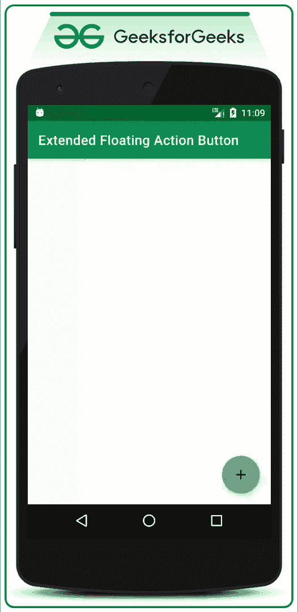
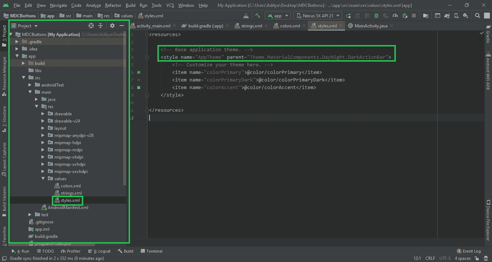

# 安卓扩展浮动动作按钮示例

> 原文:[https://www . geesforgeks . org/extended-floating-action-button-in-Android-with-example/](https://www.geeksforgeeks.org/extended-floating-action-button-in-android-with-example/)

**先决条件:** [安卓浮动动作按钮(FAB)示例](https://www.geeksforgeeks.org/floating-action-button-fab-in-android-with-example/)

在[浮动动作按钮(FAB)](https://www.geeksforgeeks.org/floating-action-button-fab-in-android-with-example/) 一文中，我们已经讨论了**正常/定期浮动** **动作按钮**和**迷你浮动动作按钮。**在本文中，我们来讨论并实现一个安卓中的**扩展浮动动作按钮**，点击时扩展，关闭时收缩，同时显示子浮动动作按钮弹出的上下文的信息。下面给出一个 GIF 示例，来了解一下在本文中我们要做什么。注意，我们将使用 **Java** 语言来实现这个项目。



### 创建扩展浮动操作按钮的步骤

**第一步:创建新项目**

要在安卓工作室创建新项目，请参考[如何在安卓工作室创建/启动新项目](https://www.geeksforgeeks.org/android-how-to-create-start-a-new-project-in-android-studio/)。注意选择 **Java** 作为编程语言。

**第二步:在 app 级 Gradle 文件中添加** **依赖项。**

*   这里我们使用的是由谷歌材质设计团队设计开发的浮动动作按钮。
*   将 [build.gradle(app)](https://www.geeksforgeeks.org/android-build-gradle/) 文件中的依赖项添加为:

> *实现‘com . Google . Android . material:material:1 . 3 . 0-alpha 02’*

*   确保将依赖项添加到应用程序级别的 Gradle 文件中。添加依赖项后，您需要点击出现在 Android Studio IDE 右上角的**“立即同步”**按钮。
*   单击“立即同步”按钮时，请确保您已连接到网络，以便网络可以下载所需的文件。
*   如果您无法获得上述步骤，或者找不到应用程序级别的渐变文件，请参考下图:


**第三步:在 styles.xml 文件**中更改基础应用主题

*   主题需要更改，因为扩展浮动操作按钮是谷歌材质设计按钮的子类。因此，它需要将 MaterialComponent 主题应用于应用程序的 Base 主题。否则，我们一启动应用程序，应用程序就会立即崩溃。
*   你可以参考这篇文章:[安卓中的材质设计按钮，示例](https://www.geeksforgeeks.org/material-design-buttons-in-android-with-example/)，因为扩展的材质设计按钮是材质设计按钮的子类。文章说，有 Material 设计按钮的好处，为什么主题需要改变。
*   转到**app->src->main->RES->values->style . XML**并更改基础应用主题。材料组件包含各种动作栏主题样式，除了**【AppCompat】**样式之外，可以调用任何 **【材料组件】** 动作栏主题样式。下面是**style . XML**文件的代码。

## 可扩展标记语言

```java
<resources> 
    <!-- Base application theme. -->
    <style name="AppTheme" parent="Theme.MaterialComponents.DayNight.DarkActionBar"> 
        <!-- Customize your theme here -->
        <item name="colorPrimary">@color/colorPrimary</item> 
        <item name="colorPrimaryDark">@color/colorPrimaryDark</item> 
        <item name="colorAccent">@color/colorAccent</item> 
    </style>
</resources>
```

如果你不能得到上面提到的东西，你可以参考这张图片。



**第四步:导入** **可绘制文件夹**中的部分矢量图标

*   在这种情况下，简单的添加矢量、添加报警、矢量、添加人矢量图标都是为了演示目的而导入的。
*   要导入项目中的任何矢量，需要在可绘制文件夹- >新建- >矢量资源上单击鼠标右键。
*   将会打开一个新的弹出窗口，通过点击**剪贴画**按钮选择您想要的任何矢量。
*   您可以参考下图了解如何打开矢量资产选择器。


*   您可以参考下图了解如何定位**剪贴画**按钮并选择矢量。


**第 5 步:使用 activity_main.xml 文件**

*   在添加扩展浮动操作按钮的 activity_main.xml 文件中。
*   在 activity_main.xml 文件中调用以下代码。为了清楚理解，请参考下面给出的代码中的注释:

## 可扩展标记语言

```java
<?xml version="1.0" encoding="utf-8"?>
<androidx.constraintlayout.widget.ConstraintLayout 
    xmlns:android="http://schemas.android.com/apk/res/android"
    xmlns:app="http://schemas.android.com/apk/res-auto"
    xmlns:tools="http://schemas.android.com/tools"
    android:layout_width="match_parent"
    android:layout_height="match_parent"
    tools:context=".MainActivity"
    tools:ignore="HardcodedText">

    <!--This will be the parent Floating Action Button-->
    <!--After the implementation the Floating Action Button at
         the bottom right corner as we have constrained accordingly-->
    <!--After clicking the above button the 
        following two buttons will pop up.
         So this button is considered as parent FAB-->
    <!--After opening the application it looks like regular 
        FAB but after user clicks it, it extends-->
    <!--This functionality has been handled in the MainActivity.java-->
    <com.google.android.material.floatingactionbutton.ExtendedFloatingActionButton
        android:id="@+id/add_fab"
        android:layout_width="wrap_content"
        android:layout_height="wrap_content"
        android:layout_gravity="end"
        android:layout_marginEnd="16dp"
        android:layout_marginBottom="16dp"
        android:backgroundTint="@color/colorAccent"
        android:text="Actions"
        app:icon="@drawable/ic_add_black_24dp"
        app:layout_constraintBottom_toBottomOf="parent"
        app:layout_constraintEnd_toEndOf="parent" />

    <!--Floating action button for add alarm-->
    <!--Make sure that you are constraining this 
        button to the parent button-->
    <!--Make sure to add backgroundTint attribute to match
         the entire application color-->
    <!--because after changing the base application theme the color
         of the FAB is set Blue as default-->
    <com.google.android.material.floatingactionbutton.FloatingActionButton
        android:id="@+id/add_alarm_fab"
        android:layout_width="wrap_content"
        android:layout_height="wrap_content"
        android:layout_marginBottom="24dp"
        android:backgroundTint="@color/colorAccent"
        app:fabSize="normal"
        app:layout_constraintBottom_toTopOf="@+id/add_fab"
        app:layout_constraintEnd_toEndOf="@+id/add_fab"
        app:srcCompat="@drawable/ic_add_alarm_black_24dp" />

    <!--Action name text for the add alarm button-->
    <!--Make sure that you are constraining this 
        Text to the add Alarm FAB button-->
    <TextView
        android:id="@+id/add_alarm_action_text"
        android:layout_width="wrap_content"
        android:layout_height="wrap_content"
        android:layout_marginEnd="8dp"
        android:text="Add Alarm"
        app:layout_constraintBottom_toBottomOf="@+id/add_alarm_fab"
        app:layout_constraintEnd_toStartOf="@+id/add_alarm_fab"
        app:layout_constraintTop_toTopOf="@+id/add_alarm_fab" />

    <!--Floating action button for add person-->
    <!--Make sure that you are constraining this button 
        to the add Alarm FAB button-->
    <!--Make sure to add backgroundTint attribute to match
         the entire application color-->
    <!--because after changing the base application theme
         the color of the FAB is set Blue as default-->
    <com.google.android.material.floatingactionbutton.FloatingActionButton
        android:id="@+id/add_person_fab"
        android:layout_width="wrap_content"
        android:layout_height="wrap_content"
        android:layout_marginBottom="24dp"
        android:backgroundTint="@color/colorAccent"
        app:fabSize="normal"
        app:layout_constraintBottom_toTopOf="@+id/add_alarm_fab"
        app:layout_constraintEnd_toEndOf="@+id/add_alarm_fab"
        app:layout_constraintStart_toStartOf="@+id/add_alarm_fab"
        app:srcCompat="@drawable/ic_person_add_black_24dp" />

    <!--Action name text for the add person button-->
    <!--Make sure that you are constraining this Text
         to the add Person FAB button-->
    <TextView
        android:id="@+id/add_person_action_text"
        android:layout_width="wrap_content"
        android:layout_height="wrap_content"
        android:layout_marginEnd="8dp"
        android:text="Add Person"
        app:layout_constraintBottom_toBottomOf="@+id/add_person_fab"
        app:layout_constraintEnd_toStartOf="@+id/add_person_fab"
        app:layout_constraintTop_toTopOf="@+id/add_person_fab" />

</androidx.constraintlayout.widget.ConstraintLayout>
```

**步骤 6:使用 MainActivity.java 文件**

*   在继续查看输出之前，最好先处理父浮动操作按钮及其子浮动操作按钮，如果没有完成，您可能会得到一些不寻常的输出。
*   要处理它们，请调用 MainActivity.java 文件中的以下代码。代码中添加了注释，以更详细地理解代码。

## Java 语言(一种计算机语言，尤用于创建网站)

```java
import android.os.Bundle;
import android.view.View;
import android.widget.TextView;
import android.widget.Toast;
import androidx.appcompat.app.AppCompatActivity;
import com.google.android.material.floatingactionbutton.ExtendedFloatingActionButton;
import com.google.android.material.floatingactionbutton.FloatingActionButton;

public class MainActivity extends AppCompatActivity {

    // Use the FloatingActionButton for all the add person
    // and add alarm
    FloatingActionButton mAddAlarmFab, mAddPersonFab;

    // Use the ExtendedFloatingActionButton to handle the
    // parent FAB
    ExtendedFloatingActionButton mAddFab;

    // These TextViews are taken to make visible and
    // invisible along with FABs except parent FAB's action
    // name
    TextView addAlarmActionText, addPersonActionText;

    // to check whether sub FABs are visible or not
    Boolean isAllFabsVisible;

    @Override
    protected void onCreate(Bundle savedInstanceState) {
        super.onCreate(savedInstanceState);
        setContentView(R.layout.activity_main);

        // Register all the FABs with their appropriate IDs
          // This FAB button is the Parent
        mAddFab = findViewById(R.id.add_fab); 
        // FAB button
        mAddAlarmFab = findViewById(R.id.add_alarm_fab);
        mAddPersonFab = findViewById(R.id.add_person_fab);

        // Also register the action name text, of all the
        // FABs. except parent FAB action name text
        addAlarmActionText = findViewById(R.id.add_alarm_action_text);
        addPersonActionText = findViewById(R.id.add_person_action_text);

        // Now set all the FABs and all the action name
        // texts as GONE
        mAddAlarmFab.setVisibility(View.GONE);
        mAddPersonFab.setVisibility(View.GONE);
        addAlarmActionText.setVisibility(View.GONE);
        addPersonActionText.setVisibility(View.GONE);

        // make the boolean variable as false, as all the
        // action name texts and all the sub FABs are
        // invisible
        isAllFabsVisible = false;

        // Set the Extended floating action button to
        // shrinked state initially
        mAddFab.shrink();

        // We will make all the FABs and action name texts
        // visible only when Parent FAB button is clicked So
        // we have to handle the Parent FAB button first, by
        // using setOnClickListener you can see below
        mAddFab.setOnClickListener(
                new View.OnClickListener() {
                    @Override
                    public void onClick(View view) {
                        if (!isAllFabsVisible) {

                            // when isAllFabsVisible becomes
                            // true make all the action name
                            // texts and FABs VISIBLE.
                            mAddAlarmFab.show();
                            mAddPersonFab.show();
                            addAlarmActionText.setVisibility(View.VISIBLE);
                            addPersonActionText.setVisibility(View.VISIBLE);

                            // Now extend the parent FAB, as
                            // user clicks on the shrinked
                            // parent FAB
                            mAddFab.extend();

                            // make the boolean variable true as
                            // we have set the sub FABs
                            // visibility to GONE
                            isAllFabsVisible = true;
                        } else {

                            // when isAllFabsVisible becomes
                            // true make all the action name
                            // texts and FABs GONE.
                            mAddAlarmFab.hide();
                            mAddPersonFab.hide();
                            addAlarmActionText.setVisibility(View.GONE);
                            addPersonActionText.setVisibility(View.GONE);

                            // Set the FAB to shrink after user
                            // closes all the sub FABs
                            mAddFab.shrink();

                            // make the boolean variable false
                            // as we have set the sub FABs
                            // visibility to GONE
                            isAllFabsVisible = false;
                        }
                    }
                });

        // below is the sample action to handle add person
        // FAB. Here it shows simple Toast msg. The Toast
        // will be shown only when they are visible and only
        // when user clicks on them
        mAddPersonFab.setOnClickListener(
                new View.OnClickListener() {
                    @Override
                    public void onClick(View view) {
                        Toast.makeText(MainActivity.this, "Person Added", Toast.LENGTH_SHORT).show();
                    }
                });

        // below is the sample action to handle add alarm
        // FAB. Here it shows simple Toast msg The Toast
        // will be shown only when they are visible and only
        // when user clicks on them
        mAddAlarmFab.setOnClickListener(
                new View.OnClickListener() {
                    @Override
                    public void onClick(View view) {
                        Toast.makeText(MainActivity.this, "Alarm Added", Toast.LENGTH_SHORT).show();
                    }
                });
    }
}
```

### 输出:在模拟器上运行

<video class="wp-video-shortcode" id="video-491009-1" width="640" height="360" preload="metadata" controls=""><source type="video/mp4" src="https://media.geeksforgeeks.org/wp-content/uploads/20200923231921/GFG_frame_nexus5.mp4?_=1">[https://media.geeksforgeeks.org/wp-content/uploads/20200923231921/GFG_frame_nexus5.mp4](https://media.geeksforgeeks.org/wp-content/uploads/20200923231921/GFG_frame_nexus5.mp4)</video>