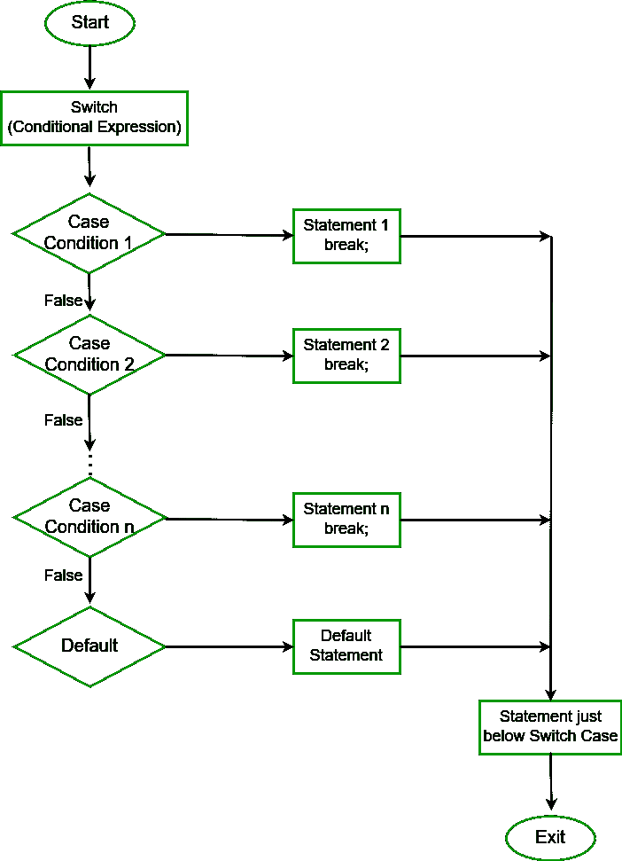

# Java 中的失败条件

> 原文:[https://www . geeksforgeeks . org/fall-through-condition-in-Java/](https://www.geeksforgeeks.org/fall-through-condition-in-java/)

**开关语句**是多路分支语句。它提供了一种简单的方法，可以根据表达式的值将执行分派到代码的不同部分。基本上，表达式可以是字节、短、字符和 int 基本数据类型。从 JDK7 开始，它还可以处理枚举类型(java 中的[](https://www.geeksforgeeks.org/enum-in-java/)<u>)、[](https://www.geeksforgeeks.org/string-class-in-java/)<u>类和 [<u>Wrapper</u>](https://www.geeksforgeeks.org/primitive-wrapper-classes-are-immutable-in-java/) 类。</u></u>

<u><u>**开关柜流程图:**</u></u>

<u><u></u></u>

<u><u>**失败条件:**当 switch 语句中没有针对特定案例的 break 关键字提及时，switch 控制语句中会出现此条件，并导致案例的执行，直到没有 break 语句出现或退出 switch 语句。这个条件有它自己的优点和缺点，它完全取决于我们在程序中想要的操作类型。</u></u>

<u><u>**以下程序中的失败条件:**</u></u>

## <u><u>Java 语言(一种计算机语言，尤用于创建网站)</u></u>

```java
<u>// Java program to showcase the fall through condition

import java.util.*;
import java.io.*;
class GFG{ 
public static void main(String[] args) {
        int gfg = 1; 

        switch ( gfg ){ 
          case 1:{ 
            System.out.println("GeeksforGeeks number 1"); 
          } 
          // Since break statement is missing
          // it will lead to fall through condition
          case 2:{ 
            System.out.println("GeeksforGeeks number 2"); 
          } 
          case 3:{ 
            System.out.println("GeeksforGeeks number 3"); 
          } 
          default :{ 
            System.out.println("This is default case"); 
          } 
        } 
    }
}</u>
```

<u><u>**Output**

```java
GeeksforGeeks number 1
GeeksforGeeks number 2
GeeksforGeeks number 3
This is default case
```</u></u> 

<u><u>**缺点:**在上面的程序中，我们忘记提到 switch 语句中的 break 语句，该语句导致执行所有案例，即使它们与匹配的值不匹配。这种情况在程序中造成了一个主要问题。因此，我们必须在 switch 语句中对每种情况都使用 break 关键字，以克服这种情况，这就是失败条件的**劣势**。</u></u>

<u><u>**通过条件的优势:**</u></u>

<u><u>我们非常清楚 switch 语句适用于单个变量或表达式，并且在许多情况下，当有相同的输出时，许多值和这里的失败条件在这种情况下起着重要的作用，并且通过减少比较使程序高效</u></u>

<u><u>**例:** Java 一个月总天数，Java 程序检查字符是否为元音等。</u></u>

## <u><u>Java 语言(一种计算机语言，尤用于创建网站)</u></u>

```java
<u>// Java Program to check whether the character is a vowel or not

import java.util.*;
import java.io.*;
class GFG{ 
public static void main(String[] args) {

        char ch='f'; 

        switch ( ch ){ 
        case 'a':
        case 'e':
        case 'i':
        case 'o':
        case 'u':System.out.println("Vowel");
        break;
        default :{ 
            System.out.println("Consonant"); 

        } 
    }
}}</u>
```

<u><u>**Output**

```java
Consonant
```</u></u>