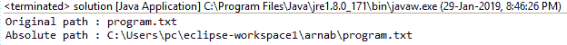
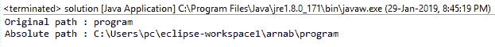
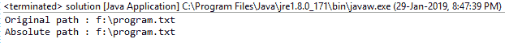

# Java 中的 File getAbsolutePath()方法，带示例

> 原文:[https://www . geesforgeks . org/file-getabsolutepath-method-in-Java-with-examples/](https://www.geeksforgeeks.org/file-getabsolutepath-method-in-java-with-examples/)

**getAbsolutePath()** 方法是[文件](https://www.geeksforgeeks.org/File-class-in-java/)类的一部分。该函数返回给定文件对象的绝对路径名。如果文件对象的路径名是绝对的，那么它只返回当前文件对象的路径。

**例如:**如果我们使用路径“program.txt”创建一个文件对象，它将指向保存可执行程序的同一目录中的文件(如果您使用的是 IDE，它将指向您保存程序的文件)。这里上面提到的文件路径是“program.txt”，但是这个路径不是绝对的(即不完整)。函数 getAbsolutePath()将从根目录返回绝对(完整)路径。如果文件对象是用绝对路径创建的，那么 getPath()和 getAbsolutePath()将给出相同的结果。

**功能签名:**

```
public String getAbsolutePath()
```

**函数语法:**

```
file.getAbsolutePath()
```

**参数:**此功能不接受任何参数。

**返回值:**该函数返回一个字符串值，该值是给定文件对象的绝对路径。

**异常:**如果无法访问需要的属性值，该方法抛出**安全异常**。

下面的程序将说明 getAbsolutePath()方法的使用:

**示例 1:** 当前工作目录中有一个名为“program.txt”的文件。

```
// Java program to demonstrate the
// use of getAbsolutePath() function

import java.io.*;

public class solution {
    public static void main(String args[])
    {

        // try-catch block to handle exceptions
        try {

            // Create a file object
            File f = new File("program.txt");

            // Get the absolute path of file f
            String absolute = f.getAbsolutePath();

            // Display the file path of the file object
            // and also the file path of absolute file
            System.out.println("Original  path: "
                               + f.getPath());
            System.out.println("Absolute  path: "
                               + absolute);
        }
        catch (Exception e) {
            System.err.println(e.getMessage());
        }
    }
}
```

**输出:**

```
Original Path: program.txt
Absolute Path: C:\Users\pc\eclipse-workspace1\arnab\program.txt

```



**例 2:** 当前工作目录中有一个名为“program”的目录。

```
// Java program to demonstrate the
// use of getAbsolutePath() function

import java.io.*;

public class solution {
    public static void main(String try-catch   {

        // try catch block to handle exceptions
        try {

            // Create a file object
            File f = new File("program");

            // Get the absolute path of file f
            String absolute = f.getAbsolutePath();

            // Display the file path of the file object
            // and also the file path of absolute file
            System.out.println("Original path: "
                               + f.getPath());
            System.out.println("Absolute path: "
                               + absolute);
        }
        catch (Exception e) {
            System.err.println(e.getMessage());
        }
    }
}
```

**输出:**

```
Original Path: program
Absolute Path: C:\Users\pc\eclipse-workspace1\arnab\program

```



**例 3:** 在“f:\”目录下的一个名为“f:\program.txt”的文件。

```
// Java program to demonstrate the
// use of getAbsolutePath() function

import java.io.*;

public class solution {
    public static void main(String args[])
    {

        // try catch block to handle exceptions
        try {

            // Create a file object
            File f = new File("f:\\program.txt");

            // get the absolute path
            // of file f
            String absolute = f.getAbsolutePath();

            // display the file path of the file object
            // and also the file path of absolute file
            System.out.println("Original  path: "
                               + f.getPath());
            System.out.println("Absolute  path: "
                               + absolute);
        }
        catch (Exception e) {
            System.err.println(e.getMessage());
        }
    }
}
```

**输出:**

```
Original file path: f:\program.txt
Absolute file path: f:\program.txt

```



**程序可能无法在在线 IDE 中运行。请使用离线 IDE 并设置文件的路径**