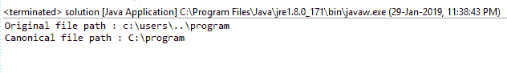

# Java 中的 File getCanonicalFile()方法，带示例

> 原文:[https://www . geesforgeks . org/file-getcanonicalfile-method-in-Java-with-examples/](https://www.geeksforgeeks.org/file-getcanonicalfile-method-in-java-with-examples/)

**getCanonicalFile()** 方法是[文件](https://www.geeksforgeeks.org/File-class-in-java/)类的一部分。这个函数返回给定文件对象的规范文件。如果文件对象的文件路径是规范的，那么它只返回当前文件对象的文件。
规范文件总是绝对的和唯一的，函数删除了“.”'..'从文件路径(如果存在)中选择。

**例如:**如果我们使用路径“program.txt”创建一个文件对象，它将指向保存可执行程序的同一目录中的文件(如果您使用的是 IDE，它将指向您保存程序的文件)。这里上面提到的文件路径是“program.txt”，但是这个路径不是绝对的(即不完整)。函数 getCanonicalFile()将返回一个文件，该文件的路径将是根目录中的绝对唯一路径。现有文件的规范形式可以不同于相同的不存在的文件的规范形式，并且当删除时，现有文件的规范形式可以不同于相同文件的规范形式。
**功能签名:**

```java
public File getCanonicalFile()
```

**函数语法:**

```java
file.getCanonicalFile()
```

**参数:**此功能不接受任何参数。

**返回值:**该函数返回文件对象，即给定文件对象的规范文件。

**异常**该方法抛出以下异常

*   **安全异常:**如果无法访问需要的属性值。
*   **输入输出异常:**如果出现输入输出异常。

下面的程序将说明 getCanonicalFile()方法的使用:

**示例 1:** 这里的“program.txt”是存在于当前工作目录中的文件

```java
// Java program to demonstrate the
// use of getCanonicalFile() function

import java.io.*;

public class solution {
    public static void main(String args[])
    {

        // try-catch block to handle exceptions
        try {

            // Create a file object
            File f = new File("program.txt");

            // Get the Canonical file
            // of the given file f
            File canonical = f.getCanonicalFile();

            // Display the file path of the file object
            // and also the file path of Canonical file
            System.out.println("Original file path: "
                               + f.getPath());
            System.out.println("Canonical file path: "
                               + canonical.getPath());
        }
        catch (Exception e) {
            System.err.println(e.getMessage());
        }
    }
}
```

**输出:**

```java
Original file path: program.txt
Canonical file path: C:\Users\pc\eclipse-workspace1\arnab\program.txt

```


**示例 2:** 给定一个文件对象，我们必须从该文件对象创建规范文件。

```java
// Java program to demonstrate the
// use of getCanonicalFile() function

import java.io.*;

public class solution {
    public static void main(String args[])
    {

        // try-catch block to handle exceptions
        try {

            // Create a file object
            File f
                = new File("c:\\users\\..\\program");

            // Get the Canonical file
            // of the given file f
            File canonical = f.getCanonicalFile();

            // Display the file path of the file object
            // and also the file path of Canonical file
            System.out.println("Original file path: "
                               + f.getPath());
            System.out.println("Canonical file path: "
                               + canonical.getPath());
        }
        catch (Exception e) {
            System.err.println(e.getMessage());
        }
    }
}
```

**输出:**

```java
Original file path: c:\users\..\program
Canonical file path: C:\program

```



**程序可能无法在在线 IDE 中运行。请使用离线 IDE 并设置文件的路径**