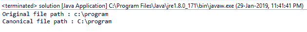

# Java 中的文件 getCanonicalPath()方法，带示例

> 原文:[https://www . geesforgeks . org/file-getcanonicalpath-method-in-Java-with-examples/](https://www.geeksforgeeks.org/file-getcanonicalpath-method-in-java-with-examples/)

**getCanonicalPath()** 方法是 [Path](https://www.geeksforgeeks.org/Path-class-in-java/) 类的一部分。该函数返回给定文件对象的规范路径名。如果文件对象的路径名是规范的，那么它只返回当前文件对象的路径。规范路径总是绝对且唯一的，函数移除了“.”'..'如果存在的话。

**例如:**如果我们使用路径“program.txt”创建一个文件对象，它将指向保存可执行程序的同一目录中的文件(如果您使用的是 IDE，它将指向您保存程序的文件)。这里上面提到的文件路径是“program.txt”，但是这个路径不是绝对的(即不完整)。函数 getCanonicalPath()将返回一个路径，该路径将是根目录中的绝对唯一路径。现有文件的规范形式可以不同于相同的不存在文件的规范形式，并且现有文件的规范形式可以不同于相同文件被删除时的规范形式。

**功能签名:**

```
public String getCanonicalPath()
```

**函数语法:**

```
file.getCanonicalPath()
```

**参数:**此功能不接受任何参数。

**返回值:**如果给定文件对象的规范路径，该函数返回一个字符串值。

**异常:**该方法抛出以下异常:

*   如果无法访问所需的属性值，则**安全异常**。*   **I/O Exception** if I/O exception occurs.

    下面的程序将说明 getAbsolutePath()方法的使用:

    **示例 1:** 我们有一个带有指定路径的 File 对象，我们将尝试找到它的规范路径。

    ```
    // Java program to demonstrate the
    // use of getCanonicalPath() function

    import java.io.*;

    public class solution {
        public static void main(String args[])
        {
            // try-catch block to handle exceptions
            try {

                // Create a file object
                File f = new File("c:\\program");

                // Get the Canonical path of file f
                String canonical = f.getCanonicalPath();

                // Display the file path of the file object
                // and also the file path of Canonical file
                System.out.println("Original file path : "
                                   + f.getPath());
                System.out.println("Canonical file path : "
                                   + canonical);
            }
            catch (Exception e) {
                System.err.println(e.getMessage());
            }
        }
    }
    ```

    **输出**

    ```
    Original file path : c:\program
    Canonical file path : C:\program

    ```

    

    **示例 2:** 我们有一个带有指定路径的 File 对象，我们将尝试找到它的规范路径。

    ```
    // Java program to demonstrate the
    // use of getCanonicalPath() function

    import java.io.*;
    public class solution {
        public static void main(String args[])
        {
            // try-catch block to handle exceptions
            try {

                // Create a file object
                File f = new File("c:\\users\\..\\program");

                // Get the Canonical path of file f
                String canonical = f.getCanonicalPath();

                // Display the file path of the file object
                // and also the file path of Canonical file
                System.out.println("Original file path : "
                                   + f.getPath());
                System.out.println("Canonical file path : "
                                   + canonical);
            }
            catch (Exception e) {
                System.err.println(e.getMessage());
            }
        }
    }
    ```

    **输出**

    ```
    Original file path : c:\users\..\program
    Canonical file path : C:\program

    ```

    

    **程序可能无法在在线 IDE 中运行。请使用离线 IDE 并设置文件的路径**