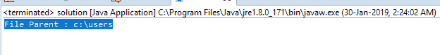

# Java 中的 File getParentFile()方法，带示例

> 原文:[https://www . geesforgeks . org/file-getparentfile-method-in-Java-with-examples/](https://www.geeksforgeeks.org/file-getparentfile-method-in-java-with-examples/)

**getParentFile()** 方法是[文件](https://www.geeksforgeeks.org/File-class-in-java/)类的一部分。该函数返回给定文件对象的父文件。该函数返回一个文件对象，该对象包含给定文件对象的父文件。如果抽象路径不包含任何父文件，则返回空值。

**功能签名:**

```
public File getParentFile()
```

**函数语法:**

```
file.getParentFile()
```

**参数:**此功能不接受任何参数。

**返回值:**函数返回文件对象，它是给定文件对象的父文件。

下面的程序将说明 getParentFile()函数的使用:

**例 1:** 给我们一个文件的文件对象，我们要得到文件对象的父文件。

```
// Java program to demonstrate the
// use of getParentFile() function

import java.io.*;

public class solution {
    public static void main(String args[])
    {

        // try-catch block to handle exceptions
        try {

            // Create a file object
            File f = new File("c:\\users\\program.txt");

            // Get the Parent of the given file f
            File Parent = f.getParentFile();

            // Display the file Parent file
            // of the file object
            System.out.println("File Parent : "
                               + Parent.getPath());
        }
        catch (Exception e) {
            System.err.println(e.getMessage());
        }
    }
}
```

**输出:**

```
File Parent : c:\users

```



**例 2:** 给我们一个目录的文件对象，我们要得到文件对象的父文件。

```
// Java program to demonstrate the
// use of getParentFile() function

import java.io.*;

public class solution {
    public static void main(String args[])
    {

        // try-catch block to handle exceptions
        try {

            // Create a file object
            File f = new File("c:\\users\\program");

            // Get the Parent of the given file f
            File Parent = f.getParentFile();

            // Display the file Parent
            // file of the file object
            System.out.println("File Parent : "
                               + Parent.getPath());
        }
        catch (Exception e) {
            System.err.println(e.getMessage());
        }
    }
}
```

**输出:**

```
File Parent : c:\users

```


**程序可能无法在在线 IDE 中运行。请使用离线 IDE 并设置文件的父文件**