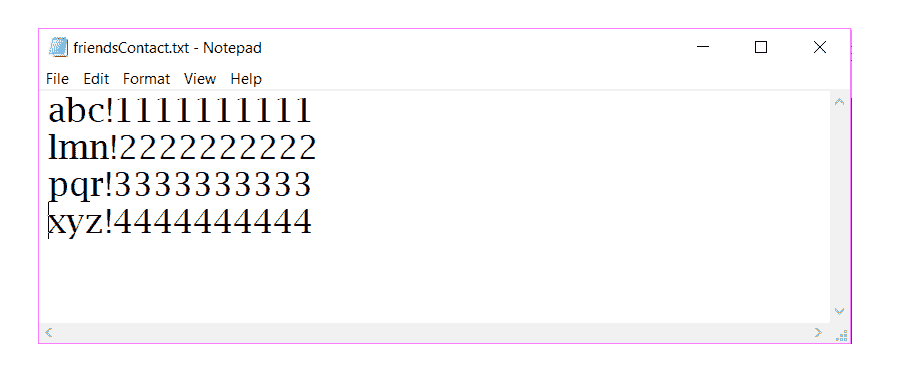
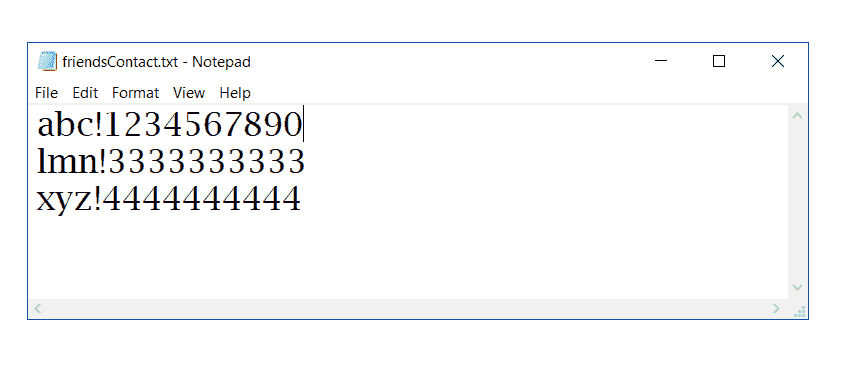
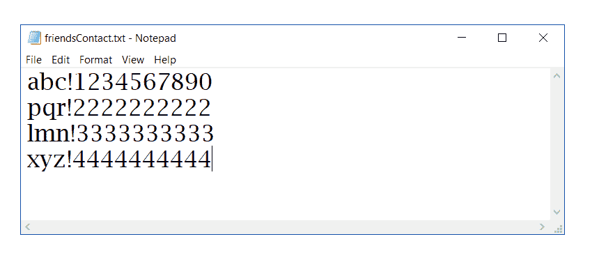

# 用 CRUD 操作进行 Java 文件处理

> 原文:[https://www . geesforgeks . org/file-handling-in-Java-with-crud-operations/](https://www.geeksforgeeks.org/file-handling-in-java-with-crud-operations/)

到目前为止，使用 Java 程序的操作是在没有存储在任何地方的提示符/终端上完成的。但是在软件行业，大多数程序都是为了存储从程序中获取的信息而编写的。一种方法是将提取的信息存储在**文件**中。

**什么是 Java 中的文件处理？**

一个**文件**是一个用来存储各种类型信息的容器。通过创建一个具有唯一名称的文件，数据被永久存储在辅助内存中。文件可以由文本、图像或任何其他文档组成。

**可以对文件进行的不同操作有:**

1.  创建新文件
2.  打开现有文件
3.  从文件中读取
4.  写入文件
5.  移动到文件中的特定位置
6.  关闭文件

**可在 Java 中用于文件处理的不同类:**

1.  [InputStream](https://www.geeksforgeeks.org/java-io-inputstream-class-in-java/)
2.  输出流
3.  [滤波器 utputStream](https://www.geeksforgeeks.org/java-io-filteroutputstream-class-java/)
4.  档案输出流
5.  字节数组输出流
6.  [字节阵列输入流](https://www.geeksforgeeks.org/io-bytearrayinputstream-class-java/)
7.  fileinputstream
8.  过滤输入流
9.  [StringBufferInputStream](https://www.geeksforgeeks.org/java-io-stringbufferinputstream-class-java/)
10.  [SequenceInputStream](https://www.geeksforgeeks.org/java-io-sequenceinputstream-java/)
11.  [缓冲器 utputStream](https://www.geeksforgeeks.org/java-io-bufferedoutputstream-class-java/)
12.  [StringBufferInputStream](https://www.geeksforgeeks.org/java-io-stringbufferinputstream-class-java/)
13.  [DataOutputStream](https://www.geeksforgeeks.org/dataoutputstream-in-java/)
14.  打印流
15.  [buffer edinpertstream](https://www.geeksforgeeks.org/java-io-bufferedinputstream-class-java/)
16.  datainputstream
17.  [pushbakinputstream](https://www.geeksforgeeks.org/java-io-pushbackinputstream-class-java/)

在本文中，我们将学习如何使用类[来执行 8 位(1 字节)的输入和输出](https://www.geeksforgeeks.org/java-io-randomaccessfile-class-method-set-1/) [Java 字节流](https://www.geeksforgeeks.org/character-stream-vs-byte-stream-java/)，该类由方法 **writeBytes()和 readBytes()** 组成，以字节的形式写入和读取数据。

**执行文件操作的各种方法:**

*   **写入字节(字符串):**将字符串作为字节序列写入文件。
*   **readLine():** 从此文件中读取下一行文本。
*   **getFilePointer():** 返回此文件中的当前偏移量。
*   **length():** 返回该文件的长度，返回类型为 long。
*   **close():** 关闭该随机访问文件流，并释放与该流相关联的任何系统资源。
*   **设置长度(长新长度):**设置该文件的长度。
*   **寻道(长位置):**设置文件指针偏移量，从该文件的开始位置开始测量，在该位置进行下一次读取或写入。

**Java 文件打开方式:**

<figure class="table">

| 

价值

 | 

意义

 |
| --- | --- |
| " r " | 仅供阅读。调用结果对象的任何写方法都将导致引发 IOException。

 |
| “rw” | 开放阅读和写作。如果文件不存在，将尝试创建它。 |
| “rws” | 像“rw”一样，打开进行读写，还要求文件内容或元数据的每次更新都同步写入底层存储设备。 |
| “rwd” | 像“rw”一样，打开进行读写，还要求文件内容的每次更新都同步写入底层存储设备。 |

</figure>

**使用 RandomAccessFile 打开文件的语法:**

```
File file = new File( filename )
RandomAccessFile raf = new RandomAccessFile(file, mode)
```

**Java 中使用文件处理的 CRUD 操作**

**示例:**考虑您希望在文件中保留朋友联系号码的记录。为了区分你朋友的名字和联系电话，你需要一个分隔符。为此，您需要选择一个分隔符，如“！”或“{ content }”；或者一些没有出现在你朋友名字里的特殊符号。然后我们将形成一个由名称、特殊符号和数字组成的字符串插入到文件中。

【friendsContact.txt 文件中联系人的语法:

```
Name!Number
```

**如何用 Java 创建文件？**

## Java 语言(一种计算机语言，尤用于创建网站)

```
// Java program to create a file "friendsContact.txt"
// and add a new contact in the file

import java.io.File;
import java.io.IOException;
import java.io.RandomAccessFile;
import java.lang.NumberFormatException;

class AddFriend {

    public static void main(String data[])
    {

        try {

            // Get the name of the contact to be updated
            // from the Command line argument
            String newName = data[0];

            // Get the number to be updated
            // from the Command line argument
            long newNumber = Long.parseLong(data[1]);

            String nameNumberString;
            String name;
            long number;
            int index;

            // Using file pointer creating the file.
            File file = new File("friendsContact.txt");

            if (!file.exists()) {

                // Create a new file if not exists.
                file.createNewFile();
            }

            // Opening file in reading and write mode.

            RandomAccessFile raf
                = new RandomAccessFile(file, "rw");
            boolean found = false;

            // Checking whether the name
            // of contact already exists.
            // getFilePointer() give the current offset
            // value from start of the file.
            while (raf.getFilePointer() < raf.length()) {

                // reading line from the file.
                nameNumberString = raf.readLine();

                // splitting the string to get name and
                // number
                String[] lineSplit
                    = nameNumberString.split("!");

                // separating name and number.
                name = lineSplit[0];
                number = Long.parseLong(lineSplit[1]);

                // if condition to find existence of record.
                if (name == newName
                    || number == newNumber) {
                    found = true;
                    break;
                }
            }

            if (found == false) {

                // Enter the if block when a record
                // is not already present in the file.
                nameNumberString
                    = newName + "!"
                      + String.valueOf(newNumber);

                // writeBytes function to write a string
                // as a sequence of bytes.
                raf.writeBytes(nameNumberString);

                // To insert the next record in new line.
                raf.writeBytes(System.lineSeparator());

                // Print the message
                System.out.println(" Friend added. ");

                // Closing the resources.
                raf.close();
            }
            // The contact to be updated
            // could not be found
            else {

                // Closing the resources.
                raf.close();

                // Print the message
                System.out.println(" Input name"
                                   + " does not exists. ");
            }
        }

        catch (IOException ioe) {

            System.out.println(ioe);
        }
        catch (NumberFormatException nef) {

            System.out.println(nef);
        }
    }
}
```

**输出:**

**在新创建的文件中编译并添加联系人:**

```
javac AddFriend.java 

java AddFriend abc 1111111111 
Friend added

java AddFriend pqr 1111111111
Input name or number already exist
```

**文件:**



**如何用 Java 读取文件？**

## Java 语言(一种计算机语言，尤用于创建网站)

```
// Java program to read from file "friendsContact.txt"
// and display the contacts

import java.io.File;
import java.io.IOException;
import java.io.RandomAccessFile;
import java.lang.NumberFormatException;

class DisplayFriends {

    public static void main(String data[])
    {

        try {

            String nameNumberString;
            String name;
            long number;
            int index;

            // Using file pointer creating the file.
            File file = new File("friendsContact.txt");

            if (!file.exists()) {

                // Create a new file if not exists.
                file.createNewFile();
            }

            // Opening file in reading and write mode.

            RandomAccessFile raf
                = new RandomAccessFile(file, "rw");
            boolean found = false;

            // Traversing the file
            // getFilePointer() give the current offset
            // value from start of the file.
            while (raf.getFilePointer() < raf.length()) {

                // reading line from the file.
                nameNumberString = raf.readLine();

                // splitting the string to get name and
                // number
                String[] lineSplit
                    = nameNumberString.split("!");

                // separating name and number.
                name = lineSplit[0];
                number = Long.parseLong(lineSplit[1]);

                // Print the contact data
                System.out.println(
                    "Friend Name: " + name + "\n"
                    + "Contact Number: " + number + "\n");
            }

            catch (IOException ioe)
            {

                System.out.println(ioe);
            }
            catch (NumberFormatException nef)
            {

                System.out.println(nef);
            }
        }
    }
```

**输出:**

**从文件中编译和读取联系人:**

```
javac DisplayFriends.java 

java DisplayFriends
Friend Name: abc 
Contact Number: 1234567890

Friend Name: lmn
Contact Number: 3333333333

Friend Name: xyz 
Contact Number: 4444444444
```

**文件:**



**如何用 Java 更新文件？**

## Java 语言(一种计算机语言，尤用于创建网站)

```
// Java program to update in the file "friendsContact.txt"
// and change the number of an old contact

import java.io.File;
import java.io.IOException;
import java.io.RandomAccessFile;
import java.lang.NumberFormatException;

class UpdateFriend {

    public static void main(String data[])
    {

        try {

            // Get the name of the contact to be updated
            // from the Command line argument
            String newName = data[0];

            // Get the number to be updated
            // from the Command line argument
            long newNumber = Long.parseLong(data[1]);

            String nameNumberString;
            String name;
            long number;
            int index;

            // Using file pointer creating the file.
            File file = new File("friendsContact.txt");

            if (!file.exists()) {

                // Create a new file if not exists.
                file.createNewFile();
            }

            // Opening file in reading and write mode.
            RandomAccessFile raf
                = new RandomAccessFile(file, "rw");
            boolean found = false;

            // Checking whether the name
            // of contact already exists.
            // getFilePointer() give the current offset
            // value from start of the file.
            while (raf.getFilePointer() < raf.length()) {

                // reading line from the file.
                nameNumberString = raf.readLine();

                // splitting the string to get name and
                // number
                String[] lineSplit
                    = nameNumberString.split("!");

                // separating name and number.
                name = lineSplit[0];
                number = Long.parseLong(lineSplit[1]);

                // if condition to find existence of record.
                if (name == newName
                    || number == newNumber) {
                    found = true;
                    break;
                }
            }

            // Update the contact if record exists.
            if (found == true) {

                // Creating a temporary file
                // with file pointer as tmpFile.
                File tmpFile = new File("temp.txt");

                // Opening this temporary file
                // in ReadWrite Mode
                RandomAccessFile tmpraf
                    = new RandomAccessFile(tmpFile, "rw");

                // Set file pointer to start
                raf.seek(0);

                // Traversing the friendsContact.txt file
                while (raf.getFilePointer()
                       < raf.length()) {

                    // Reading the contact from the file
                    nameNumberString = raf.readLine();

                    index = nameNumberString.indexOf('!');
                    name = nameNumberString.substring(
                        0, index);

                    // Check if the fetched contact
                    // is the one to be updated
                    if (name.equals(inputName)) {

                        // Update the number of this contact
                        nameNumberString
                            = name + "!"
                              + String.valueOf(newNumber);
                    }

                    // Add this contact in the temporary
                    // file
                    tmpraf.writeBytes(nameNumberString);

                    // Add the line separator in the
                    // temporary file
                    tmpraf.writeBytes(
                        System.lineSeparator());
                }

                // The contact has been updated now
                // So copy the updated content from
                // the temporary file to original file.

                // Set both files pointers to start
                raf.seek(0);
                tmpraf.seek(0);

                // Copy the contents from
                // the temporary file to original file.
                while (tmpraf.getFilePointer()
                       < tmpraf.length()) {
                    raf.writeBytes(tmpraf.readLine());
                    raf.writeBytes(System.lineSeparator());
                }

                // Set the length of the original file
                // to that of temporary.
                raf.setLength(tmpraf.length());

                // Closing the resources.
                tmpraf.close();
                raf.close();

                // Deleting the temporary file
                tmpFile.delete();

                System.out.println(" Friend updated. ");
            }

            // The contact to be updated
            // could not be found
            else {

                // Closing the resources.
                raf.close();

                // Print the message
                System.out.println(" Input name"
                                   + " does not exists. ");
            }
        }

        catch (IOException ioe) {
            System.out.println(ioe);
        }

        catch (NumberFormatException nef) {
            System.out.println(nef);
        }
    }
}
```

**输出:**

**编译并更新文件中的联系人:**

```
javac UpdateFriend.java 

java UpdateFriend abc 1234567890
Friend updated.

java UpdateFriend tqr
Input name does not exists.
```

**文件:**



**如何在 Java 中删除文件？**

## Java 语言(一种计算机语言，尤用于创建网站)

```
// Java program to delete a contact
// from the file "friendsContact.txt"

import java.io.File;
import java.io.IOException;
import java.io.RandomAccessFile;
import java.lang.NumberFormatException;

class DeleteFriend {

    public static void main(String data[])
    {

        try {

            // Get the name of the contact to be updated
            // from the Command line argument
            String newName = data[0];

            String nameNumberString;
            String name;
            long number;
            int index;

            // Using file pointer creating the file.
            File file = new File("friendsContact.txt");

            if (!file.exists()) {

                // Create a new file if not exists.
                file.createNewFile();
            }

            // Opening file in reading and write mode.
            RandomAccessFile raf
                = new RandomAccessFile(file, "rw");
            boolean found = false;

            // Checking whether the name of contact exists.
            // getFilePointer() give the current offset
            // value from start of the file.
            while (raf.getFilePointer() < raf.length()) {

                // reading line from the file.
                nameNumberString = raf.readLine();

                // splitting the string to get name and
                // number
                String[] lineSplit
                    = nameNumberString.split("!");

                // separating name and number.
                name = lineSplit[0];
                number = Long.parseLong(lineSplit[1]);

                // if condition to find existence of record.
                if (name == newName) {
                    found = true;
                    break;
                }
            }

            // Delete the contact if record exists.
            if (found == true) {

                // Creating a temporary file
                // with file pointer as tmpFile.
                File tmpFile = new File("temp.txt");

                // Opening this temporary file
                // in ReadWrite Mode
                RandomAccessFile tmpraf
                    = new RandomAccessFile(tmpFile, "rw");

                // Set file pointer to start
                raf.seek(0);

                // Traversing the friendsContact.txt file
                while (raf.getFilePointer()
                       < raf.length()) {

                    // Reading the contact from the file
                    nameNumberString = raf.readLine();

                    index = nameNumberString.indexOf('!');
                    name = nameNumberString.substring(
                        0, index);

                    // Check if the fetched contact
                    // is the one to be deleted
                    if (name.equals(inputName)) {

                        // Skip inserting this contact
                        // into the temporary file
                        continue;
                    }

                    // Add this contact in the temporary
                    // file
                    tmpraf.writeBytes(nameNumberString);

                    // Add the line separator in the
                    // temporary file
                    tmpraf.writeBytes(
                        System.lineSeparator());
                }

                // The contact has been deleted now
                // So copy the updated content from
                // the temporary file to original file.

                // Set both files pointers to start
                raf.seek(0);
                tmpraf.seek(0);

                // Copy the contents from
                // the temporary file to original file.
                while (tmpraf.getFilePointer()
                       < tmpraf.length()) {
                    raf.writeBytes(tmpraf.readLine());
                    raf.writeBytes(System.lineSeparator());
                }

                // Set the length of the original file
                // to that of temporary.
                raf.setLength(tmpraf.length());

                // Closing the resources.
                tmpraf.close();
                raf.close();

                // Deleting the temporary file
                tmpFile.delete();

                System.out.println(" Friend deleted. ");
            }

            // The contact to be deleted
            // could not be found
            else {

                // Closing the resources.
                raf.close();

                // Print the message
                System.out.println(" Input name"
                                   + " does not exists. ");
            }
        }

        catch (IOException ioe) {
            System.out.println(ioe);
        }
    }
}
```

**输出:**

**编辑和删除文件中的联系人:**

```
javac DeleteFriend.java 

java DeleteFriend pqr
Friend deleted.

java DeleteFriend tqr
Input name does not exists.
```

**文件:**


## 创造

```
// Java program to create a file "friendsContact.txt"
// and add a new contact in the file

import java.io.File;
import java.io.IOException;
import java.io.RandomAccessFile;
import java.lang.NumberFormatException;

class AddFriend {

    public static void main(String data[])
    {

        try {

            // Get the name of the contact to be updated
            // from the Command line argument
            String newName = data[0];

            // Get the number to be updated
            // from the Command line argument
            long newNumber = Long.parseLong(data[1]);

            String nameNumberString;
            String name;
            long number;
            int index;

            // Using file pointer creating the file.
            File file = new File("friendsContact.txt");

            if (!file.exists()) {

                // Create a new file if not exists.
                file.createNewFile();
            }

            // Opening file in reading and write mode.

            RandomAccessFile raf
                = new RandomAccessFile(file, "rw");
            boolean found = false;

            // Checking whether the name
            // of contact already exists.
            // getFilePointer() give the current offset
            // value from start of the file.
            while (raf.getFilePointer() < raf.length()) {

                // reading line from the file.
                nameNumberString = raf.readLine();

                // splitting the string to get name and
                // number
                String[] lineSplit
                    = nameNumberString.split("!");

                // separating name and number.
                name = lineSplit[0];
                number = Long.parseLong(lineSplit[1]);

                // if condition to find existence of record.
                if (name == newName
                    || number == newNumber) {
                    found = true;
                    break;
                }
            }

            if (found == false) {

                // Enter the if block when a record
                // is not already present in the file.
                nameNumberString
                    = newName + "!"
                      + String.valueOf(newNumber);

                // writeBytes function to write a string
                // as a sequence of bytes.
                raf.writeBytes(nameNumberString);

                // To insert the next record in new line.
                raf.writeBytes(System.lineSeparator());

                // Print the message
                System.out.println(" Friend added. ");

                // Closing the resources.
                raf.close();
            }
            // The contact to be updated
            // could not be found
            else {

                // Closing the resources.
                raf.close();

                // Print the message
                System.out.println(" Input name"
                                   + " does not exists. ");
            }
        }

        catch (IOException ioe) {

            System.out.println(ioe);
        }
        catch (NumberFormatException nef) {

            System.out.println(nef);
        }
    }
}
```

## 阅读

```
// Java program to read from file "friendsContact.txt"
// and display the contacts

import java.io.File;
import java.io.IOException;
import java.io.RandomAccessFile;
import java.lang.NumberFormatException;

class DisplayFriends {

    public static void main(String data[])
    {

        try {

            String nameNumberString;
            String name;
            long number;
            int index;

            // Using file pointer creating the file.
            File file = new File("friendsContact.txt");

            if (!file.exists()) {

                // Create a new file if not exists.
                file.createNewFile();
            }

            // Opening file in reading and write mode.

            RandomAccessFile raf
                = new RandomAccessFile(file, "rw");
            boolean found = false;

            // Traversing the file
            // getFilePointer() give the current offset
            // value from start of the file.
            while (raf.getFilePointer() < raf.length()) {

                // reading line from the file.
                nameNumberString = raf.readLine();

                // splitting the string to get name and
                // number
                String[] lineSplit
                    = nameNumberString.split("!");

                // separating name and number.
                name = lineSplit[0];
                number = Long.parseLong(lineSplit[1]);

                // Print the contact data
                System.out.println(
                    "Friend Name: " + name + "\n"
                    + "Contact Number: " + number + "\n");
            }

            catch (IOException ioe)
            {

                System.out.println(ioe);
            }
            catch (NumberFormatException nef)
            {

                System.out.println(nef);
            }
        }
    }
```

## 更新

```
// Java program to update in the file "friendsContact.txt"
// and change the number of an old contact

import java.io.File;
import java.io.IOException;
import java.io.RandomAccessFile;
import java.lang.NumberFormatException;

class UpdateFriend {

    public static void main(String data[])
    {

        try {

            // Get the name of the contact to be updated
            // from the Command line argument
            String newName = data[0];

            // Get the number to be updated
            // from the Command line argument
            long newNumber = Long.parseLong(data[1]);

            String nameNumberString;
            String name;
            long number;
            int index;

            // Using file pointer creating the file.
            File file = new File("friendsContact.txt");

            if (!file.exists()) {

                // Create a new file if not exists.
                file.createNewFile();
            }

            // Opening file in reading and write mode.
            RandomAccessFile raf
                = new RandomAccessFile(file, "rw");
            boolean found = false;

            // Checking whether the name
            // of contact already exists.
            // getFilePointer() give the current offset
            // value from start of the file.
            while (raf.getFilePointer() < raf.length()) {

                // reading line from the file.
                nameNumberString = raf.readLine();

                // splitting the string to get name and
                // number
                String[] lineSplit
                    = nameNumberString.split("!");

                // separating name and number.
                name = lineSplit[0];
                number = Long.parseLong(lineSplit[1]);

                // if condition to find existence of record.
                if (name == newName
                    || number == newNumber) {
                    found = true;
                    break;
                }
            }

            // Update the contact if record exists.
            if (found == true) {

                // Creating a temporary file
                // with file pointer as tmpFile.
                File tmpFile = new File("temp.txt");

                // Opening this temporary file
                // in ReadWrite Mode
                RandomAccessFile tmpraf
                    = new RandomAccessFile(tmpFile, "rw");

                // Set file pointer to start
                raf.seek(0);

                // Traversing the friendsContact.txt file
                while (raf.getFilePointer()
                       < raf.length()) {

                    // Reading the contact from the file
                    nameNumberString = raf.readLine();

                    index = nameNumberString.indexOf('!');
                    name = nameNumberString.substring(
                        0, index);

                    // Check if the fetched contact
                    // is the one to be updated
                    if (name.equals(inputName)) {

                        // Update the number of this contact
                        nameNumberString
                            = name + "!"
                              + String.valueOf(newNumber);
                    }

                    // Add this contact in the temporary
                    // file
                    tmpraf.writeBytes(nameNumberString);

                    // Add the line separator in the
                    // temporary file
                    tmpraf.writeBytes(
                        System.lineSeparator());
                }

                // The contact has been updated now
                // So copy the updated content from
                // the temporary file to original file.

                // Set both files pointers to start
                raf.seek(0);
                tmpraf.seek(0);

                // Copy the contents from
                // the temporary file to original file.
                while (tmpraf.getFilePointer()
                       < tmpraf.length()) {
                    raf.writeBytes(tmpraf.readLine());
                    raf.writeBytes(System.lineSeparator());
                }

                // Set the length of the original file
                // to that of temporary.
                raf.setLength(tmpraf.length());

                // Closing the resources.
                tmpraf.close();
                raf.close();

                // Deleting the temporary file
                tmpFile.delete();

                System.out.println(" Friend updated. ");
            }

            // The contact to be updated
            // could not be found
            else {

                // Closing the resources.
                raf.close();

                // Print the message
                System.out.println(" Input name"
                                   + " does not exists. ");
            }
        }

        catch (IOException ioe) {
            System.out.println(ioe);
        }

        catch (NumberFormatException nef) {
            System.out.println(nef);
        }
    }
}
```

## 删除

```
// Java program to delete a contact
// from the file "friendsContact.txt"

import java.io.File;
import java.io.IOException;
import java.io.RandomAccessFile;
import java.lang.NumberFormatException;

class DeleteFriend {

    public static void main(String data[])
    {

        try {

            // Get the name of the contact to be updated
            // from the Command line argument
            String newName = data[0];

            String nameNumberString;
            String name;
            long number;
            int index;

            // Using file pointer creating the file.
            File file = new File("friendsContact.txt");

            if (!file.exists()) {

                // Create a new file if not exists.
                file.createNewFile();
            }

            // Opening file in reading and write mode.
            RandomAccessFile raf
                = new RandomAccessFile(file, "rw");
            boolean found = false;

            // Checking whether the name of contact exists.
            // getFilePointer() give the current offset
            // value from start of the file.
            while (raf.getFilePointer() < raf.length()) {

                // reading line from the file.
                nameNumberString = raf.readLine();

                // splitting the string to get name and
                // number
                String[] lineSplit
                    = nameNumberString.split("!");

                // separating name and number.
                name = lineSplit[0];
                number = Long.parseLong(lineSplit[1]);

                // if condition to find existence of record.
                if (name == newName) {
                    found = true;
                    break;
                }
            }

            // Delete the contact if record exists.
            if (found == true) {

                // Creating a temporary file
                // with file pointer as tmpFile.
                File tmpFile = new File("temp.txt");

                // Opening this temporary file
                // in ReadWrite Mode
                RandomAccessFile tmpraf
                    = new RandomAccessFile(tmpFile, "rw");

                // Set file pointer to start
                raf.seek(0);

                // Traversing the friendsContact.txt file
                while (raf.getFilePointer()
                       < raf.length()) {

                    // Reading the contact from the file
                    nameNumberString = raf.readLine();

                    index = nameNumberString.indexOf('!');
                    name = nameNumberString.substring(
                        0, index);

                    // Check if the fetched contact
                    // is the one to be deleted
                    if (name.equals(inputName)) {

                        // Skip inserting this contact
                        // into the temporary file
                        continue;
                    }

                    // Add this contact in the temporary
                    // file
                    tmpraf.writeBytes(nameNumberString);

                    // Add the line separator in the
                    // temporary file
                    tmpraf.writeBytes(
                        System.lineSeparator());
                }

                // The contact has been deleted now
                // So copy the updated content from
                // the temporary file to original file.

                // Set both files pointers to start
                raf.seek(0);
                tmpraf.seek(0);

                // Copy the contents from
                // the temporary file to original file.
                while (tmpraf.getFilePointer()
                       < tmpraf.length()) {
                    raf.writeBytes(tmpraf.readLine());
                    raf.writeBytes(System.lineSeparator());
                }

                // Set the length of the original file
                // to that of temporary.
                raf.setLength(tmpraf.length());

                // Closing the resources.
                tmpraf.close();
                raf.close();

                // Deleting the temporary file
                tmpFile.delete();

                System.out.println(" Friend deleted. ");
            }

            // The contact to be deleted
            // could not be found
            else {

                // Closing the resources.
                raf.close();

                // Print the message
                System.out.println(" Input name"
                                   + " does not exists. ");
            }
        }

        catch (IOException ioe) {
            System.out.println(ioe);
        }
    }
}
```