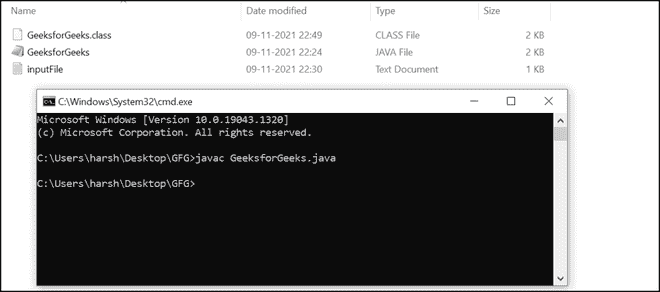
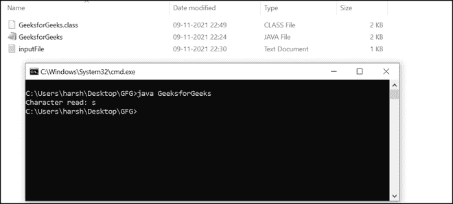
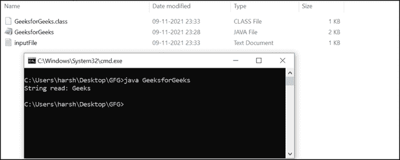

# Java 中的 FileInputStream skip()方法，带示例

> 原文:[https://www . geesforgeks . org/file inputstream-skip-method-in-Java-with-examples/](https://www.geeksforgeeks.org/fileinputstream-skip-method-in-java-with-examples/)

[**FileInputStream**](https://www.geeksforgeeks.org/java-io-fileinputstream-class-java/) 类对于以字节序列的形式从文件中读取数据相当有帮助。FileInputStream 用于读取原始字节流，如图像、音频、视频等。阅读文字流推荐[T5【文件阅读器】T6](https://www.geeksforgeeks.org/file-handling-java-using-filewriter-filereader/)。它首先在 JDK 1.0 中引入。

### FileInputStream skip()方法

FileInputStream 中的 skip(n)方法非常有用，因为它从输入流的开头就丢弃了 n 个字节的数据。我们可以通过下面的例子来理解它的工作原理，

我们正在通过 FileInputStream 读取一个字符流，我们希望在跳过流中的前八个字符后读取它。让字符串为“ **GeeksforGeeks** ，这样跳过前八个字符后，我们的字符串就变成了“ **Geeks** ”。

skip()方法对于完成上述任务非常有用。这个方法在 [**Java.io**](https://www.geeksforgeeks.org/java-io-input-output-in-java-with-examples/) 包的 FileInputStream 类中定义。

Java 输入输出包帮助用户执行所有的输入输出操作。这些流支持所有对象、数据类型、字符、文件等。，以完全执行输入/输出操作。

**语法:**

```
Input_File_Stream.skip(n)
Input_File_Stream: The file input stream.
```

**参数:**

*   n-非负整数。
*   要从字符流中跳过的字节。

**返回值:**返回实际跳过的字节数。

**异常:***IOException*—如果 n 为负整数或出现输入/输出错误。

### **例 1:**

## Java 语言(一种计算机语言，尤用于创建网站)

```
// Java program to demonstrate the working
// of skip() method in FileInputStream

// Importing the class files
// defined under io Package
import java.io.FileInputStream;
import java.io.IOException;

// Public class
public class GeeksforGeeks {

    // Main method
    public static void main(String[] args)
        throws IOException
    {

        FileInputStream inputFileStream = null;

        // Variables to store the fifth character
        int integerValue = 0;
        char characterValue;
        try {
            // Create new file input stream
            inputFileStream = new FileInputStream(
                "C:\\Users\\harsh\\Desktop\\GFG\\inputFile.txt");

            // Skip 4 bytes from the beginning
            // in the file input stream
            inputFileStream.skip(4);

            // Read bytes from this stream
            // (first character only)
            integerValue = inputFileStream.read();

            // Converting integer to character type
            characterValue = (char)i;

            // Print the character
            System.out.print("Character read: "
                             + characterValue);
        }
        catch (Exception exception) {

            // If any error occurs
            exception.printStackTrace();
        }
        finally {

            // Releasing all system resources
            if (inputFileStream != null)
                inputFileStream.close();
        }
    }
}
// This code is contributed by Bhuwanesh
```

### 在本地系统中编译的步骤:

**1。**我们在本地保存了上述名为“ **GeeksforGeeks** 的程序:


**源码文件**

**2。**现在让我们创建一个名为“**输入文件**的文本文件:


**文本文件**

**3。**我们需要在创建的文本文件中输入一些文本。例如，我们在文本文件中写了“**极客博客**”。


**文本文件数据**

**4。**我们现在将使用命令提示符通过 javac 编译器编译我们的程序:

```
javac GeeksforGeeks.java
```



**编译的源代码文件**

**5。**如下图所示 **GeeksforGeeks.class** 字节代码文件生成。现在使用以下命令运行程序:

```
java GeeksforGeeks
```

**输出:**



**输出**

**输出描述:**既然我们已经将 4 作为参数传递给了程序中的 skip()函数。正如我们在程序的输出中看到的，前四个字符(或字节)被跳过(‘T2’G’、‘T4’e、‘T6】e、‘T8】k)。GeekforGeeks 中的第五个字符是“ **s** ”，因此，控制台上会打印“ **s** ”。

### **例 2:**

## Java 语言(一种计算机语言，尤用于创建网站)

```
// Java program to demonstrate the working
// of skip() method in FileInputStream

// Importing the FileInputStream class
import java.io.FileInputStream;
// Importing the IOException class
import java.io.IOException;

// Public class
public class GeeksforGeeks {

    // Main method
    public static void main(String[] args)
        throws IOException
    {

        FileInputStream inputFileStream = null;
        int integerValue = 0;
        char characterValue;
        try {
            // Create new file input stream
            // Give the full path of the input file
            inputFileStream = new FileInputStream(
                "C:\\Users\\harsh\\Desktop\\GFG\\inputFile.txt");

            // Skip 8 bytes from the beginning in the file
            // input stream
            inputFileStream.skip(8);

            // Print on console
            System.out.print("String read: ");

            // Iterate till EOF is not reached
            while ((integerValue = inputFileStream.read())
                   != -1) {

                // converts integer to character
                characterValue = (char)i;

                // prints character
                System.out.print(characterValue);
            }
        }
        catch (Exception exception) {

            // If any error occurs
            exception.printStackTrace();
        }
        finally {

            // Releasing all system resources
            if (inputFileStream != null)
                inputFileStream.close();
        }
    }
}
// This code is contributed by Bhuwanesh
```

为了在本地系统中编译上述程序，我们可以按照示例 1 中提到的相同步骤进行。编译后，我们可以运行程序，它会生成以下输出。

**输出:**



**输出**

**输出说明:**如您在输出中看到的，前八个字符被跳过( **G** '、 **e** '、 **e** '、 **k** '、 **s** '、 **f** '、 **o** '、 **r** ')。剩下的字符串是“**极客**，所以会打印在控制台上。