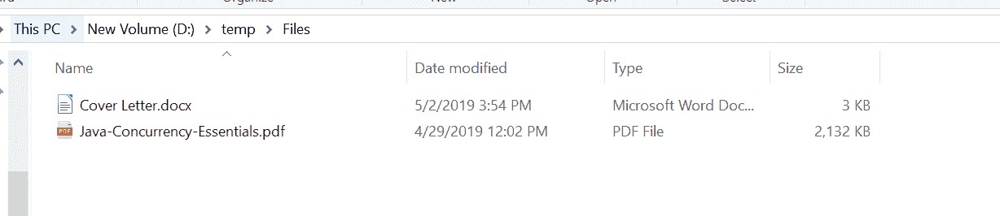
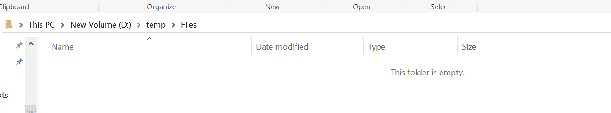

# Java 中的文件删除()方法，示例

> 原文:[https://www . geesforgeks . org/files-delete-method-in-Java-with-examples/](https://www.geeksforgeeks.org/files-delete-method-in-java-with-examples/)

**删除() **[的](https://www.geeksforgeeks.org/tag/java-nio-file-package/)**方法。文件**帮助我们删除位于作为参数传递的路径的文件。
相对于其他文件系统操作，该方法可能不是原子的。

如果文件是符号链接，则删除符号链接本身，而不是链接的最终目标。如果文件是一个目录，那么只有当目录为空时，此方法才会删除该文件。在一些实现中，目录具有在创建目录时创建的特殊文件或链接的条目。在这样的实现中，当只有特殊条目存在时，目录被认为是空的。在这种情况下，可以使用此方法删除目录。在某些操作系统上，当文件打开并被该 Java 虚拟机或其他程序使用时，可能无法删除该文件。

**语法:**

```
public static void delete(Path path)
                   throws IOException

```

**参数:**此方法接受一个参数**路径**，它是要删除的文件的路径。

**返回值:**此方法不返回任何内容。

**异常:**这个方法会抛出以下异常:

1.  **NoSuchFileException**–如果文件不存在(可选特定例外)
2.  **目录无例外**–如果文件是一个目录，并且由于目录不为空而无法删除
3.  **io 异常**–如果出现输入/输出错误
4.  **security exception**–如果是默认提供程序，并且安装了安全管理器，则调用 security manager . checkdelete(String)方法来检查删除对文件的访问

下面的程序说明删除？(路径)方法:
**程序一:**

```
// Java program to demonstrate
// java.nio.file.Files.delete?() method

import java.io.IOException;
import java.nio.file.*;

public class GFG {
    public static void main(String[] args)
    {

        // create object of Path
        Path path
            = Paths.get("D:\\Work\\Test\\file1.txt");

        // delete File
        try {

            Files.delete(path);
        }
        catch (IOException e) {

            // TODO Auto-generated catch block
            e.printStackTrace();
        }
    }
}
```

**Output:**

**删除文件前:**文件存在于路径“D:\ \ Work \ \ Test \ \ file 1 . txt”


**After deleting the file:** The file is deleted from the path “D:\\Work\\Test\\file1.txt”

**程序 2:**

```
// Java program to demonstrate
// java.nio.file.Files.delete?() method

import java.io.IOException;
import java.nio.file.*;

public class GFG {
    public static void main(String[] args)
    {

        // create object of Path
        Path pathOfFile1
            = Paths.get("D:\\temp\\Files"
                        + "\\Cover Letter.docx");
        Path pathOfFile2
            = Paths.get("D:\\temp\\Files"
                        + "\\Java-Concurrency-Essentials.pdf");

        // delete both Files
        try {

            Files.delete(pathOfFile1);
            Files.delete(pathOfFile2);
        }
        catch (IOException e) {

            // TODO Auto-generated catch block
            e.printStackTrace();
        }
    }
}
```

**Output:**

**删除文件前:**


**After deleting the file:**

**参考文献:**[https://docs . Oracle . com/javase/10/docs/API/Java/nio/file . html # delete(Java . nio . file . path)](https://docs.oracle.com/javase/10/docs/api/java/nio/file/Files.html#delete(java.nio.file.Path))