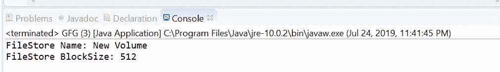
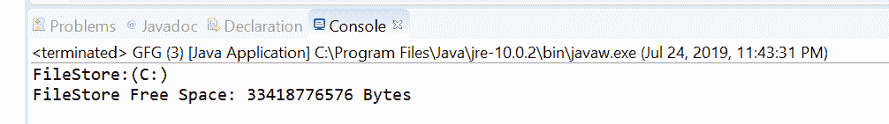

# Java 中的文件 getFileStore()方法，示例

> 原文:[https://www . geesforgeks . org/files-getfilestore-method-in-Java-with-examples/](https://www.geeksforgeeks.org/files-getfilestore-method-in-java-with-examples/)

**getFileStore()** 法的 **[java.nio.file](https://www.geeksforgeeks.org/tag/java-nio-file-package/) 。文件**帮助我们返回代表文件所在文件存储的文件存储对象。一旦获得对文件存储的引用，就可以应用文件存储类型的操作来获取文件存储的信息。

**语法:**

```java
public static FileStore
  getFileStore(Path path)
    throws IOException

```

**参数:**这个方法接受一个参数**路径**，它是获取文件存储的文件路径。

**返回值:**该方法返回文件存储的文件存储。

**异常:**这个方法会抛出以下异常:

1.  **io 异常**:如果出现输入输出错误
2.  **SecurityException** :在默认提供者的情况下，安装了安全管理器，调用 securitymanager . checkgetfilestore(String)方法检查 getFileStore 对文件的访问

下面的程序说明了 getFileStore(路径)方法:
**程序 1:**

```java
// Java program to demonstrate
// Files.getFileStore() method

import java.io.IOException;
import java.nio.file.*;

public class GFG {
    public static void main(String[] args)
    {

        // create object of Path
        Path path
            = Paths.get(
                "D:\\Work\\Test\\file1.txt");

        // get FileStore object
        try {

            FileStore fs
                = Files.getFileStore(path);

            // print FileStore name and block size
            System.out.println("FileStore Name: "
                               + fs.name());
            System.out.println("FileStore BlockSize: "
                               + fs.getBlockSize());
        }
        catch (IOException e) {

            // TODO Auto-generated catch block
            e.printStackTrace();
        }
    }
}
```

**Output:**

**程序 2:**

```java
// Java program to demonstrate
// Files.getFileStore() method

import java.io.IOException;
import java.nio.file.*;

public class GFG {
    public static void main(String[] args)
    {

        // create object of Path
        Path path = Paths.get("C:\\data\\db");

        // get FileStore object
        try {

            FileStore fs
                = Files.getFileStore(path);

            // print FileStore details
            System.out.println("FileStore:"
                               + fs.toString());
            System.out.println("FileStore Free Space: "
                               + fs.getUnallocatedSpace()
                               + " Bytes");
        }
        catch (IOException e) {

            // TODO Auto-generated catch block
            e.printStackTrace();
        }
    }
}
```

**Output:**

**参考:**[https://docs . Oracle . com/javase/10/docs/API/Java/nio/file/files . html # getFileStore(Java . nio . file . path)](https://docs.oracle.com/javase/10/docs/api/java/nio/file/Files.html#getFileStore(java.nio.file.Path))