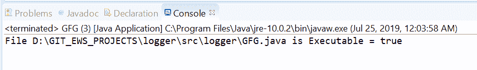
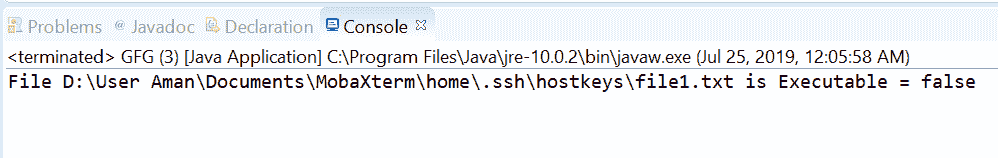

# 用示例在 Java 中文件 isExecutable()方法

> 原文:[https://www . geesforgeks . org/files-isexecutable-method-in-Java-with-examples/](https://www.geeksforgeeks.org/files-isexecutable-method-in-java-with-examples/)

**isExecutable()** 法的**法的[法的](https://www.geeksforgeeks.org/tag/java-nio-file-package/)法。文件**帮助我们检查一个文件是否可执行。该方法检查该路径上是否存在文件，如果存在，则 [Java 虚拟机](https://www.geeksforgeeks.org/jvm-works-jvm-architecture/)具有执行该文件的适当权限。检查对目录的访问时，语义可能会有所不同。

例如，在 [UNIX](https://www.geeksforgeeks.org/introduction-to-unix-system/) 系统上，检查执行访问检查表明 Java 虚拟机有权搜索目录以便访问文件或子目录。因此，我们可以说，如果文件存在并且是可执行的，isExecutable()方法将返回 true，如果出现以下情况，它将返回 false:

*   文件不存在
*   execute access would be denied because the Java virtual machine has insufficient privileges,

    无法确定访问权限。

**语法:**

```java
public static boolean isExecutable(Path path)

```

**参数:**这个方法接受一个参数**路径**，它是要检查的文件的路径。

**返回值:**如果文件存在且可执行，则该方法返回真，如果出现以下情况，则返回假:

*   文件不存在
*   execute access would be denied because the Java virtual machine has insufficient privileges,

    无法确定访问权限。

**异常:**这个方法会抛出 **SecurityException** 在默认提供程序的情况下，安装了安全管理器，调用 checkExec 检查对文件的执行访问。
步行文件树。

下面的程序说明了 isExecutable(路径)方法:
**程序 1:**

```java
// Java program to demonstrate
// Files.isExecutable() method

import java.io.IOException;
import java.nio.file.*;

public class GFG {
    public static void main(String[] args)
    {

        // create an object of Path
        Path path
            = Paths.get(
                "D:\\GIT_EWS_PROJECTS\\logger"
                + "\\src\\logger"
                + "\\GFG.java");

        // check whether this file
        // is executable or not
        boolean result
            = Files.isExecutable(path);

        System.out.println("File " + path
                           + " is Executable = "
                           + result);
    }
}
```

**Output:**

**程序 2:**

```java
// Java program to demonstrate
// Files.isExecutable() method

import java.io.IOException;
import java.nio.file.*;

public class GFG {
    public static void main(String[] args)
    {

        // create object of Path for a file
        // which did not exists.
        Path path
            = Paths.get(
                "D:\\User Aman\\Documents"
                + "\\MobaXterm\\home"
                + "\\.ssh\\hostkeys\\file1.txt");

        // check whether this file
        // is executable or not
        boolean result
            = Files.isExecutable(path);

        // as the file does not exist
        // then answer should be false
        System.out.println("File " + path
                           + " is Executable = "
                           + result);
    }
}
```

**Output:**

**参考文献:**[https://docs . Oracle . com/javase/10/docs/API/Java/nio/file/files . html # isExecutable(Java . nio . file . path)](https://docs.oracle.com/javase/10/docs/api/java/nio/file/Files.html#isExecutable(java.nio.file.Path))