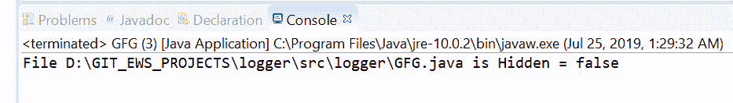
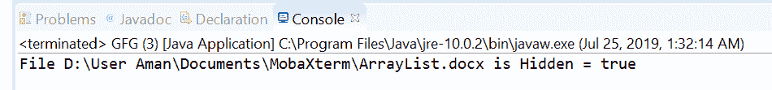

# 用示例将 isHidden()方法用 Java 文件化

> 原文:[https://www . geesforgeks . org/files-ishidden-method-in-Java-with-examples/](https://www.geeksforgeeks.org/files-ishidden-method-in-java-with-examples/)

**isHidden()** 法的 **[法的](https://www.geeksforgeeks.org/tag/java-nio-file-package/)。文件**帮助我们检查文件是否隐藏。如果文件被认为是隐藏的，这个方法返回真，否则返回假。隐藏的确切定义取决于平台或提供者。

例如，在 [UNIX](https://www.geeksforgeeks.org/introduction-to-unix-system/) 上，如果一个文件的名称以句点字符('.'开头，则该文件被认为是隐藏的).在 Windows 上，如果文件不是目录，并且设置了 DOS 隐藏属性，则认为该文件是隐藏的。根据实现方式，此方法可能需要访问文件系统来确定文件是否被视为隐藏。

**语法:**

```
public static boolean isHidden(Path path)
                       throws IOException

```

**参数:**这个方法接受一个参数**路径**，它是要检查的文件的路径。

**返回值:**如果文件被认为是隐藏的，则该方法返回 true。

**异常:**这个方法会抛出以下异常:

1.  **io 异常:**如果出现输入/输出错误
2.  **SecurityException:** 在默认提供程序的情况下，安装了安全管理器，调用 checkRead 方法检查对文件的读访问。

以下程序说明了 isHidden(路径)方法:
**程序 1:**

```
// Java program to demonstrate
// Files.isHidden() method

import java.io.IOException;
import java.nio.file.*;

public class GFG {
    public static void main(String[] args)
    {

        // create object of Path
        // This file is not hidden
        Path path
            = Paths.get(
                "D:\\GIT_EWS_PROJECTS\\logger"
                + "\\src\\logger"
                + "\\GFG.java");

        // check whether this file
        // is hidden or not
        boolean result;

        try {
            result = Files.isHidden(path);

            System.out.println("File " + path
                               + " is Hidden = "
                               + result);
        }
        catch (IOException e) {
            // TODO Auto-generated catch block
            e.printStackTrace();
        }
    }
}
```

**Output:**

**程序 2:**

```
// Java program to demonstrate
// Files.isHidden() method

import java.io.IOException;
import java.nio.file.*;

public class GFG {
    public static void main(String[] args)
    {

        // create object of Path
        // This file is available on windows and
        // It is hidden.

        Path path
            = Paths.get(
                "D:\\User Aman\\"
                + "Documents\\MobaXterm\\"
                + "\\ArrayList.docx");

        // check whether this file
        // is hidden or not

        boolean result;

        try {
            result = Files.isHidden(path);

            System.out.println("File " + path
                               + " is Hidden = "
                               + result);
        }
        catch (IOException e) {

            // TODO Auto-generated catch block
            e.printStackTrace();
        }
    }
}
```

**Output:**

**参考:**[https://docs . Oracle . com/javase/10/docs/API/Java/nio/file/files . html # isHidden(Java . nio . file . path)](https://docs.oracle.com/javase/10/docs/api/java/nio/file/Files.html#isHidden(java.nio.file.Path))