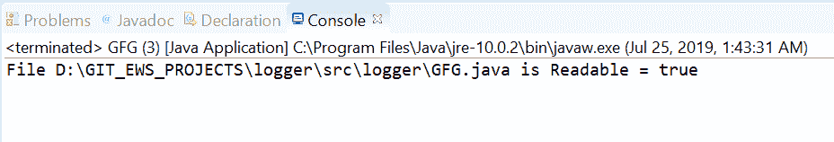
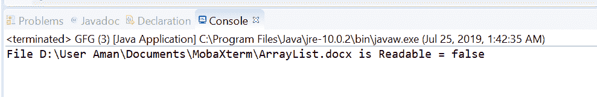

# Java 中的 Files isReadable()方法，示例

> 原文:[https://www . geesforgeks . org/files-is readable-in-Java-method-with-examples/](https://www.geeksforgeeks.org/files-isreadable-method-in-java-with-examples/)

**isReadable()** 法的 **[java.nio.file](https://www.geeksforgeeks.org/tag/java-nio-file-package/) 。文件**帮助我们检查 [Java 虚拟机](https://www.geeksforgeeks.org/jvm-works-jvm-architecture/)是否具有适当的权限，允许它打开该文件进行读取。该方法测试文件是否可读。此方法检查文件是否存在，如果文件存在，则它是否可读。如果文件存在且可读，此方法返回 true 如果出现以下情况，此方法将返回 false:

*   文件不存在
*   execute access would be denied because the Java virtual machine has insufficient privileges,

    无法确定访问权限。

**语法:**

```java
public static boolean isReadable(Path path)

```

**参数:**这个方法接受一个参数**路径**，它是要检查的文件的路径。

**返回值:**如果文件存在且可读，则该方法返回真；如果出现以下情况，则该方法返回假:

*   文件不存在
*   execute access would be denied because the Java virtual machine has insufficient privileges,

    无法确定访问权限。

**异常:**这个方法会抛出**安全异常**在默认提供者的情况下，安装了安全管理器，调用 checkRead 检查对文件的读访问。

下面的程序说明了一个可修改的(路径)方法:
**程序 1:**

```java
// Java program to demonstrate
// Files.isReadable() method

import java.io.IOException;
import java.nio.file.*;

public class GFG {
    public static void main(String[] args)
    {

        // create object of Path
        // This file is available on windows and
        // It is a readable file.

        Path path
            = Paths.get(
                "D:\\GIT_EWS_PROJECTS\\logger"
                + "\\src\\logger"
                + "\\GFG.java");

        // check whether this file
        // is readable or not
        boolean result;
        result = Files.isReadable(path);

        System.out.println("File " + path
                           + " is Readable = "
                           + result);
    }
}
```

**Output:**

**程序 2:**

```java
// Java program to demonstrate
// Files.isReadable() method

import java.io.IOException;
import java.nio.file.*;

public class GFG {
    public static void main(String[] args)
    {

        // create an object of Path
        // This file is available on windows and
        // It is not a readable file.

        Path path
            = Paths.get(
                "D:\\User Aman\\"
                + "Documents\\MobaXterm\\"
                + "\\ArrayList.docx");

        // check whether this file
        // is readable or not
        boolean result;
        result = Files.isReadable(path);

        System.out.println("File " + path
                           + " is Readable = "
                           + result);
    }
}
```

**Output:**

**参考文献:**[https://docs . Oracle . com/javase/10/docs/API/Java/nio/file/files . html # isReadable(Java . nio . file . path)](https://docs.oracle.com/javase/10/docs/api/java/nio/file/Files.html#isReadable(java.nio.file.Path))