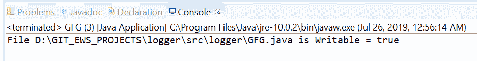
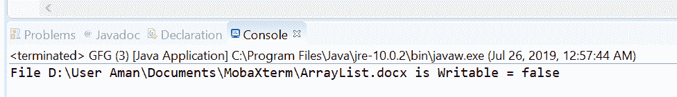

# 文件是 Java 中的可写()方法，示例

> 原文:[https://www . geesforgeks . org/files-is writable-method-in-Java-with-examples/](https://www.geeksforgeeks.org/files-iswritable-method-in-java-with-examples/)

**isWritable()** 法的 **[java.nio.file](https://www.geeksforgeeks.org/tag/java-nio-file-package/) 。文件**帮助我们检查 Java 虚拟机是否有适当的权限，允许它打开这个文件进行写入。这意味着这个方法测试文件是否可写。此方法检查文件是否存在，如果文件存在，则它是否可写。如果文件存在且可写，此方法返回 true 如果出现以下情况，此方法将返回 false:

*   文件不存在
*   execute access would be denied because the Java virtual machine has insufficient privileges,

    无法确定访问权限。

**语法:**

```java
public static boolean isWritable(Path path)

```

**参数:**这个方法接受一个参数**路径**，它是要检查的文件的路径。

**返回值:**如果文件存在且可写，则该方法返回真；如果出现以下情况，则该方法返回假:

*   文件不存在
*   execute access would be denied because the Java virtual machine has insufficient privileges,

    无法确定访问权限。

**异常:**这个方法会抛出**安全异常**在默认提供者的情况下，安装了安全管理器，调用 checkWrite 检查对文件的写访问。

下面的程序说明了 isWritable(路径)方法:
**程序 1:**

```java
// Java program to demonstrate
// Files.isWritable() method

import java.nio.file.*;

public class GFG {
    public static void main(String[] args)
    {

        // create an object of Path
        // This file is available on windows and
        // It is a Writable file.

        Path path
            = Paths.get(
                "D:\\GIT_EWS_PROJECTS\\logger"
                + "\\src\\logger"
                + "\\GFG.java");

        // check whether this file
        // is Writable or not
        boolean result;
        result = Files.isWritable(path);

        System.out.println("File " + path
                           + " is Writable = "
                           + result);
    }
}
```

**Output:**

**程序 2:**

```java
// Java program to demonstrate
// java.nio.file.Files.isWritable() method

import java.nio.file.*;

public class GFG {
    public static void main(String[] args)
    {

        // create an object of Path
        // This file is available on windows and
        // It is not a Writable file.

        Path path
            = Paths.get(
                "D:\\User Aman\\"
                + "Documents\\MobaXterm\\"
                + "\\ArrayList.docx");

        // check whether this file
        // is Writable or not
        boolean result;
        result = Files.isWritable(path);

        System.out.println("File " + path
                           + " is Writable = "
                           + result);
    }
}
```

**Output:**

**参考文献:**[https://docs . Oracle . com/javase/10/docs/API/Java/nio/file . html # isWritable(Java . nio . file . path)](https://docs.oracle.com/javase/10/docs/api/java/nio/file/Files.html#isWritable(java.nio.file.Path))