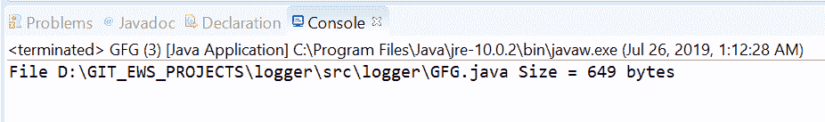
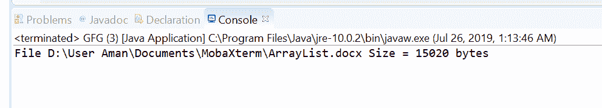

# Java 中的文件大小()方法，示例

> 原文:[https://www . geesforgeks . org/files-size-method-in-Java-with-examples/](https://www.geeksforgeeks.org/files-size-method-in-java-with-examples/)

**大小()**法**T3【爪哇】文件。文件**帮助我们获取文件的大小(以字节为单位)。此方法通过将文件路径作为参数返回文件大小(以字节为单位)。由于压缩、支持稀疏文件或其他原因，大小可能与文件系统上的实际大小不同。非常规文件的大小是特定于实现的，因此未指定。

**语法:**

```java
public static long size(Path path)
                 throws IOException

```

**参数:**这个方法接受一个参数**路径**，它是文件的路径。

**返回值:**该方法返回文件大小，以字节为单位。

**异常:**这个方法会抛出以下异常:

1.  **如果出现输入/输出错误，则出现异常**。
2.  **SecurityException** 在默认提供程序的情况下，安装了安全管理器，其 checkRead 方法拒绝对文件的读访问。

下面的程序说明大小？(路径)方法:
**程序一:**

```java
// Java program to demonstrate
// Files.size() method

import java.io.IOException;
import java.nio.file.*;

public class GFG {
    public static void main(String[] args)
        throws IOException
    {

        // create object of Path
        Path path
            = Paths.get("D:\\GIT_EWS_PROJECTS\\logger"
                        + "\\src\\logger"
                        + "\\GFG.java");

        // get File Size

        long result;

        result = Files.size(path);

        System.out.println("File " + path
                           + " Size = "
                           + result + " bytes");
    }
}
```

**Output:**

**程序 2:**

```java
// Java program to demonstrate
// Files.size() method

import java.io.IOException;
import java.nio.file.*;

public class GFG {
    public static void main(String[] args)
        throws IOException
    {

        // create object of Path
        Path path
            = Paths.get("D:\\User Aman\\"
                        + "Documents\\MobaXterm\\"
                        + "\\ArrayList.docx");
        // get File Size
        long result;
        result = Files.size(path);

        System.out.println("File " + path
                           + " Size = "
                           + result + " bytes");
    }
}
```

**Output:**

**参考文献:**[https://docs . Oracle . com/javase/10/docs/API/Java/nio/file/files . html # size？(java.nio.file.Path)](https://docs.oracle.com/javase/10/docs/api/java/nio/file/Files.html#size?(java.nio.file.Path))