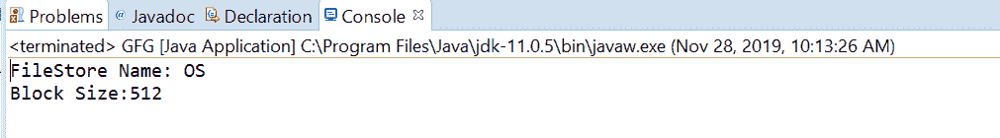
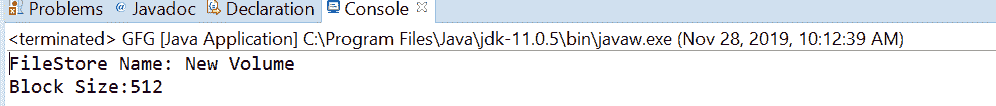

# Java 中的 FileStore getBlockSize()方法，带示例

> 原文:[https://www . geesforgeks . org/filestore-getblocksize-method-in-Java-with-examples/](https://www.geeksforgeeks.org/filestore-getblocksize-method-in-java-with-examples/)

一个**文件存储**类的 **getBlockSize()** 方法用于返回这个文件存储对象中每个块的字节数。每个文件存储都被组织成称为块的离散字节序列，块是文件存储的最小存储单元。每个读写操作都在多个块上执行。这种方法有助于获取块的大小。

**语法:**

```java
public long getBlockSize() throws IOException

```

**参数:**此方法不接受任何内容。

**返回值:**该方法返回一个正值，代表该文件存储的**块大小**，单位为字节。

**异常:**该方法抛出以下异常:

*   **io 异常**:如果出现输入输出错误。
*   **不支持操作异常**:如果不支持操作。

下面的程序说明了 getBlockSize()方法:
**程序 1:**

```java
// Java program to demonstrate
// FileStore.getBlockSize() method

import java.io.IOException;
import java.nio.file.FileStore;
import java.nio.file.Files;
import java.nio.file.Path;
import java.nio.file.Paths;

public class GFG {

    public static void main(String[] args)
        throws IOException
    {
        // create object of Path
        Path path
            = Paths.get(
                "C:\\Movies\\001.txt");

        // get FileStore object

        FileStore fs
            = Files.getFileStore(path);

        // print FileStore name and
        // getBlockSize
        System.out.println("FileStore Name: "
                           + fs.name());

        System.out.println("Block Size:"
                           + fs.getBlockSize());
    }
}
```

**输出:**


**程序 2:**

```java
// Java program to demonstrate
// FileStore.getBlockSize() method

import java.io.IOException;
import java.nio.file.FileStore;
import java.nio.file.Files;
import java.nio.file.Path;
import java.nio.file.Paths;

public class GFG {

    public static void main(String[] args)
        throws IOException
    {
        // create object of Path
        Path path
            = Paths.get(
                "E:\\Tutorials\\file.txt");

        // get FileStore object

        FileStore fs
            = Files.getFileStore(path);

        // print FileStore name and
        // getBlockSize
        System.out.println("FileStore Name: "
                           + fs.name());

        System.out.println("Block Size:"
                           + fs.getBlockSize());
    }
}
```

**输出:**


参考文献:[https://docs . Oracle . com/javase/10/docs/API/Java/nio/file/filestore . html # getBlockSize()](https://docs.oracle.com/javase/10/docs/api/java/nio/file/FileStore.html#getBlockSize())