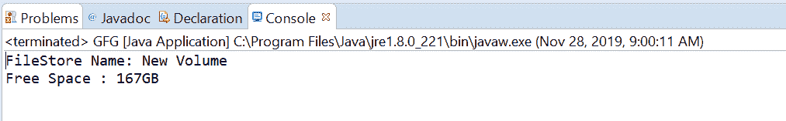

# Java 中的文件存储 getUnallocatedSpace()方法，示例

> 原文:[https://www . geesforgeks . org/filestore-getunallatedspace-method-in-Java-with-examples/](https://www.geeksforgeeks.org/filestore-getunallocatedspace-method-in-java-with-examples/)

一个**文件存储**类的 **getUnallocatedSpace()** 方法用于获取文件存储中未分配的字节数。此方法对于检查可用空间很有用。此方法将可用的未分配空间作为长值返回。
**语法:**

```
public abstract long getUnallocatedSpace()
                     throws IOException
```

**参数:**此方法不接受任何内容。
**返回值:**该方法将**可用未分配空间**作为长值返回。
**异常:**如果出现输入输出错误，该方法抛出 **IOException** 。
下面的程序说明了 getUnallocatedSpace()方法:
**程序 1:**

## Java 语言(一种计算机语言，尤用于创建网站)

```
// Java program to demonstrate
// FileStore.getUnallocatedSpace() method

import java.io.IOException;
import java.nio.file.FileStore;
import java.nio.file.Files;
import java.nio.file.Path;
import java.nio.file.Paths;

public class GFG {

    public static void main(String[] args)
    {
        // create the object of Path
        Path path
            = Paths.get(
                "E:\\Tutorials\\file.txt");

        // get FileStore object
        try {

            FileStore fs
                = Files.getFileStore(path);

            // print FileStore name and Total unused size
            System.out.println("FileStore Name: "
                               + fs.name());
            long bytes = fs.getUnallocatedSpace();
            long sizeInGB = bytes / (1024 * 1024 * 1024);
            System.out.println("Free Space : "
                               + sizeInGB + "GB");
        }
        catch (IOException e) {

            // TODO Auto-generated catch block
            e.printStackTrace();
        }
    }
}
```

**输出:**



**程序 2:**

## Java 语言(一种计算机语言，尤用于创建网站)

```
// Java program to demonstrate
// FileStore.getUnallocatedSpace() method

import java.io.IOException;
import java.nio.file.FileStore;
import java.nio.file.Files;
import java.nio.file.Path;
import java.nio.file.Paths;

public class GFG {

    public static void main(String[] args)
    {
        // create the object of Path
        Path path
            = Paths.get(
                "C:\\Movies\\&#092;;&#048;01.txt");

        // get FileStore object
        try {

            FileStore fs
                = Files.getFileStore(path);

            // print FileStore name and Total size
            System.out.println("FileStore Name: "
                               + fs.name());
            System.out.println("Free Space in bytes: "
                               + fs.getUnallocatedSpace());
        }
        catch (IOException e) {

            // TODO Auto-generated catch block
            e.printStackTrace();
        }
    }
}
```

**输出:**


参考文献:[https://docs . Oracle . com/javase/10/docs/API/Java/nio/file/filestore . html # getunallateedspace()](https://docs.oracle.com/javase/10/docs/api/java/nio/file/FileStore.html#getUnallocatedSpace())