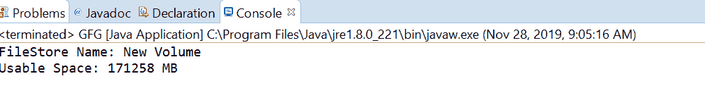
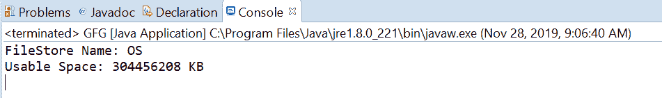

# Java 中的 FileStore getUsableSpace()方法，带示例

> 原文:[https://www . geesforgeks . org/filestore-getusablespace-method-in-Java-with-examples/](https://www.geeksforgeeks.org/filestore-getusablespace-method-in-java-with-examples/)

一个**文件存储**类的 **getUsableSpace()** 方法用于返回文件存储上该 Java 虚拟机可用的字节数。此方法对于检查可用空间很有用。此方法将可用空间作为长值返回。

**语法:**

```java
public abstract long getUsableSpace()
                     throws IOException

```

**参数:**此方法不接受任何内容。

**返回值:**该方法将**可用空间**作为长值返回。

**异常:**如果出现输入输出错误，该方法抛出**异常**。

下面的程序说明了 getUsableSpace()方法:
**程序 1:**

```java
// Java program to demonstrate
// FileStore.getUsableSpace() method

import java.io.IOException;
import java.nio.file.FileStore;
import java.nio.file.Files;
import java.nio.file.Path;
import java.nio.file.Paths;

public class GFG {

    public static void main(String[] args)
    {
        // create the object of Path
        Path path
            = Paths.get(
                "E:\\Tutorials\\file.txt");

        // get FileStore object
        try {

            FileStore fs
                = Files.getFileStore(path);

            // print FileStore name and Total usable space
            System.out.println("FileStore Name: "
                               + fs.name());
            long bytes = fs.getUsableSpace();
            long sizeInGB = bytes / (1024 * 1024);
            System.out.println("Usable Space: "
                               + sizeInGB + " MB");
        }
        catch (IOException e) {

            // TODO Auto-generated catch block
            e.printStackTrace();
        }
    }
}
```

**输出:**


**程序 2:**

```java
// Java program to demonstrate
// FileStore.getUsableSpace() method

import java.io.IOException;
import java.nio.file.FileStore;
import java.nio.file.Files;
import java.nio.file.Path;
import java.nio.file.Paths;

public class GFG {

    public static void main(String[] args)
    {
        // create the object of Path
        Path path
            = Paths.get(
                "C:\\Movies\\001.txt");

        // get FileStore object
        try {

            FileStore fs
                = Files.getFileStore(path);

            // print FileStore name and Total usable space
            System.out.println("FileStore Name: "
                               + fs.name());
            long bytes = fs.getUsableSpace();
            long sizeInGB = bytes / (1024);
            System.out.println("Usable Space: "
                               + sizeInGB + " KB");
        }
        catch (IOException e) {

            // TODO Auto-generated catch block
            e.printStackTrace();
        }
    }
}
```

**输出:**


参考文献:[https://docs . Oracle . com/javase/10/docs/API/Java/nio/file/filestore . html # getUsableSpace()](https://docs.oracle.com/javase/10/docs/api/java/nio/file/FileStore.html#getUsableSpace())