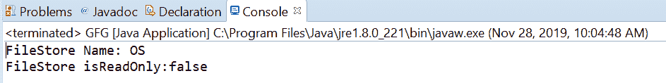

# Java 中的 FileStore isReadOnly()方法，示例

> 原文:[https://www . geesforgeks . org/filestore-is readonly-method-in-Java-with-examples/](https://www.geeksforgeeks.org/filestore-isreadonly-method-in-java-with-examples/)

如果文件存储是只读的，则使用**文件存储**类的 **isReadOnly()** 方法返回真，否则返回假。如果文件存储不支持对文件的写操作或其他更改，则称为只读。如果试图创建一个文件、打开一个现有文件进行写入等，将引发一个 IOException。

**语法:**

```
public abstract String isReadOnly()

```

**参数:**此方法不接受任何内容。

**返回值:**当且仅当该文件存储为只读时，该方法返回**真**。

下面的程序说明了 isReadOnly()方法:
**程序 1:**

```
// Java program to demonstrate
// FileStore.isReadOnly() method

import java.io.IOException;
import java.nio.file.FileStore;
import java.nio.file.Files;
import java.nio.file.Path;
import java.nio.file.Paths;

public class GFG {

    public static void main(String[] args)
        throws IOException
    {

        // create object of Path
        Path path
            = Paths.get(
                "E:\\Tutorials\\file.txt");

        // get FileStore object

        FileStore fs
            = Files.getFileStore(path);

        // print FileStore name
        System.out.println("FileStore Name: "
                           + fs.name());
        // is file is readable
        boolean isReadOnly = fs.isReadOnly();
        System.out.println("FileStore isReadOnly:"
                           + isReadOnly);
    }
}
```

**输出:**


**程序 2:**

```
// Java program to demonstrate
// FileStore.isReadOnly() method

import java.io.IOException;
import java.nio.file.FileStore;
import java.nio.file.Files;
import java.nio.file.Path;
import java.nio.file.Paths;

public class GFG {

    public static void main(String[] args)
        throws IOException
    {

        // create object of Path
        Path path
            = Paths.get(
                "C:\\Movies\\001.txt");

        // get FileStore object

        FileStore fs
            = Files.getFileStore(path);

        // print FileStore name
        System.out.println("FileStore Name: "
                           + fs.name());
        // is file is readable
        boolean isReadOnly = fs.isReadOnly();
        System.out.println("FileStore isReadOnly:"
                           + isReadOnly);
    }
}
```

**输出:**


参考文献:[https://docs . Oracle . com/javase/10/docs/API/Java/nio/file/filestore . html # isReadOnly()](https://docs.oracle.com/javase/10/docs/api/java/nio/file/FileStore.html#isReadOnly())