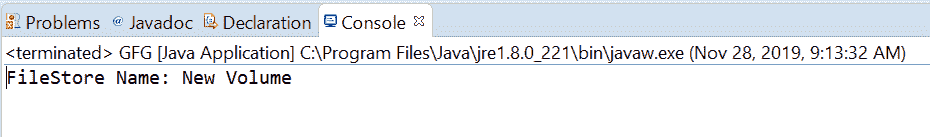
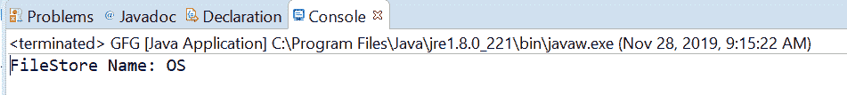

# Java 中的 FileStore name()方法，带示例

> 原文:[https://www . geesforgeks . org/filestore-name-method-in-Java-with-examples/](https://www.geeksforgeeks.org/filestore-name-method-in-java-with-examples/)

一个**文件存储**类的 **name()** 方法用于将这个文件存储的名称作为字符串返回。名称的格式通常是存储池或卷的名称。此方法返回的字符串可能与 toString()方法返回的字符串不同。

**语法:**

```java
public abstract String name()

```

**参数:**此方法不接受任何内容。

**返回值:**该方法将文件存储的**名称作为字符串返回。**

以下程序举例说明名称()方法:
**程序 1:**

```java
// Java program to demonstrate FileStore.name() method

import java.io.IOException;
import java.nio.file.FileStore;
import java.nio.file.Files;
import java.nio.file.Path;
import java.nio.file.Paths;

public class GFG {

    public static void main(String[] args)
    {
        // create the object of Path
        Path path
            = Paths.get(
                "E:\\Tutorials\\file.txt");

        // get FileStore object
        try {

            FileStore fs
                = Files.getFileStore(path);

            // print FileStore name
            System.out.println("FileStore Name: "
                               + fs.name());
        }
        catch (IOException e) {

            // TODO Auto-generated catch block
            e.printStackTrace();
        }
    }
}
```

**输出:**


**程序 2:**

```java
// Java program to demonstrate FileStore.name() method

import java.io.IOException;
import java.nio.file.FileStore;
import java.nio.file.Files;
import java.nio.file.Path;
import java.nio.file.Paths;

public class GFG {

    public static void main(String[] args)
    {
        // create the object of Path
        Path path
            = Paths.get(
                "C:\\Movies\\001.txt");

        // get FileStore object
        try {

            FileStore fs
                = Files.getFileStore(path);

            // print FileStore name and Total usable space
            String name = fs.name();
            System.out.println("FileStore Name: "
                               + name);
        }
        catch (IOException e) {

            // TODO Auto-generated catch block
            e.printStackTrace();
        }
    }
}
```

**输出:**


参考文献:[https://docs . Oracle . com/javase/10/docs/API/Java/nio/file/filestore . html # name()](https://docs.oracle.com/javase/10/docs/api/java/nio/file/FileStore.html#name())