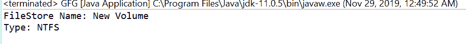
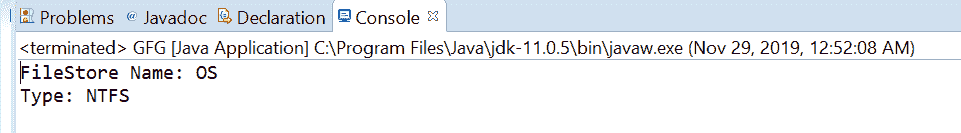

# Java 中的文件存储类型()方法，示例

> 原文:[https://www . geesforgeks . org/filestore-type-method-in-Java-with-examples/](https://www.geeksforgeeks.org/filestore-type-method-in-java-with-examples/)

一个**文件存储**类的**类型()**方法被用来返回这个文件存储的类型和返回的字符串的格式，高度特定于实现。

**语法:**

```java
public abstract String type()
```

**参数:**此方法不接受任何内容。

**返回值:**这个方法返回一个代表这个文件存储类型的字符串。

下面的程序说明了 type()方法:

**程序 1:**

## Java 语言(一种计算机语言，尤用于创建网站)

```java
// Java program to demonstrate
// FileStore.type() method

import java.io.IOException;
import java.nio.file.FileStore;
import java.nio.file.Files;
import java.nio.file.Path;
import java.nio.file.Paths;

public class GFG {

    public static void main(String[] args)
    {
        // create object of Path
        Path path = Paths.get("E:\\Tutorials\\file.txt");

        // get FileStore object
        try {

            FileStore fs = Files.getFileStore(path);

            // print FileStore name
            // and Total usable space
            System.out.println("FileStore Name: "
                               + fs.name());
            String type = fs.type();
            System.out.println("Type: " + type);
        }
        catch (IOException e) {

            // TODO Auto-generated catch block
            e.printStackTrace();
        }
    }
}
```

**输出:**



**节目 2:**

## Java 语言(一种计算机语言，尤用于创建网站)

```java
// Java program to demonstrate
// FileStore.type() method

import java.io.IOException;
import java.nio.file.FileStore;
import java.nio.file.Files;
import java.nio.file.Path;
import java.nio.file.Paths;

public class GFG {

    public static void main(String[] args)
    {
        // create object of Path
        // create object of Path
        Path path = Paths.get("C:\\Movies\\document.txt");

        // get FileStore object
        try {

            FileStore fs = Files.getFileStore(path);

            // print FileStore name
            // and Total usable space
            System.out.println("FileStore Name: "
                               + fs.name());
            String type = fs.type();
            System.out.println("Type: " + type);
        }
        catch (IOException e) {

            // TODO Auto-generated catch block
            e.printStackTrace();
        }
    }
}
```

**输出:**



参考文献:[https://docs . Oracle . com/javase/10/docs/API/Java/nio/file/filestore . html # type()](https://docs.oracle.com/javase/10/docs/api/java/nio/file/FileStore.html#type())