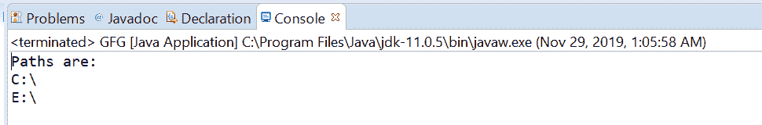

# Java 中的文件系统 getRootDirectories()方法，示例

> 原文:[https://www . geeksforgeeks . org/file system-getrootdices-method-in-Java-with-examples/](https://www.geeksforgeeks.org/filesystem-getrootdirectories-method-in-java-with-examples/)

一个**文件系统**类的**getroot directory()**方法被用来返回一个[迭代器](https://www.geeksforgeeks.org/iterators-in-java/)对象来迭代这个文件系统的根目录路径。文件系统由许多不同的文件层次结构组成，每个层次结构都有自己的顶级根目录，通过此方法返回的迭代器中的每个元素都对应于不同文件层次结构的根目录。元素的顺序没有定义。当安装了安全管理器并且拒绝访问根目录时，迭代器不会返回根目录。

**语法:**

```
public abstract Iterable getRootDirectories()

```

**参数:**此方法不接受任何内容。

**返回值:**这个方法返回一个**可迭代对象**来迭代根目录。

下面的程序说明了 getRootDirectories()方法:
**程序 1:**

```
// Java program to demonstrate
// FileSystem.getRootDirectories() method

import java.nio.file.FileSystem;
import java.nio.file.Path;
import java.nio.file.Paths;
import java.util.Iterator;

public class GFG {

    public static void main(String[] args)
    {

        // create object of Path
        Path path
            = Paths.get(
                "C:\\Movies\\document.txt");

        // get FileSystem object
        FileSystem fs = path.getFileSystem();

        // apply getFileStores() methods
        Iterable<Path> it = fs.getRootDirectories();

        // print all Path
        Iterator<Path> iterator = it.iterator();
        System.out.println("Paths are:");
        while (iterator.hasNext()) {
            System.out.println(iterator.next());
        }
    }
}
```

**输出:**


**程序 2:**

```
// Java program to demonstrate
// FileSystem.getRootDirectories() method
import java.nio.file.FileSystem;
import java.nio.file.Path;
import java.nio.file.Paths;
import java.util.Iterator;

public class GFG {

    public static void main(String[] args)
    {

        // create object of Path
        Path path
            = Paths.get(
                "E:\\Tutorials\\file.txt");

        // get FileSystem object
        FileSystem fs = path.getFileSystem();

        // apply getFileStores() methods
        Iterable<Path> it = fs.getRootDirectories();

        // print all Path
        Iterator<Path> iterator = it.iterator();
        iterator.forEachRemaining((System.out::println));
    }
}
```

**Output:**

参考文献:[https://docs . Oracle . com/javase/10/docs/API/Java/nio/file/file . html # GetRootDIrectors()](https://docs.oracle.com/javase/10/docs/api/java/nio/file/FileSystem.html#getRootDirectories())