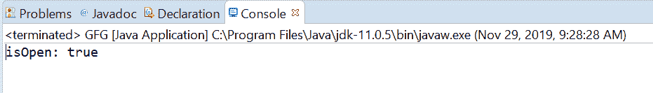
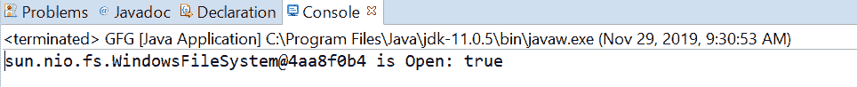

# Java 中的文件系统 isOpen()方法，示例

> 原文:[https://www . geesforgeks . org/file system-iso pen-method-in-Java-with-examples/](https://www.geeksforgeeks.org/filesystem-isopen-method-in-java-with-examples/)

如果文件系统打开，则使用**文件系统**类的 **isOpen()** 方法返回 true。这个方法对于知道文件系统是否打开非常有帮助。默认提供程序创建的文件系统总是打开的。

**语法:**

```java
public abstract boolean isOpen()

```

**参数:**此方法不接受任何内容。

**返回值:**当且仅当该文件系统打开时，该方法返回**真**。

以下程序说明了 isOpen()方法:
**程序 1:**

```java
// Java program to demonstrate
// FileSystem.isOpen() method

import java.nio.file.FileSystem;
import java.nio.file.Path;
import java.nio.file.Paths;

public class GFG {

    public static void main(String[] args)
    {

        // create the object of Path
        Path path
            = Paths.get(
                "C:\\Movies\\document.txt");

        // get FileSystem object
        FileSystem fs = path.getFileSystem();

        // apply isOpen() methods
        boolean answer = fs.isOpen();

        // print
        System.out.println("isOpen: " + answer);
    }
}
```

**输出:**


**程序 2:**

```java
// Java program to demonstrate
// FileSystem.isOpen() method

import java.nio.file.FileSystem;
import java.nio.file.Path;
import java.nio.file.Paths;

public class GFG {

    public static void main(String[] args)
    {

        // create the object of Path
        Path path
            = Paths.get(
                "E:// Tutorials// file.txt");

        // get FileSystem object
        FileSystem fs = path.getFileSystem();

        // apply isOpen() methods
        boolean answer = fs.isOpen();

        // print
        System.out.println(fs + " is Open: " + answer);
    }
}
```

**Output:**

参考文献:[https://docs . Oracle . com/javase/10/docs/API/Java/nio/file/file . html # isOpen()](https://docs.oracle.com/javase/10/docs/api/java/nio/file/FileSystem.html#isOpen())