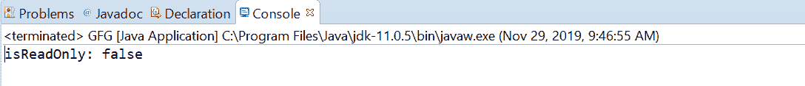
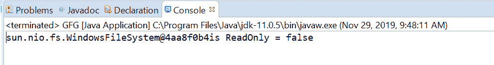

# 文件系统是 Java 中的 isReadOnly()方法，示例

> 原文:[https://www . geesforgeks . org/file system-is readonly-method-in-Java-with-examples/](https://www.geeksforgeeks.org/filesystem-isreadonly-method-in-java-with-examples/)

**文件系统**类的 **isReadOnly()** 方法用于检查该文件系统是否只允许对其文件存储进行只读访问。如果文件系统只允许对其文件存储进行读访问，则此方法将返回 true，否则返回 false。

**语法:**

```
public abstract boolean isReadOnly()

```

**参数:**此方法不接受任何内容。

**返回值:**当且仅当该文件系统提供只读访问时，该方法返回 **true** 。

下面的程序说明了 isReadOnly()方法:
**程序 1:**

```
// Java program to demonstrate
// FileSystem.isReadOnly() method

import java.nio.file.FileSystem;
import java.nio.file.Path;
import java.nio.file.Paths;

public class GFG {

    public static void main(String[] args)
    {
        // create object of Path
        Path path
            = Paths.get(
                "C:\\Movies\\document.txt");

        // get FileSystem object
        FileSystem fs = path.getFileSystem();

        // apply isReadOnly() methods
        boolean answer = fs.isReadOnly();

        // print
        System.out.println("isReadOnly: "
                           + answer);
    }
}
```

**输出:**


**程序 2:**

```
// Java program to demonstrate
// FileSystem.isReadOnly() method

import java.nio.file.FileSystem;
import java.nio.file.Path;
import java.nio.file.Paths;

public class GFG {

    public static void main(String[] args)
    {

        // create object of Path
        Path path
            = Paths.get(
                "E:// Tutorials// file.txt");

        // get FileSystem object
        FileSystem fs = path.getFileSystem();

        // apply isReadOnly() methods
        boolean answer = fs.isReadOnly();

        // print
        System.out.println(fs + "is ReadOnly = "
                           + answer);
    }
}
```

**Output:**

参考文献:[https://docs . Oracle . com/javase/10/docs/API/Java/nio/file/file . html # isReadOnly()](https://docs.oracle.com/javase/10/docs/api/java/nio/file/FileSystem.html#isReadOnly())