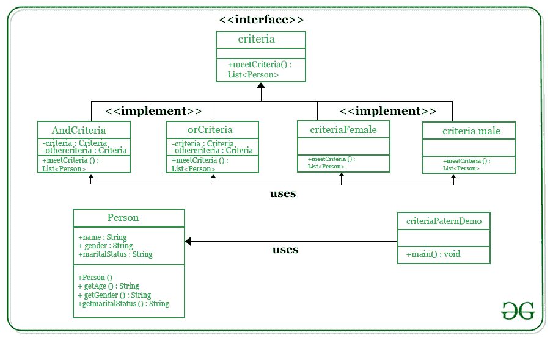

# Java 中的过滤模式

> 原文:[https://www.geeksforgeeks.org/filter-pattern-in-java/](https://www.geeksforgeeks.org/filter-pattern-in-java/)

过滤模式或标准模式是一种设计模式，它使开发人员能够使用不同的标准过滤一组对象，并通过逻辑操作以解耦的方式链接它们。



**程序:**

1.  创建要应用标准的类。
2.  为标准创建一个界面。
3.  创建实现标准接口的具体类。
4.  使用不同的标准及其组合来过滤人员。
5.  验证输出

**实施:**

我们将创建一个 Person 对象，Criteria 接口，以及实现这个接口的具体类来过滤 Person 对象的列表。CriteriaPatternDemo，我们的演示类使用 Criteria 对象根据各种标准及其组合来过滤人员对象列表。

**步骤 1:** 创建要应用标准的类。

*   Person.java

```
public class Person {

   private String name;
   private String gender;
   private String maritalStatus;

   public Person(String name, String gender, String maritalStatus){
      this.name = name;
      this.gender = gender;
      this.maritalStatus = maritalStatus;        
   }

   public String getName() {
      return name;
   }
   public String getGender() {
      return gender;
   }
   public String getMaritalStatus() {
      return maritalStatus;
   }    
}
```

**步骤 2:** 创建标准界面。

*   Criteria.java

```
import java.util.List;

public interface Criteria {
   public List<Person> meetCriteria(List<Person> persons);
}
```

**步骤 3:** 创建实现标准接口的具体类。

*   策略名称. java

```
import java.util.ArrayList;
import java.util.List;

public class CriteriaMale implements Criteria {

   @Override
   public List<Person> meetCriteria(List<Person> persons) {
      List<Person> malePersons = new ArrayList<Person>(); 

      for (Person person : persons) {
         if(person.getGender().equalsIgnoreCase("MALE")){
            malePersons.add(person);
         }
      }
      return malePersons;
   }
}
```

*   CriteriaFemale.java

```
import java.util.ArrayList;
import java.util.List;

public class CriteriaFemale implements Criteria {

   @Override
   public List<Person> meetCriteria(List<Person> persons) {
      List<Person> femalePersons = new ArrayList<Person>(); 

      for (Person person : persons) {
         if(person.getGender().equalsIgnoreCase("FEMALE")){
            femalePersons.add(person);
         }
      }
      return femalePersons;
   }
}
```

*   CriteriaSingle.java

```
import java.util.ArrayList;
import java.util.List;

public class CriteriaSingle implements Criteria {

   @Override
   public List<Person> meetCriteria(List<Person> persons) {
      List<Person> singlePersons = new ArrayList<Person>(); 

      for (Person person : persons) {
         if(person.getMaritalStatus().equalsIgnoreCase("SINGLE")){
            singlePersons.add(person);
         }
      }
      return singlePersons;
   }
}
```

*   AndCriteria.java

```
import java.util.List;

public class AndCriteria implements Criteria {

   private Criteria criteria;
   private Criteria otherCriteria;

   public AndCriteria(Criteria criteria, Criteria otherCriteria) {
      this.criteria = criteria;
      this.otherCriteria = otherCriteria; 
   }

   @Override
   public List<Person> meetCriteria(List<Person> persons) {

      List<Person> firstCriteriaPersons = criteria.meetCriteria(persons);        
      return otherCriteria.meetCriteria(firstCriteriaPersons);
   }
}
```

*   半兽人. java

```
import java.util.List;

public class OrCriteria implements Criteria {

   private Criteria criteria;
   private Criteria otherCriteria;

   public OrCriteria(Criteria criteria, Criteria otherCriteria) {
      this.criteria = criteria;
      this.otherCriteria = otherCriteria; 
   }

   @Override
   public List<Person> meetCriteria(List<Person> persons) {
      List<Person> firstCriteriaItems = criteria.meetCriteria(persons);
      List<Person> otherCriteriaItems = otherCriteria.meetCriteria(persons);

      for (Person person : otherCriteriaItems) {
         if(!firstCriteriaItems.contains(person)){
            firstCriteriaItems.add(person);
         }
      }    
      return firstCriteriaItems;
   }
}
```

**第 4 步:**使用不同的标准及其组合过滤掉人员。

*   CriteriaPatternDemo.java

## Java 语言(一种计算机语言，尤用于创建网站)

```
// Importing ArrayList and List class 
// from java.util package 
import java.util.ArrayList;
import java.util.List;

// Class
// Main class
public class CriteriaPatternDemo {

  // Main driver method
   public static void main(String[] args) {

     // Creating a onbject of List in main() method
     // Declaring object of user-defined datatype 'Person'
      List<Person> persons = new ArrayList<Person>();

     // Adding elements to the object created above
     // using the add() method of List
     // Custom entries 
      persons.add(new Person("Robert","Male", "Single"));
      persons.add(new Person("John", "Male", "Married"));
      persons.add(new Person("Laura", "Female", "Married"));
      persons.add(new Person("Diana", "Female", "Single"));
      persons.add(new Person("Mike", "Male", "Single"));
      persons.add(new Person("Bobby", "Male", "Single"));

      Criteria male = new CriteriaMale();
      Criteria female = new CriteriaFemale();
      Criteria single = new CriteriaSingle();
      Criteria singleMale = new AndCriteria(single, male);
      Criteria singleOrFemale = new OrCriteria(single, female);

      // Display message 
      System.out.println("Males: ");
      printPersons(male.meetCriteria(persons));

      // Display message 
      System.out.println("\nFemales: ");
      printPersons(female.meetCriteria(persons));

      // Display message 
      System.out.println("\nSingle Males: ");
      printPersons(singleMale.meetCriteria(persons));

      // Display message 
      System.out.println("\nSingle Or Females: ");
      printPersons(singleOrFemale.meetCriteria(persons));
   }

   public static void printPersons(List<Person> persons){

      for (Person person : persons) {
         System.out.println("Person : [ Name : " + person.getName() + ", Gender : " + person.getGender() + ", Marital Status : " + person.getMaritalStatus() + " ]");
      }
   }      
}
```

**步骤 5:** 验证输出。

```
Males: 
Person : [ Name : Robert, Gender : Male, Marital Status : Single ]
Person : [ Name : John, Gender : Male, Marital Status : Married ]
Person : [ Name : Mike, Gender : Male, Marital Status : Single ]
Person : [ Name : Bobby, Gender : Male, Marital Status : Single ]

Females: 
Person : [ Name : Laura, Gender : Female, Marital Status : Married ]
Person : [ Name : Diana, Gender : Female, Marital Status : Single ]

Single Males: 
Person : [ Name : Robert, Gender : Male, Marital Status : Single ]
Person : [ Name : Mike, Gender : Male, Marital Status : Single ]
Person : [ Name : Bobby, Gender : Male, Marital Status : Single ]

Single Or Females: 
Person : [ Name : Robert, Gender : Male, Marital Status : Single ]
Person : [ Name : Diana, Gender : Female, Marital Status : Single ]
Person : [ Name : Mike, Gender : Male, Marital Status : Single ]
Person : [ Name : Bobby, Gender : Male, Marital Status : Single ]
Person : [ Name : Laura, Gender : Female, Marital Status : Married ]
```