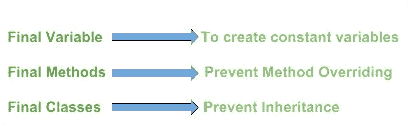

# Java 中的最终关键字

> 原文:[https://www.geeksforgeeks.org/final-keyword-in-java/](https://www.geeksforgeeks.org/final-keyword-in-java/)

*final* 关键字在不同的上下文中使用。首先， *final* 是一个[非访问修饰符](https://www.geeksforgeeks.org/access-and-non-access-modifiers-in-java/)只适用于一个变量、一个方法或者一个类。以下是使用 final 的不同上下文。



## **最终变量**

当变量用 *final* 关键字声明时，其值不能被修改，本质上是一个常量。这也意味着您必须初始化一个最终变量。如果最终变量是引用，这意味着该变量不能被重新绑定以引用另一个对象，但是该引用变量所指向的对象的内部状态可以被改变，即您可以从[最终数组](https://www.geeksforgeeks.org/final-arrays-in-java/)或最终集合中添加或移除元素。最好用大写字母表示最终变量，用下划线分隔单词。

插图:

```java
// a final variable
final int THRESHOLD = 5;
```

```java
// a blank final variable
final int THRESHOLD;
```

```java
// a final static variable PI
static final double PI = 3.141592653589793;
```

```java
// a  blank final static  variable
static final double PI;
```

**初始化一个最终变量**
我们必须初始化一个最终变量，否则编译器会抛出一个编译时错误。最终变量只能初始化一次，要么通过[初始化器](https://www.geeksforgeeks.org/g-fact-26-the-initializer-block-in-java/)要么通过赋值语句。有三种方法可以初始化最终变量:

1.  可以在声明最终变量时对其进行初始化。这种方法是最常见的。如果声明时初始化的是**而不是**，则最终变量称为**空白最终变量**。下面是初始化空白最终变量的两种方法。
2.  空白的最终变量可以在[实例初始化器块](https://www.geeksforgeeks.org/instance-initialization-block-iib-java/)内或构造函数内初始化。如果您的类中有多个构造函数，那么它必须在所有构造函数中初始化，否则将引发编译时错误。
3.  空白的最终静态变量可以在[静态块](https://www.geeksforgeeks.org/g-fact-79/)中初始化。

让我们讨论一下初始化最终变量的这两种不同方法

**示例:**

## Java 语言(一种计算机语言，尤用于创建网站)

```java
// Java Program to demonstrate Different
// Ways of Initializing a final Variable

// Main class
class GFG {

    // a final variable
    // direct initialize
    final int THRESHOLD = 5;

    // a blank final variable
    final int CAPACITY;

    // another blank final variable
    final int  MINIMUM;

    // a final static variable PI
    // direct initialize
    static final double PI = 3.141592653589793;

    // a  blank final static  variable
    static final double EULERCONSTANT;

    // instance initializer block for
    // initializing CAPACITY
    {
        CAPACITY = 25;
    }

    // static initializer block for
    // initializing EULERCONSTANT
    static{
        EULERCONSTANT = 2.3;
    }

    // constructor for initializing MINIMUM
    // Note that if there are more than one
    // constructor, you must initialize MINIMUM
    // in them also
    public GFG()
    {
        MINIMUM = -1;
    }

}
```

极客在上面的代码中没有主要的方法，因为它只是为了说明的目的，以便更好地理解，从而得出结论:

**观察 1:** 何时使用最终变量？

普通变量和最终变量之间的唯一区别是，我们可以重新给普通变量赋值，但是一旦赋值，我们就不能改变最终变量的值。因此，最终变量只能用于我们希望在整个程序执行过程中保持不变的值。

**观察 2:** 参考最终变量？

当最终变量是对对象的引用时，这个最终变量称为引用最终变量。例如，最终的 StringBuffer 变量如下所示:

```java
final StringBuffer sb;
```

众所周知，最终变量不能被重新赋值。但是在引用最终变量的情况下，该引用变量指向的对象的内部状态可以改变。请注意，这不是重新分配。*最终*的这个性质叫做*非及物性*。要理解对象内部状态的含义，如下例所示:

**例**

## Java 语言(一种计算机语言，尤用于创建网站)

```java
// Java Program to demonstrate
// Reference of Final Variable

// Main class
class GFG {

    // Main driver method
    public static void main(String[] args)
    {
        // Creating sn object of StringBuilder class
        // Final reference variable
        final StringBuilder sb = new StringBuilder("Geeks");

        // Printing the element in StringBuilder object
        System.out.println(sb);

        // changing internal state of object reference by
        //  final reference variable sb
        sb.append("ForGeeks");

        // Again printing the element in StringBuilder
        // object after appending above element in it
        System.out.println(sb);
    }
}
```

**Output**

```java
Geeks
GeeksForGeeks
```

*非传递性*属性也适用于数组，因为[数组是 java](https://www.geeksforgeeks.org/arrays-in-java/) 中的对象。带有**最终关键字**的数组也称为[最终数组](https://www.geeksforgeeks.org/final-arrays-in-java/)。

> **注意:**如上所述，最终变量不能被重新分配，这样做会引发编译时错误。

**示例:**

## Java 语言(一种计算机语言，尤用于创建网站)

```java
// Java Program to Demonstrate Re-assigning
// Final Variable will throw Compile-time Error

// Main class
class GFG {

    // Declaring and customly initializing static final
    // variable
    static final int CAPACITY = 4;

    // Main driver method
    public static void main(String args[])
    {
        // Re-assigning final variable
        // will throw compile-time error
        CAPACITY = 5;
    }
}
```

**输出:**

```java
prog.java:16: error: cannot assign a value to final variable CAPACITY
        CAPACITY = 5;
        ^
1 error
```

> **记住:**当在方法/构造函数/块内部创建最终变量时，它被称为局部最终变量，并且在创建它的地方必须初始化一次。局部最终变量见下面的程序。

**例**

## Java 语言(一种计算机语言，尤用于创建网站)

```java
// Java program to demonstrate
// local final variable

// Main class
class GFG {

    // Main driver method
    public static void main(String args[])
    {
        // Declaring local final variable
        final int i;

        // Now initializing it with integer value
        i = 20;

        // Printing the value on console
        System.out.println(i);
    }
}
```

**Output**

```java
20
```

极客们在前进之前一定要记住以下要点，如下所示:

1.  注意 C++ *const* 变量和 Java *final* 变量的区别。C++中的常量变量在声明时必须赋值。对于 Java 中的最终变量，正如我们在上面的例子中看到的，它不是必需的。最后一个变量可以稍后赋值，但只能赋值一次。
2.  *带有 [foreach loop](https://www.geeksforgeeks.org/for-each-loop-in-java/) 的 final* :带有-for-的 final 语句是合法语句。

**例**

## Java 语言(一种计算机语言，尤用于创建网站)

```java
// Java Program to demonstrate Final
// with for-each Statement

// Main class
class GFG {

    // Main driver method
    public static void main(String[] args)
    {

        // Declaring and initializing
        // custom integer array
        int arr[] = { 1, 2, 3 };

        // final with for-each statement
        // legal statement
        for (final int i : arr)
            System.out.print(i + " ");
    }
}
```

**Output**

```java
1 2 3 
```

**输出解释:**

由于“*I”*变量在循环的每次迭代中都超出了范围，所以它实际上是在每次迭代中重新声明，允许使用相同的标记(即 I)来表示多个变量。

**期末班**

当一个类用 *final* 关键字声明时，称为最终类。最终类不能扩展(继承)。

最后一节课有两种用途:

**用法 1:** 一个肯定是防止[继承](https://www.geeksforgeeks.org/inheritance-in-java/)，因为最终类不能扩展。例如所有[包装类](https://www.geeksforgeeks.org/wrapper-classes-java/)如[整数](https://www.geeksforgeeks.org/java-lang-integer-class-java/)、[浮点](https://www.geeksforgeeks.org/java-lang-float-class-in-java/)等。是最后一堂课。我们不能扩展它们。

```java
final class A
{
     // methods and fields
}
// The following class is illegal
class B extends A 
{ 
    // COMPILE-ERROR! Can't subclass A
}
```

**用法 2:**final with class 的另一个用法是[创建一个不可变的类](https://www.geeksforgeeks.org/create-immutable-class-java/)，就像预定义的 [String](https://www.geeksforgeeks.org/string-class-in-java/) 类一样。不把一个类变成最终的，就不能把它变成不可变的。

### **最终方法**

当一个方法用 *final* 关键字声明时，称为 final 方法。最终方法不能被[覆盖](https://www.geeksforgeeks.org/overriding-in-java/)。[对象](https://www.geeksforgeeks.org/object-class-in-java/)类做到了这一点——它的许多方法都是最终的。我们必须用 final 关键字声明方法，对于这些方法，我们需要在所有派生类中遵循相同的实现。

**图解:**用方法的最终关键字

```java
class A 
{
    final void m1() 
    {
        System.out.println("This is a final method.");
    }
}

class B extends A 
{
    void m1()
    { 
        // Compile-error! We can not override
        System.out.println("Illegal!");
    }
}
```

**有关 final 方法和 final 类**的更多示例和行为，请参见[使用带有继承的 final。](https://www.geeksforgeeks.org/using-final-with-inheritance-in-java/)请参见 java 中的[摘要](https://www.geeksforgeeks.org/abstract-keyword-in-java/)文章，了解最终和摘要之间的区别。
**相关面试问题(重要):** [期末、期末、Java 期末](https://www.geeksforgeeks.org/g-fact-24-finalfinally-and-finalize-in-java/)的区别

本文由**高拉夫·米格拉尼**供稿。如果你喜欢 GeeksforGeeks 并想投稿，你也可以使用[write.geeksforgeeks.org](https://write.geeksforgeeks.org)写一篇文章或者把你的文章邮寄到 review-team@geeksforgeeks.org。看到你的文章出现在极客博客主页上，帮助其他极客。如果你发现任何不正确的地方，或者你想分享更多关于上面讨论的话题的信息，请写评论。