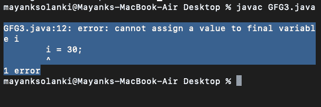

# Java 中的最终变量

> 原文:[https://www.geeksforgeeks.org/final-variables-in-java/](https://www.geeksforgeeks.org/final-variables-in-java/)

在 Java 中，我们可以将 [final 关键字](https://www.geeksforgeeks.org/final-keyword-java/)用于变量、方法和类。当 final 关键字与原始数据类型的变量(如 int、float 等)一起使用时，变量的值不能更改。

**示例 1:** 带有原始数据类型的 final 的用法

## Java 语言(一种计算机语言，尤用于创建网站)

```
// Java Program to illustrate Use of Final Keyword
// With Primitive Datatypes

// Main class
class GFG {

    // Main driver method
    public static void main(String args[])
    {

        // Final primitive variable
        final int i = 10;
        i = 30;

        // Error will be generated above
    }
}
```

**输出:**



现在你一定想知道如果我们使用 final 关键字非原始变量会怎么样，让我们借助一个例子来探索与上面相同的内容。

> **注意:**非原语变量始终是对 Java 中对象的引用，被引用对象的成员是可以改变的。final 对于非基元变量来说，只是意味着它们不能被更改为引用任何其他对象。

**示例 2:** 带有原始数据类型的 final 的用法

## Java 语言(一种计算机语言，尤用于创建网站)

```
// Java Program to illustrate Use of Final Keyword
// With Primitive Datatypes

// Class 1
class Helper {
    int i = 10;
}

// Clss 2
// main class
class GFG {

    // Main driver method
    public static void main(String args[])
    {

        final Helper t1 = new Helper();
        t1.i = 30; // Works

        // Print statement for successful execution of
        // Program
        System.out.print("Successfully executed");
    }
}
```

**Output**

```
Successfully executed
```

如果你发现任何不正确的地方，或者你想分享更多关于上面讨论的话题的信息，请写评论。