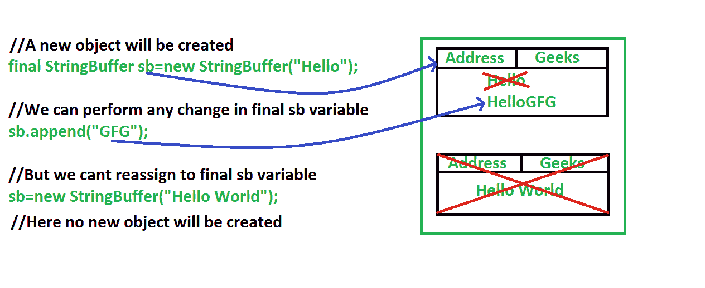

# Java 中的最终 vs 不变性

> 原文:[https://www.geeksforgeeks.org/final-vs-immutability-java/](https://www.geeksforgeeks.org/final-vs-immutability-java/)

**final :** 在 Java 中， [final](https://www.geeksforgeeks.org/final-keyword-java/) 是一个修饰符，也用于类、方法和变量。当一个变量用 final 关键字声明时，它的值不能被修改，本质上是一个常量。
[**不变性**](https://www.geeksforgeeks.org/create-immutable-class-java/) **:** 简单来说，不变性就是指随着时间的推移不变或者无法改变。在 Java 中，我们知道字符串对象是不可变的，这意味着我们不能对现有的字符串对象进行任何更改。

**最终和不变性之间的差异**

*   final 意味着您不能更改对象的引用来指向另一个引用或另一个对象，但是您仍然可以改变它的状态(例如使用 setter 方法)。而不可变意味着对象的实际值不能改变，但是你可以改变它对另一个对象的引用。
*   final 修饰符适用于变量，但不适用于对象，而不变性适用于对象，但不适用于变量。
*   通过将引用变量声明为 final，我们不会得到任何不变性，即使引用变量是 final。我们可以在相应的对象中执行任何类型的更改。但是我们无法对该变量执行重新分配。
*   final 确保对象的地址保持不变，而不可变则表明一旦创建对象，我们就不能改变对象的状态。

## Java 语言（一种计算机语言，尤用于创建网站）

```
// Java program to illustrate
// difference between final
// and immutability

class Geeks {
    public static void main(String[] args)
    {
        final StringBuffer sb = new StringBuffer("Hello");

        // Even though reference variable sb is final
        // We can perform any changes
        sb.append("GFG");

        System.out.println(sb);

        // Here we will get Compile time error
        // Because reassignment is not possible for final variable
        sb = new StringBuffer("Hello World");

        System.out.println(sb);
    }
}
```

输出:

```
Geeks.java:14: error: cannot assign a value to final variable sb
        sb = new StringBuffer("Hello World");
        ^
1 error
```

**上述程序的图示**



**说明:**在上图中，我们可以看到，我们是通过使引用成为 final 来创建 StringBuffer 类的对象。

*   将引用变量声明为 final，并不意味着对象是不可变的。
*   在下一行中，我们对创建的对象执行 append()操作，并成功地对其进行了更改。
*   如果对象是不可变的，那么上面的追加操作就无法完成。
*   但是它成功地执行了，因为我们将引用变量声明为 final。final 意味着我们不能再给那个引用变量重新赋值了。
*   因此，当我们试图创建一个新的 BufferedReader 对象时，它不会通过向控制台抛出一个错误来创建任何对象。