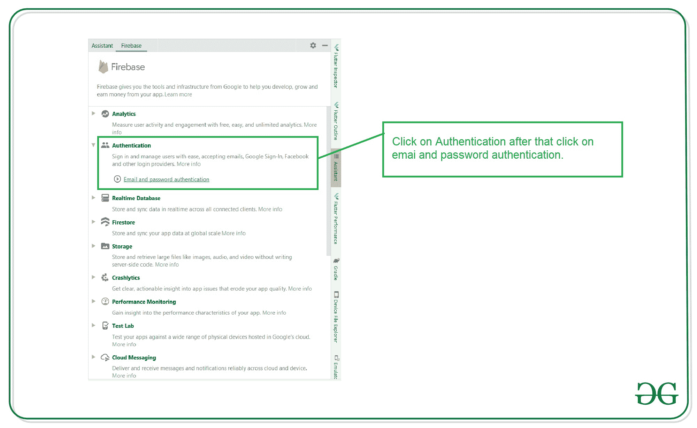
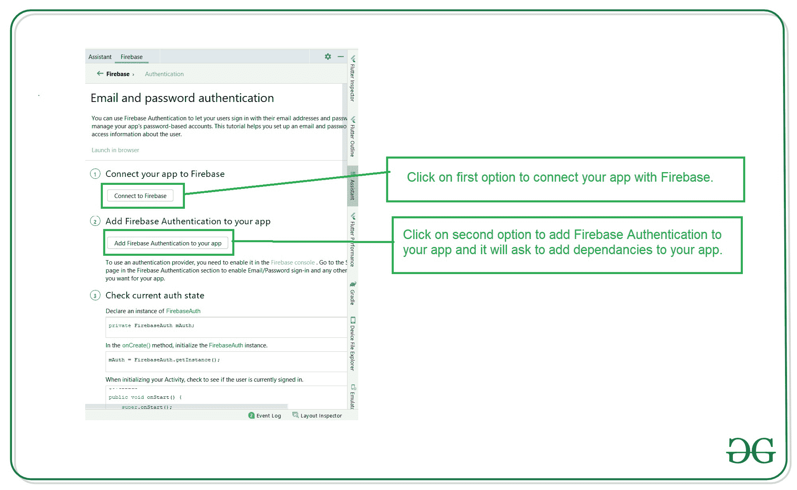
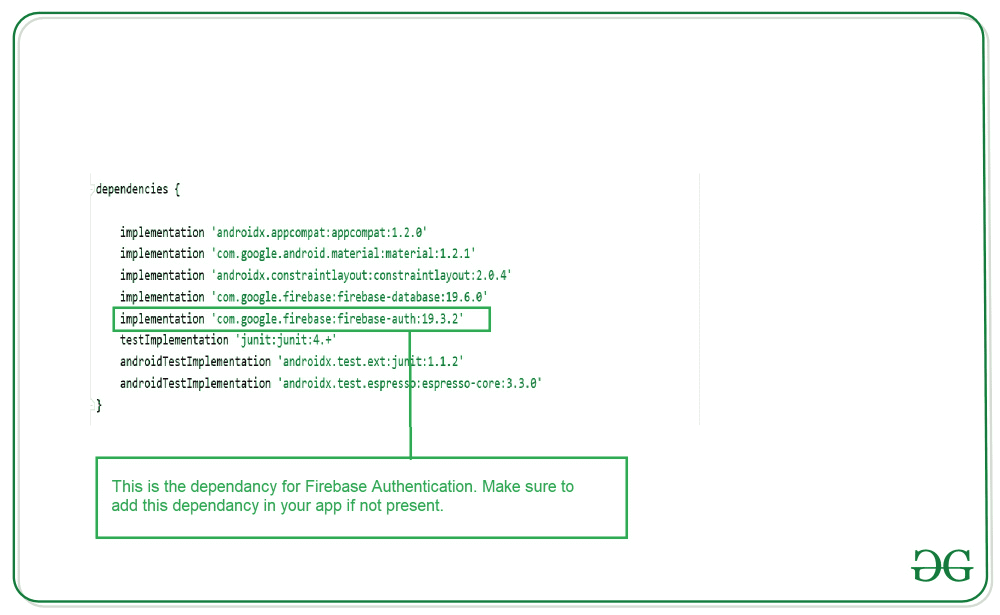
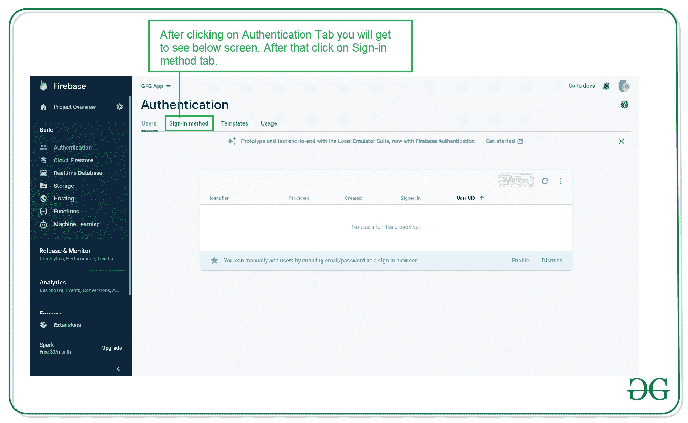
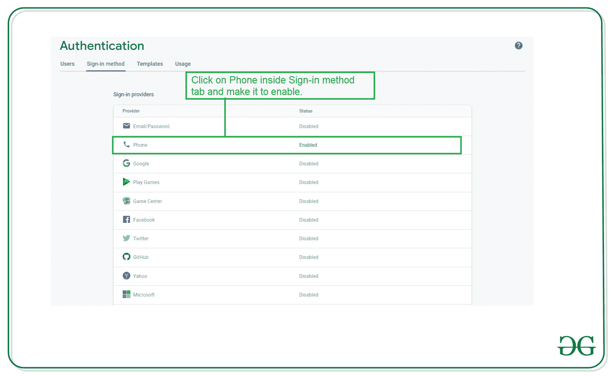
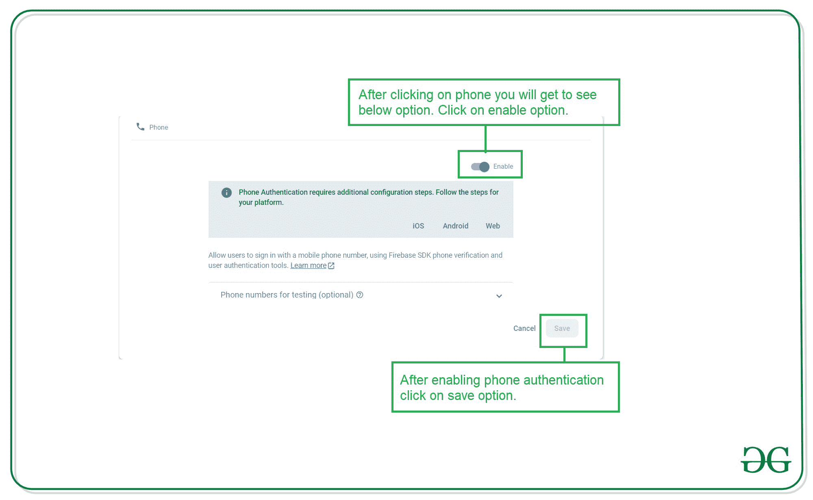

# 安卓手机号码 OTP 的 Firebase 认证

> 原文:[https://www . geesforgeks . org/firebase-带电话号码的身份验证-安卓 OTP/](https://www.geeksforgeeks.org/firebase-authentication-with-phone-number-otp-in-android/)

许多应用程序要求用户经过身份验证。因此，为了验证应用程序，会在应用程序内部使用电话号码验证。在电话认证中，用户必须用他的电话号码来验证他的身份。在应用程序中，用户必须输入他的电话号码，然后他将在他的手机号码上收到一个验证码。他必须输入验证码并验证自己的身份。这就是电话认证的工作原理。 [Firebase](https://www.geeksforgeeks.org/firebase-introduction/) 为认证用户提供了如此多的方式，如谷歌、电子邮件和密码、电话等等。在这篇文章中，我们将看看在我们的应用程序中使用 Firebase 实现电话认证。

### 我们将在本文中构建什么？

我们将创建一个简单的应用程序，它有两个屏幕。第一个屏幕将是我们的验证屏幕，用户必须在上面添加他的电话号码。添加他的电话号码后，用户将点击获取动态口令按钮，然后 Firebase 将发送上述号码的动态口令。收到该动态口令后，用户必须在下面的文本字段中输入该动态口令，并点击下面的按钮以验证输入的动态口令。点击验证按钮后，Firebase 将验证该动态口令，并仅当输入的动态口令正确时才允许用户进入主屏幕，否则用户将收到一条错误消息。注意，我们将使用 **Java** 语言来实现这个项目。

### 逐步实施

**第一步:创建新项目**

要在安卓工作室创建新项目，请参考[如何在安卓工作室创建/启动新项目](https://www.geeksforgeeks.org/android-how-to-create-start-a-new-project-in-android-studio/)。注意选择 **Java** 作为编程语言。

**第二步:将你的应用连接到 Firebase**

在 Android Studio 中创建新项目后，将您的应用程序连接到 Firebase。用于将您的应用程序连接到 firebase。导航到顶部栏上的工具。之后点击 Firebase。右侧将打开一个新窗口。在该窗口中，单击身份验证，然后单击电子邮件和密码身份验证。



点击电子邮件和密码认证后，您将看到下面的屏幕。在此屏幕中，单击第一个选项连接到 firebase，然后单击第二个选项将 Firebase 身份验证添加到您的应用程序中。



**第 3 步:验证 Firebase 身份验证的依赖项是否已添加到您的应用程序中**

将您的应用程序连接到 Firebase 后。如果没有添加，请确保在您的 [build.gradle](https://www.geeksforgeeks.org/android-build-gradle/) 文件中添加此依赖项。添加此依赖项后，同步您的项目。



> **注意**:一定要在上图中添加确切的依赖版本，因为最新的依赖没有**OTP**自动检测的实现。

**第 4 步:使用 activity_main.xml 文件**

转到 **activity_main.xml** 文件，参考以下代码。下面是 **activity_main.xml** 文件的代码。

## 可扩展标记语言

```java
<?xml version="1.0" encoding="utf-8"?>
<RelativeLayout
    xmlns:android="http://schemas.android.com/apk/res/android"
    xmlns:tools="http://schemas.android.com/tools"
    android:layout_width="match_parent"
    android:layout_height="match_parent"
    tools:context=".MainActivity">

    <!--Edittext for getting users phone number-->
    <EditText
        android:id="@+id/idEdtPhoneNumber"
        android:layout_width="match_parent"
        android:layout_height="wrap_content"
        android:layout_centerHorizontal="true"
        android:layout_margin="10dp"
        android:hint="Enter your phone"
        android:importantForAutofill="no"
        android:inputType="phone" />

    <!--Button for getting OTP-->
    <Button
        android:id="@+id/idBtnGetOtp"
        android:layout_width="match_parent"
        android:layout_height="wrap_content"
        android:layout_below="@id/idEdtPhoneNumber"
        android:layout_margin="10dp"
        android:text="Get OTP"
        android:textAllCaps="false" />

    <!--Edittext for getting otp from user-->
    <EditText
        android:id="@+id/idEdtOtp"
        android:layout_width="match_parent"
        android:layout_height="wrap_content"
        android:layout_below="@id/idBtnGetOtp"
        android:layout_margin="10dp"
        android:hint="Enter OTP"
        android:importantForAutofill="no"
        android:inputType="phone" />

    <!--button for verifying user OTP-->
    <Button
        android:id="@+id/idBtnVerify"
        android:layout_width="match_parent"
        android:layout_height="wrap_content"
        android:layout_below="@id/idEdtOtp"
        android:layout_margin="10dp"
        android:text="Verify OTP"
        android:textAllCaps="false" />

</RelativeLayout>
```

**第五步:在你的 Manifest.xml 文件中添加互联网权限**

导航至**应用程序> AndroidManifest.xml** 文件，并添加以下权限。

## 可扩展标记语言

```java
<uses-permission android:name="android.permission.INTERNET" />
<uses-permission android:name="android.permission.ACCESS_NETWORK_STATE" />
```

**第 6 步:为我们的主页创建一个新活动**

导航到**应用程序> java >您的应用程序的包名>右键单击您的应用程序的包名，然后单击新建>活动>空活动**并命名您的活动。这里我们给它起了一个名字**家庭活动**。

**步骤 7:使用 MainActivity.java 文件**

转到**MainActivity.java**文件，参考以下代码。以下是**MainActivity.java**文件的代码。代码中添加了注释，以更详细地理解代码。

## Java 语言(一种计算机语言，尤用于创建网站)

```java
import android.content.Intent;
import android.os.Bundle;
import android.text.TextUtils;
import android.view.View;
import android.widget.Button;
import android.widget.EditText;
import android.widget.Toast;

import androidx.annotation.NonNull;
import androidx.appcompat.app.AppCompatActivity;

import com.google.android.gms.tasks.OnCompleteListener;
import com.google.android.gms.tasks.Task;
import com.google.android.gms.tasks.TaskExecutors;
import com.google.firebase.FirebaseException;
import com.google.firebase.auth.AuthResult;
import com.google.firebase.auth.FirebaseAuth;
import com.google.firebase.auth.PhoneAuthCredential;
import com.google.firebase.auth.PhoneAuthProvider;

import java.util.concurrent.TimeUnit;

public class MainActivity extends AppCompatActivity {

    // variable for FirebaseAuth class
    private FirebaseAuth mAuth;

    // variable for our text input
    // field for phone and OTP.
    private EditText edtPhone, edtOTP;

    // buttons for generating OTP and verifying OTP
    private Button verifyOTPBtn, generateOTPBtn;

    // string for storing our verification ID
    private String verificationId;

    @Override
    protected void onCreate(Bundle savedInstanceState) {
        super.onCreate(savedInstanceState);
        setContentView(R.layout.activity_main);

        // below line is for getting instance
        // of our FirebaseAuth.
        mAuth = FirebaseAuth.getInstance();

        // initializing variables for button and Edittext.
        edtPhone = findViewById(R.id.idEdtPhoneNumber);
        edtOTP = findViewById(R.id.idEdtOtp);
        verifyOTPBtn = findViewById(R.id.idBtnVerify);
        generateOTPBtn = findViewById(R.id.idBtnGetOtp);

        // setting onclick listener for generate OTP button.
        generateOTPBtn.setOnClickListener(new View.OnClickListener() {
            @Override
            public void onClick(View v) {
                // below line is for checking weather the user
                // has entered his mobile number or not.
                if (TextUtils.isEmpty(edtPhone.getText().toString())) {
                    // when mobile number text field is empty
                    // displaying a toast message.
                    Toast.makeText(MainActivity.this, "Please enter a valid phone number.", Toast.LENGTH_SHORT).show();
                } else {
                    // if the text field is not empty we are calling our
                    // send OTP method for getting OTP from Firebase.
                    String phone = "+91" + edtPhone.getText().toString();
                    sendVerificationCode(phone);
                }
            }
        });

        // initializing on click listener
        // for verify otp button
        verifyOTPBtn.setOnClickListener(new View.OnClickListener() {
            @Override
            public void onClick(View v) {
                // validating if the OTP text field is empty or not.
                if (TextUtils.isEmpty(edtOTP.getText().toString())) {
                    // if the OTP text field is empty display
                    // a message to user to enter OTP
                    Toast.makeText(MainActivity.this, "Please enter OTP", Toast.LENGTH_SHORT).show();
                } else {
                    // if OTP field is not empty calling
                    // method to verify the OTP.
                    verifyCode(edtOTP.getText().toString());
                }
            }
        });
    }

    private void signInWithCredential(PhoneAuthCredential credential) {
        // inside this method we are checking if
        // the code entered is correct or not.
        mAuth.signInWithCredential(credential)
                .addOnCompleteListener(new OnCompleteListener<AuthResult>() {
                    @Override
                    public void onComplete(@NonNull Task<AuthResult> task) {
                        if (task.isSuccessful()) {
                            // if the code is correct and the task is successful
                            // we are sending our user to new activity.
                            Intent i = new Intent(MainActivity.this, HomeActivity.class);
                            startActivity(i);
                            finish();
                        } else {
                            // if the code is not correct then we are
                            // displaying an error message to the user.
                            Toast.makeText(MainActivity.this, task.getException().getMessage(), Toast.LENGTH_LONG).show();
                        }
                    }
                });
    }

    private void sendVerificationCode(String number) {
        // this method is used for getting
        // OTP on user phone number.
        PhoneAuthOptions options =
                PhoneAuthOptions.newBuilder(mAuth)
                        .setPhoneNumber(number)            // Phone number to verify
                        .setTimeout(60L, TimeUnit.SECONDS) // Timeout and unit
                        .setActivity(this)                 // Activity (for callback binding)
                        .setCallbacks(mCallBack)           // OnVerificationStateChangedCallbacks
                        .build();
        PhoneAuthProvider.verifyPhoneNumber(options);
    }

    // callback method is called on Phone auth provider.
    private PhoneAuthProvider.OnVerificationStateChangedCallbacks

            // initializing our callbacks for on
            // verification callback method.
            mCallBack = new PhoneAuthProvider.OnVerificationStateChangedCallbacks() {

        // below method is used when
        // OTP is sent from Firebase
        @Override
        public void onCodeSent(String s, PhoneAuthProvider.ForceResendingToken forceResendingToken) {
            super.onCodeSent(s, forceResendingToken);
            // when we receive the OTP it
            // contains a unique id which
            // we are storing in our string
            // which we have already created.
            verificationId = s;
        }

        // this method is called when user
        // receive OTP from Firebase.
        @Override
        public void onVerificationCompleted(PhoneAuthCredential phoneAuthCredential) {
            // below line is used for getting OTP code
            // which is sent in phone auth credentials.
            final String code = phoneAuthCredential.getSmsCode();

            // checking if the code
            // is null or not.
            if (code != null) {
                // if the code is not null then
                // we are setting that code to
                // our OTP edittext field.
                edtOTP.setText(code);

                // after setting this code
                // to OTP edittext field we
                // are calling our verifycode method.
                verifyCode(code);
            }
        }

        // this method is called when firebase doesn't
        // sends our OTP code due to any error or issue.
        @Override
        public void onVerificationFailed(FirebaseException e) {
            // displaying error message with firebase exception.
            Toast.makeText(MainActivity.this, e.getMessage(), Toast.LENGTH_LONG).show();
        }
    };

    // below method is use to verify code from Firebase.
    private void verifyCode(String code) {
        // below line is used for getting getting
        // credentials from our verification id and code.
        PhoneAuthCredential credential = PhoneAuthProvider.getCredential(verificationId, code);

        // after getting credential we are
        // calling sign in method.
        signInWithCredential(credential);
    }
}
```

**第 8 步:开展家庭活动**

现在，我们已经验证了我们的用户，并开始我们的家庭活动。现在，我们将向用户显示一条关于成功身份验证的欢迎消息。为此，导航至**应用程序> res >布局> activity_home.xml** ，并添加以下代码。

## 可扩展标记语言

```java
<?xml version="1.0" encoding="utf-8"?>
<RelativeLayout
    xmlns:android="http://schemas.android.com/apk/res/android"
    xmlns:tools="http://schemas.android.com/tools"
    android:layout_width="match_parent"
    android:layout_height="match_parent"
    tools:context=".HomeActivity">

    <TextView
        android:layout_width="match_parent"
        android:layout_height="wrap_content"
        android:layout_centerInParent="true"
        android:padding="10dp"
        android:text="Geeks for Geeks \n Welcome to Home Screen"
        android:textAlignment="center"
        android:textColor="@color/purple_500"
        android:textSize="20sp" />

</RelativeLayout>
```

**第九步:在我们的 Firebase 控制台**中启用 Firebase 电话认证

要在 Firebase 控制台中启用电话身份验证，请转到 [Firebase 控制台](https://firebase.google.com/)。现在点击**转到控制台**选项，导航到您的项目。之后点击你的项目。你可以看到下面的屏幕。


点击认证后，您将看到下面的屏幕。在此屏幕上，单击登录方法选项卡。



单击登录方法后，您将看到下面的身份验证屏幕列表。单击电话选项并启用它。



点击电话选项，您将看到下面的弹出屏幕。在此屏幕中，单击启用选项并保存它。



> **注意:**要获取 OTP，请不要输入带有国家代码的电话号码，因为我们已经在代码本身中添加了该国家代码。

**输出:**

<video class="wp-video-shortcode" id="video-535055-1" width="640" height="360" preload="metadata" controls=""><source type="video/mp4" src="https://media.geeksforgeeks.org/wp-content/uploads/20201226174523/Screenrecorder-2020-12-26-17-41-59-768.mp4?_=1">[https://media.geeksforgeeks.org/wp-content/uploads/20201226174523/Screenrecorder-2020-12-26-17-41-59-768.mp4](https://media.geeksforgeeks.org/wp-content/uploads/20201226174523/Screenrecorder-2020-12-26-17-41-59-768.mp4)</video>

**来源** : [点击此处下载项目文件](https://media.geeksforgeeks.org/wp-content/cdn-uploads/20210723125605/FirebasePhoneAuthentication-master.zip)。